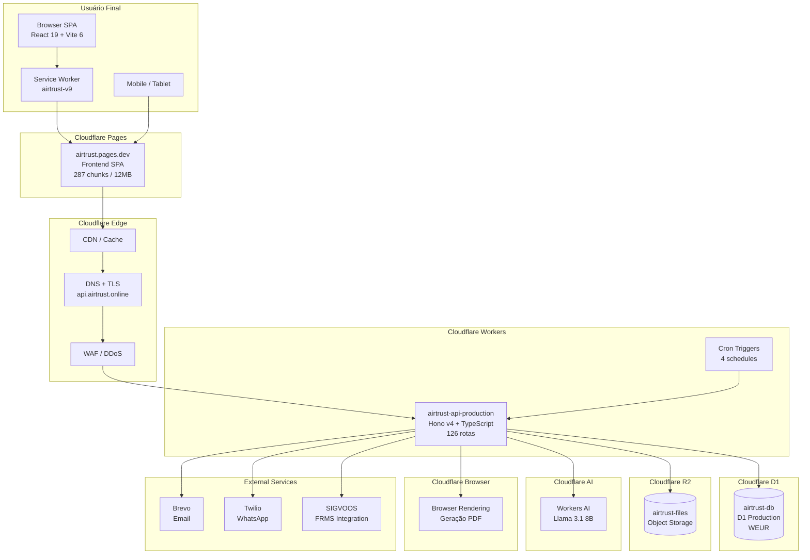
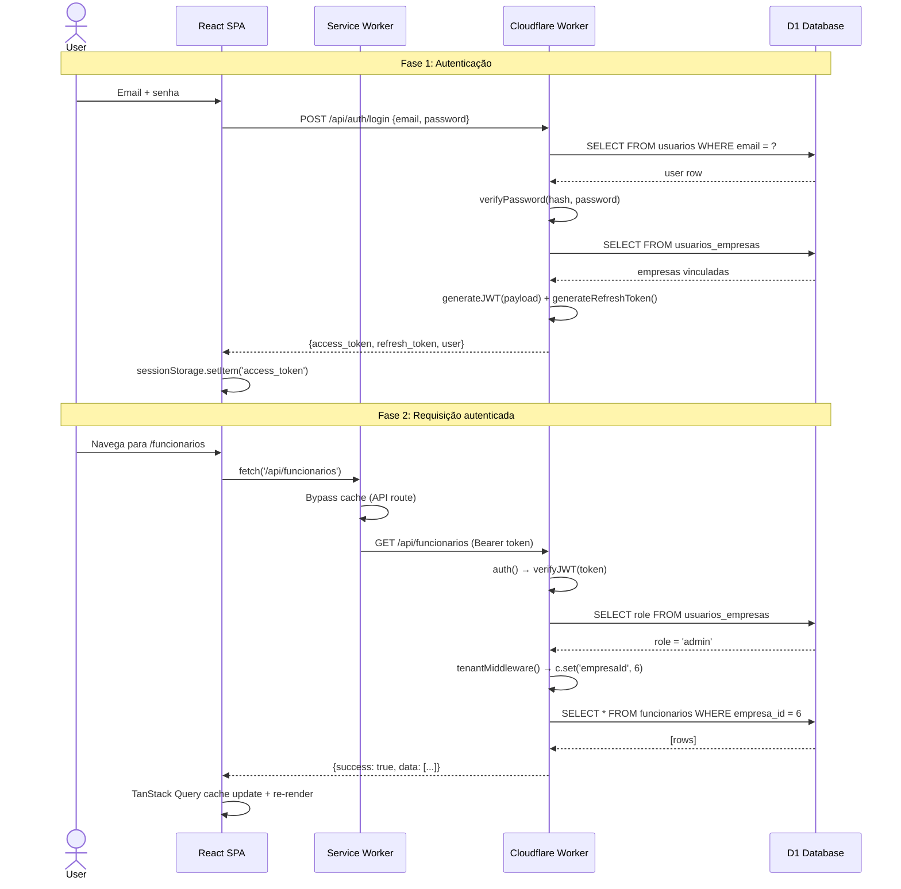

# AirTrust — Visão Geral da Arquitetura

> **Versão do documento:** 1.0 | **Data:** 2026-06-12 | **HEAD:** `5be104893`
> **Plataforma:** Cloudflare Workers + D1 + R2 + Pages + AI + Browser Rendering
> **Runtime:** Node.js v26 | **Wrangler:** 4.75 | **TypeScript:** 5.8.3

---

## Sumário

1. [Topologia Cloudflare](#1-topologia-cloudflare)
2. [Fluxo de Request End-to-End](#2-fluxo-de-request-end-to-end)
3. [Diagrama de Infraestrutura](#3-diagrama-de-infraestrutura)
4. [Ambientes](#4-ambientes)
5. [Cron Jobs](#5-cron-jobs)
6. [Service Worker (Frontend)](#6-service-worker-frontend)
7. [Vite Dev Proxy](#7-vite-dev-proxy)
8. [Middlewares Globais](#8-middlewares-globais)
9. [Build & Deploy Pipeline](#9-build--deploy-pipeline)
10. [Bindings Cloudflare](#10-bindings-cloudflare)
11. [Compatibilidade & Runtime](#11-compatibilidade--runtime)

---

## 1. Topologia Cloudflare

O AirTrust opera integralmente sobre a edge network da Cloudflare, utilizando seis produtos
principais que eliminam a necessidade de servidores tradicionais:

| Produto Cloudflare | Função no AirTrust | Escala |
|---|---|---|
| **Workers** | Backend API serverless (Hono v4 + TypeScript) | 126 rotas ativas |
| **D1** | Banco de dados SQL relacional (SQLite-compatível) | 378+ migrations |
| **R2** | Object storage para documentos, assets SCORM/H5P, PDFs, backups | Bucket: `airtrust-files` |
| **Pages** | Hospedagem do frontend SPA + deploy automático | Branch: `production` |
| **Workers AI** | Inferência LLM (Llama 3.1 8B) para assistente e tradução | Modelo: `@cf/meta/llama-3.1-8b-instruct` |
| **Browser Rendering** | Geração de PDFs server-side (fichas, relatórios, exportações) | API: `cloudflare/browser-rendering` |

### Vantagens da topologia serverless

- **Zero cold start perceptível** — Workers são pré-aquecidos na edge network (330+ datacenters)
- **D1 replica automaticamente** — Leituras na edge mais próxima; escritas na região primária (WEUR)
- **R2 sem egress fees** — Sem custo de transferência de dados
- **Escalabilidade automática** — Workers escalam horizontalmente sem configuração manual
- **Segurança integrada** — TLS termination, DDoS protection, WAF gerenciados pela plataforma

### Limitações conhecidas

| Limitação | Valor | Impacto no AirTrust |
|---|---|---|
| CPU time por request (Worker) | 30s (paid) | Exportações pesadas usam streaming; backups chunked |
| Duração de Cron Trigger | 30s | Backups grandes usam abordagem incremental |
| D1 row read limit por query | 25,000 rows | Paginação obrigatória; limit=200 max nas APIs |
| D1 storage por banco | 2 GB (paid) | Monitoramento ativo de crescimento |
| Workers AI requests/min (free) | 300 req/min | Cache de respostas do assistente (migration 0357) |

---

## 2. Fluxo de Request End-to-End

### 2.1 Requisição autenticada típica (ex: `GET /api/funcionarios`)

```
Browser (SPA)
    │
    ├─ 1. Usuário navega para /funcionarios
    │     React Router resolve <Funcionarios /> (lazy-loaded)
    │
    ├─ 2. Componente monta → TanStack Query dispara fetchWithAuth('/api/funcionarios')
    │     fetchWithAuth() injeta header Authorization: Bearer <access_token>
    │
    ▼
Service Worker (sw.js)
    │
    ├─ 3. Intercepta o fetch → API_BYPASS_PATHS → bypass (network-only)
    │
    ▼
Cloudflare Pages (airtrust.pages.dev)
    │
    ├─ 4. Serve index.html (SPA fallback) e assets estáticos com hash
    │
    ▼
Cloudflare Edge Network (DNS + TLS)
    │
    ├─ 5. TLS termination, DDoS protection, WAF rules
    │
    ▼
Cloudflare Worker (airtrust-api-production)
    │
    ├─ 6. Hono recebe o Request, middlewares executam em ordem:
    │     6a. X-AirTrust-Version header
    │     6b. requestIdMiddleware → X-Request-ID
    │     6c. noCacheMiddleware (se env != production + rotas críticas)
    │     6d. OPTIONS catch-all (preflight CORS)
    │     6e. cors() → resolveAllowedOrigin()
    │     6f. cacheControl()
    │     6g. Security Headers (CSP, X-Frame-Options, HSTS)
    │     6h. Multi-tenant guard (/api/*):
    │         ├─ isPublicPath? → next(), skip auth
    │         └─ else → auth() → verifyJWT() → tenantMiddleware()
    │     6i. domainEventProcessorMiddleware
    │
    ├─ 7. Roteador Hono: GET /api/funcionarios → funcionariosRoutes
    │
    ├─ 8. Handler: db.prepare('SELECT ... FROM funcionarios WHERE empresa_id = ? ...')
    │
    ▼
Cloudflare D1 (airtrust-db)
    │
    ├─ 9. SQLite engine processa query → resultados
    │
    ▼
Worker (continua)
    │
    ├─ 10. Resposta: { success: true, data: [...], pagination: {...} }
    │
    ▼
Browser (SPA)
    │
    ├─ 11. TanStack Query recebe response, atualiza cache (staleTime: 5min)
    │     React 19 re-render com dados
```

### 2.2 Requisição pública (ex: `GET /api/certificados/validar/:hash`)

Rotas públicas são whitelisted no `isPublicPath`. O multi-tenant guard aplica
`await next()` sem chamar `auth()` nem `tenantMiddleware()`.

### 2.3 Requisição de asset LMS (ex: `GET /api/lms/scorm/assets/...`)

Assets SCORM/H5P são servidos via **cookie JWT com TTL de 15 minutos**:
1. Frontend monta `<iframe>` → `/api/lms/scorm/launch/:matriculaId`
2. Worker gera JWT com `token_type: 'lms_asset'`, TTL 15min
3. Token setado como cookie `HttpOnly; Secure; SameSite=Strict`
4. Requisições do iframe incluem o cookie automaticamente
5. Middleware auth() detecta `token_type: 'lms_asset'` → autoriza

---

## 3. Diagrama de Infraestrutura



### Diagrama de sequência: Login + Primeira requisição autenticada



---

## 4. Ambientes

| Ambiente | Worker Name | Domínio | D1 Database | R2 Bucket |
|---|---|---|---|---|
| **Produção** | `airtrust-api-production` | `api.airtrust.online` | `airtrust-db` (WEUR) | `airtrust-storage` |
| **Staging** | `airtrust-api-staging` | `*.workers.dev` | `airtrust-db-staging` | `airtrust-storage-staging` |
| **Development** | `airtrust-api-development` | `*.workers.dev` | `airtrust-db-dev` | `airtrust-storage-dev` |
| **Local** | `airtrust-api` (wrangler dev) | `localhost:8787` | Local SQLite (Miniflare) | Local R2 (Miniflare) |

### Configuração Wrangler

| Arquivo | Ambiente |
|---|---|
| `worker-airtrust/wrangler.toml` | Base (3 ambientes) |
| `worker-airtrust/wrangler.dev.toml` | Local |
| `worker-airtrust/wrangler.deploy.toml` | Template para deploy |
| `*.deploy.*.tmp.toml` | Gerado no deploy (não versionado) |

### Variáveis de ambiente por ambiente

| Variável | Local | Dev | Staging | Prod |
|---|---|---|---|---|
| `ENVIRONMENT` | `development` | `development` | `staging` | `production` |
| `ENABLE_DEV_AUTH_BYPASS` | `true` (opcional) | `true` | **nunca** | **nunca** |
| `ENABLE_MANUAL_MIGRATIONS` | `true` (opcional) | **nunca** | **nunca** | **nunca** |
| `SIMULATOR_SHARED_SESSIONS_ENABLED` | `true` | `true` | `true` | `true` |

---

## 5. Cron Jobs

| Schedule | Horário (BRT) | Função | Status |
|---|---|---|---|
| `*/10 * * * *` | A cada 10 min | EdApp reconciliation | ❌ Desativado (no-op, 410) |
| `0 8 * * *` | 5h BRT | Notificações diárias + Stats + FRMS | ✅ Ativo |
| `0 3 * * *` | 0h BRT | Backup diário | ✅ Ativo |
| `0 4 * * SUN` | 1h BRT (dom) | Backup semanal | ✅ Ativo |
| `0 5 1 * *` | 2h BRT (dia 1) | Backup mensal | ✅ Ativo |

---

## 6. Service Worker (Frontend)

Versão: **`airtrust-v9`**. Registrado apenas em produção.

### Estratégias de cache

| Tipo de recurso | Estratégia | Cache |
|---|---|---|
| `index.html` / navegação SPA | **Network-first** | `airtrust-v9-runtime` |
| Assets com hash (`*.js`, `*.css`, etc.) | **Cache-first** | `airtrust-v9-assets` |
| API calls (`/api/*`) | **Network-only** (bypass) | — |
| LMS Player (`/lms/player/*`) | **Network-only** (bypass) | — |
| Minha Escala (`/escalas/minha-escala`) | **Offline-first** (app shell) | `airtrust-v9-runtime` |

### Ciclo de vida

```
Install → Activate → Fetch

Install:
  1. Deleta caches de versões antigas
  2. self.skipWaiting()

Activate:
  1. clients.claim() — toma controle de todas as páginas
  2. PostMessage: { type: 'AIRTRUST_UPDATE_AVAILABLE' }

Fetch:
  1. Verifica bypass (API, LMS player, dev server)
  2. Navegação SPA → network-first
  3. Assets com hash → cache-first com validação de MIME type
  4. Outros → cache-first com fallback
```

---

## 7. Vite Dev Proxy

```typescript
// vite.config.ts
const devProxyTarget = env.VITE_DEV_PROXY_TARGET || 'http://localhost:8787';
proxy: { '/api': { target: devProxyTarget, changeOrigin: true } }
```

| Risco | Severidade | Mitigação |
|---|---|---|
| Proxy para produção | 🔴 CRÍTICO | Console warning; `.env.local` não versionado |
| HMR em produção | 🟡 MÉDIO | `hmr.overlay: false`; SW só em PROD |
| Cache em dev | 🟡 MÉDIO | Headers anti-cache forçados |

---

## 8. Middlewares Globais

| # | Middleware | Escopo | Função |
|---|---|---|---|
| 1 | Version Header | `*` | `X-AirTrust-Version` |
| 2 | requestIdMiddleware | `*` | `X-Request-ID` UUID v4 |
| 3 | noCacheMiddleware (dev) | `*` (≠ production) | Anti-cache em staging/dev |
| 4 | noCacheMiddleware (rotas críticas) | Específico | Escalas, qualificações, FRMS, SGSO, EVD, certificados |
| 5 | OPTIONS catch-all | `*` | Preflight CORS manual |
| 6 | cors() | `*` | resolveAllowedOrigin() |
| 7 | cacheControl() | `*` | Headers de cache padrão |
| 8 | Security Headers | `*` | CSP (diferenciada SCORM vs padrão), HSTS (prod) |
| 9 | Multi-tenant guard | `/api/*` | auth() + tenantMiddleware() (com whitelist) |
| 10 | domainEventProcessor | `/api/*` | Eventos pós-resposta |

### Security Headers

**Rotas padrão**:
```
CSP: default-src 'self'; base-uri 'self'; frame-ancestors 'none'; object-src 'none';
  img-src 'self' data: https:; font-src 'self' data: https:;
  style-src 'self' 'unsafe-inline'; script-src 'self';
  connect-src 'self' https: http: ws: wss:; form-action 'self'; manifest-src 'self'
X-Frame-Options: DENY
X-Content-Type-Options: nosniff
Referrer-Policy: strict-origin-when-cross-origin
Permissions-Policy: camera=(), microphone=(), geolocation=()
```

**Rotas SCORM/H5P** (relaxada para iframes e scripts inline):
```
CSP: frame-ancestors *; script-src 'self' 'unsafe-inline';
  style-src 'self' 'unsafe-inline'; default-src 'self' blob: data: https: http:
```

**Produção adicional**: `Strict-Transport-Security: max-age=31536000; includeSubDomains; preload`

---

## 9. Build & Deploy Pipeline

### Build do Frontend

```bash
npm run build
# → vite build (target: es2020)
# → remove-duplicate-build-assets.sh
# → tsc --noEmit false

# Resultado: dist/client/
# ├── index.html (com __BUILD_VERSION__)
# ├── assets/
# │   ├── vendor-<hash>.js (react + react-dom)
# │   ├── router-<hash>.js (react-router-dom)
# │   ├── query-<hash>.js (@tanstack/react-query)
# │   ├── charts-<hash>.js (recharts, 432 KB)
# │   └── <287 chunks JS, 2 CSS, ~12 MB total>
# └── manifest.json
```

### Deploy do Frontend

```bash
npm run deploy:pages
# → preflight-clean-deploy.sh
# → npm run build
# → stamp-build-version.sh dist/client/index.html
# → wrangler pages deploy dist/client --project-name=airtrust --branch=production
```

### Deploy do Worker

```bash
npm run deploy:worker:only
# → deploy-worker-only.sh
#   Gera wrangler.deploy.<env>.toml com APP_VERSION e APP_BUILD_TIME
#   Gate de migrations (dupla confirmação)
#   wrangler deploy --env production
```

### Manual chunks

| Chunk | Dependências | Tamanho estimado |
|---|---|---|
| `vendor` | `react` + `react-dom` | ~130 KB |
| `router` | `react-router-dom` | ~60 KB |
| `query` | `@tanstack/react-query` | ~80 KB |
| `charts` | `recharts` | ~432 KB |
| `pdf` | `jspdf` | ~180 KB |
| `capture` | `html2canvas` | ~80 KB |
| `excel` | `xlsx` | ~500 KB |
| `forms` | `react-hook-form` + `zod` | ~40 KB |
| `dnd` | `@dnd-kit/*` | ~60 KB |

---

## 10. Bindings Cloudflare

```toml
[[d1_databases]]
binding = "DB"
database_name = "airtrust-db"

[[r2_buckets]]
binding = "BUCKET"
bucket_name = "airtrust-files"

[ai]
binding = "AI"
```

### Secrets (wrangler secret put, nunca versionados)

Os secrets de produção são gerenciados via `wrangler secret put` e nunca
comprometidos em arquivos rastreados. Categorias: autenticação JWT, email
transacional, WhatsApp/Twilio, PDF rendering, manutenção interna.

> **[INTERNO]** Os nomes e impactos dos secrets são documentados no registro
> interno de segurança. Consultar a documentação Wrangler para listar os secrets
> configurados em cada ambiente via CLI.

---

## 11. Compatibilidade & Runtime

```toml
compatibility_date = "2025-11-22"
compatibility_flags = ["nodejs_compat"]
```

### Limites do Worker (paid plan)

| Limite | Valor |
|---|---|
| CPU time por request | 30s |
| Subrequests por request | 50 |
| Script size (comprimido) | 3 MB |
| Cron triggers | 5 (4 em uso) |

### Dependências críticas (backend)

| Biblioteca | Versão | Uso |
|---|---|---|
| `hono` | `^4.10.1` | Framework HTTP |
| `@hono/zod-validator` | `^0.5.0` | Validação Zod |
| `jose` | (bundle) | JWT sign/verify |

---

## Apêndice A: Estrutura do Worker

```
worker-airtrust/src/
├── index.ts                    # Entry point + montagem de rotas (938 linhas)
├── types/index.ts              # Env, Variables, JwtPayload, entidades
├── config/allowed-origins.ts   # CORS origin resolver
├── middleware/
│   ├── auth.ts                 # JWT verify + role resolution (441 linhas)
│   ├── tenant.ts               # Multi-tenant isolation (563 linhas)
│   ├── cors.ts, cache.ts, no-cache.ts
│   ├── error-handler.ts, rate-limit.ts, rbac.ts
│   ├── requestId.ts, domainEventProcessor.ts
│   └── platform-support.ts
├── routes/ (112 arquivos)
│   ├── auth.ts (1554 linhas)
│   ├── funcionarios.ts, qualificacoes/ (9 arquivos)
│   ├── frms*.ts (9 arquivos), escalas*.ts, lms*.ts (6)
│   ├── sgso*.ts (5), simuladores*.ts (17)
│   ├── dashboard.ts, backup.ts, empresas.ts
│   ├── exportacao.ts, importacao.ts
│   └── ...
├── lib/
│   ├── frms/ (27 arquivos, ~6000+ linhas)
│   ├── rbac/, audit/, email.ts
│   └── status/
├── utils/
│   ├── security.ts (JWT, hash, tokens)
│   ├── db.ts, db-schema.ts
│   └── twilio.ts, whatsapp*.ts
├── cron/
│   ├── scheduled-handler.ts
│   └── notificacoes.ts
└── runtime/
    ├── worker-entrypoint.ts
    └── api-bootstrap.ts
```

## Apêndice B: Estrutura do Frontend

```
src/react-app/
├── main.tsx                    # Entry point + providers + SW
├── App.tsx                     # Router + lazy imports (35+ páginas)
├── index.css                   # Tailwind + Design System
├── components/
├── pages/
│   ├── LoginSimple.tsx, Funcionarios.tsx
│   ├── frms/ (12 páginas), escalas/ (5), lms/ (10)
│   ├── sgso/ (4), simuladores/ (10+)
│   └── admin/, Configuracoes/
├── config/
│   ├── api.ts (fetchWithAuth, token refresh)
│   └── feature-flags.ts
├── context/AuthContext.tsx
├── hooks/ (40+ hooks: queries, mutations, domain)
├── stores/ (2 Zustand stores: escalas only)
├── i18n/ (LanguageProvider, ~200+ translation keys)
├── lib/query-client.ts
├── theme/ThemeProvider.tsx
└── utils/lazyWithRetry.ts
```

---

## 12. Remoção de rotas mortas em `lookup.ts` (2026-07-25)

`lookup.ts` mantinha handlers GET/POST/DELETE para `/api/funcoes` e `/api/setores`
com apenas `auth()` (sem `requireRole`, sem `registrarAuditoria`). Esses handlers
nunca eram alcançados em runtime: `index.ts` monta `funcoes.ts` (`/api/funcoes`) e
`setores.ts` (`/api/setores`) — ambos com RBAC (`requireRole('admin'|'manager')`),
escopo de tenant e auditoria completos — antes de montar `lookup.ts` em `/api`
(linhas 459, 469 e 524 respectivamente). Verificado empiricamente reproduzindo a
mesma ordem de registro do Hono fora do runtime do Worker: para GET/POST/DELETE em
ambos os recursos, o roteador que responde é sempre `funcoes.ts`/`setores.ts`,
nunca `lookup.ts`.

A remoção do código morto em `lookup.ts` não altera comportamento observável de
nenhum consumidor. Ela elimina um risco latente: se a ordem de montagem em
`index.ts` mudar no futuro, os handlers sem RBAC/auditoria voltariam a ser
alcançáveis.

**Fora do escopo desta entrega (não verificado, não declarar como concluído):**
- Matriz de isolamento multi-tenant executada contra ambiente real (não existe
  script funcional no repositório nesta data).
- Restore rehearsal real de backup (SHA-256, restauração em D1/SQLite
  descartável, `integrity_check`/`foreign_key_check`, RTO/RPO medidos).
- Classificação individual das migrations 0440–0443 quanto a ledger/aplicação em
  produção (os 4 arquivos existem no repositório; status de aplicação não foi
  auditado nesta passagem).
- Reconciliação de staging.
