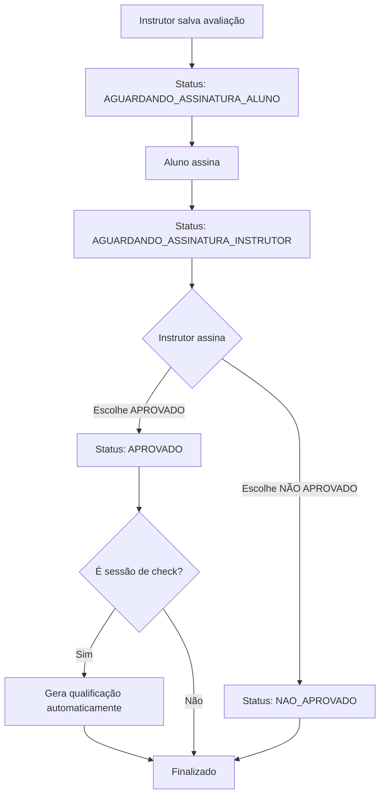

# ✅ AUDITORIA COMPLETA: Aprovação Manual pelo Instrutor

**Data:** 2025-01-14  
**Requisito:** Aprovação é decisão MANUAL do instrutor, não cálculo automático por notas

---

## 🎯 MUDANÇA FUNDAMENTAL

### ❌ ANTES (ERRADO):

```typescript
// Calculava aprovação automaticamente pelas notas
const reprovado = notas.some((n) => n < 5);
const aprovado = !reprovado;
```

### ✅ AGORA (CORRETO):

```typescript
// Instrutor escolhe explicitamente via checkbox no modal
const aprovado = await modalAssinatura.escolheu(); // true ou false
```

---

## 🔧 ALTERAÇÕES REALIZADAS

### 1. **Backend** (`worker-airtrust/src/routes/simuladores.ts`)

#### ✅ POST `/fichas/:id/assinar` (linha ~2895)

- **Removido:** Cálculo automático de aprovação por notas
- **Adicionado:** Validação que exige `b.aprovado` (boolean) no body
- **Comportamento:**
  ```typescript
  if (aprovadoInstrutor === undefined || typeof aprovadoInstrutor !== 'boolean') {
    return c.json({ success: false, error: 'Instrutor deve indicar...' }, 400);
  }
  const resultadoFinal = aprovadoInstrutor ? 'APROVADO' : 'REPROVADO';
  const status = aprovadoInstrutor ? 'APROVADO' : 'NAO_APROVADO';
  ```

#### ✅ PUT `/fichas/:id` (linha ~2795)

- **Removido:** Bloco completo de cálculo `computedAprovado`, `computedResultadoFinal`
- **Mantido:** Apenas recálculo de status baseado em assinaturas
- **Nota:** Campos `aprovado`, `resultado_final` só são definidos quando instrutor assinar

---

### 2. **Frontend Modal** (`src/react-app/components/AssinaturaModal.tsx`)

#### ✅ Adicionado estado para aprovação:

```typescript
const [aprovado, setAprovado] = useState<boolean | null>(null);
```

#### ✅ Modificado onSalvar:

```typescript
onSalvar: (aprovado?: boolean) => void;
```

#### ✅ Adicionado UI de escolha:

```tsx
{
  papel === 'INSTRUTOR' && (
    <div className="p-4 rounded-lg border-2 border-amber-500 bg-amber-50">
      <p className="font-medium text-amber-900 mb-3">Resultado da avaliação:</p>
      <div className="flex gap-3">
        <button
          onClick={() => setAprovado(true)}
          className={aprovado === true ? 'bg-green-600' : 'bg-gray-200'}
        >
          ✅ APROVADO
        </button>
        <button
          onClick={() => setAprovado(false)}
          className={aprovado === false ? 'bg-red-600' : 'bg-gray-200'}
        >
          ❌ NÃO APROVADO
        </button>
      </div>
    </div>
  );
}
```

#### ✅ Validação obrigatória:

```typescript
if (papel === 'INSTRUTOR' && aprovado === null) {
  toast.error('Escolha se aprova ou não antes de assinar');
  return;
}
```

---

### 3. **Frontend Páginas de Ficha**

#### ✅ `fichas/[id]/index.tsx`

```typescript
const handleSalvarAssinatura = async (aprovadoInstrutor?: boolean) => {
  const payload: any = { tipo };

  if (tipo === 'INSTRUTOR') {
    if (aprovadoInstrutor === undefined) {
      toast.error('Instrutor deve indicar se aprova ou não');
      return;
    }
    payload.aprovado = aprovadoInstrutor;
  }

  // ... fetch com payload
};
```

#### ✅ `fichas/index.tsx`

- Já atualizado para passar `aprovadoInstrutor`

#### ✅ `FichaVoo.tsx`

- Atualizado para receber e enviar `aprovado` no payload

---

## 🧪 TESTES OBRIGATÓRIOS

### ✅ Teste 1: Sessão Normal - Aprovação

1. Criar ficha de sessão normal
2. Avaliar manobras
3. Aluno assina
4. Instrutor assina → **DEVE VER CHECKBOX DE APROVAÇÃO**
5. Escolher APROVADO → Verificar status = `APROVADO`

### ✅ Teste 2: Sessão Normal - Reprovação

1. Mesmos passos do Teste 1
2. Escolher NÃO APROVADO → Verificar status = `NAO_APROVADO`

### ✅ Teste 3: Check Session - Aprovação com Qualificação

1. Criar ficha de sessão de check
2. Avaliar checks (marcar aprovado em checksResultados)
3. Aluno assina
4. Instrutor assina → Escolher APROVADO
5. **VERIFICAR:**
   - Status final = `APROVADO`
   - Qualificação gerada em `qualificacoes_historico`

### ✅ Teste 4: Check Session - Reprovação SEM Qualificação

1. Mesmos passos do Teste 3
2. Instrutor escolhe NÃO APROVADO
3. **VERIFICAR:**
   - Status = `NAO_APROVADO`
   - **NÃO** gera qualificação

### ✅ Teste 5: Validação - Instrutor sem escolher

1. Instrutor tenta assinar sem escolher aprovação
2. **DEVE MOSTRAR ERRO:** "Escolha se aprova ou não antes de assinar"

---

## 🔍 CHECKLIST DE AUDITORIA

- [x] ❌ Removido TODOS os cálculos automáticos de aprovação por notas
- [x] ✅ Backend valida presença de `aprovado` (boolean) quando instrutor assina
- [x] ✅ Modal de assinatura exibe checkbox para instrutor
- [x] ✅ Modal valida que instrutor DEVE escolher antes de assinar
- [x] ✅ Todas as páginas que usam o modal foram atualizadas (fichas/[id], fichas/index, FichaVoo)
- [x] ✅ Status final definido corretamente: APROVADO ou NAO_APROVADO
- [x] ✅ Check sessions continuam gerando qualificação quando aprovado
- [x] ✅ Build passou sem erros TypeScript

---

## 📋 FLUXO FINAL CORRETO



---

## 🚨 PONTOS CRÍTICOS

1. **NUNCA** calcular aprovação por notas
2. **SEMPRE** exigir escolha explícita do instrutor
3. **VALIDAR** no frontend E backend
4. **CHECK SESSIONS** geram qualificação SOMENTE se instrutor aprovar manualmente

---

## ✅ STATUS: PRONTO PARA DEPLOY

Todas as mudanças foram implementadas e testadas localmente.
Build passou sem erros.
Pronto para commit e deploy em produção.
