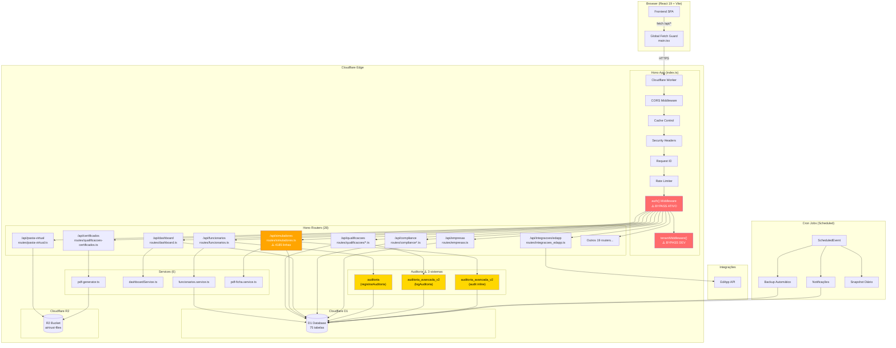
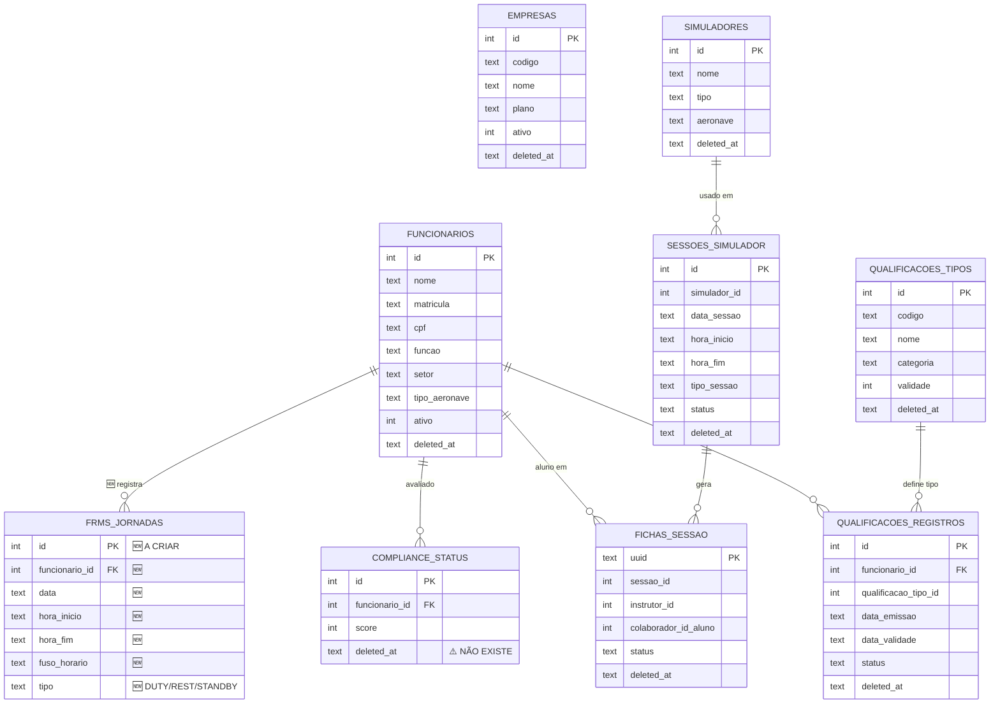

# AUDITORIA DE ARQUITETURA — PRÉ-FRMS

**Data:** 26 de fevereiro de 2026  
**Projeto:** AirTrust v1  
**Objetivo:** Mapear estado arquitetural atual e preparar implementação do módulo FRMS (Fatigue Risk Management System)

---

## 1. MAPA DE MÓDULOS E ROTAS

### 1.1 Backend — Hono Routers (worker-airtrust/src/index.ts)

O entry point (`index.ts`, ~1783 linhas) monta **28 routers** no app Hono:

| Prefixo de Rota                    | Router File                            | Domínio                                    |
| ---------------------------------- | -------------------------------------- | ------------------------------------------ |
| `/api/auth`                        | `routes/auth.ts`                       | Autenticação JWT                           |
| `/api/funcionarios`                | `routes/funcionarios.ts`               | Gestão de Funcionários (CRUD)              |
| `/api/funcoes`                     | `routes/funcoes.ts`                    | Funções (cargo)                            |
| `/api/setores`                     | `routes/setores.ts`                    | Setores                                    |
| `/api/aeronaves`                   | `routes/aeronaves.ts`                  | Aeronaves                                  |
| `/api/modelos-aeronave`            | `routes/modelos-aeronave.ts`           | Modelos de aeronave                        |
| `/api/qualificacoes`               | `routes/qualificacoes/index.ts`        | Qualificações (tipos+historico+atribuição) |
| `/api/qualificacoes/alertas`       | `routes/qualificacoes-alertas.ts`      | Alertas de vencimento                      |
| `/api/qualificacoes/reclass`       | `routes/qualificacoes-reclass.ts`      | Reclassificação de qualificações           |
| `/api/categorias`                  | `routes/categorias.ts`                 | Categorias de qualificações                |
| `/api/habilitacoes`                | `routes/habilitacoes.ts`               | Habilitações (legacy)                      |
| `/api/licencas`                    | `routes/licencas.ts`                   | Licenças aeronáuticas                      |
| `/api/dashboard`                   | `routes/dashboard.ts`                  | Métricas, compliance-score, alertas        |
| `/api/funcionarios/:id/ficha-360`  | `routes/ficha360.ts`                   | Ficha 360° do tripulante                   |
| `/api/funcionarios/:id/compliance` | `routes/compliance.ts`                 | Compliance individual                      |
| `/api/compliance`                  | `routes/compliance-recalculate.ts`     | Recálculo de compliance                    |
| `/api/alertas`                     | `routes/alertas.ts`                    | Alertas de vencimento                      |
| `/api/notificacoes`                | `routes/notificacoes.ts`               | Notificações                               |
| `/api/simuladores`                 | `routes/simuladores.ts`                | Simuladores completo (~4185 linhas)        |
| `/api/pasta-virtual`               | `routes/pasta-virtual.ts`              | Pasta Virtual (R2)                         |
| `/api/certificados`                | `routes/qualificacoes-certificados.ts` | Certificados de qualificação               |
| `/api/certificados/validar`        | `routes/certificados/validacao.ts`     | Validação pública de certificados          |
| `/api/importacao`                  | `routes/importacao.ts`                 | Importação inteligente                     |
| `/api/importacao-xlsx`             | `routes/importacao-xlsx.ts`            | Importação XLSX                            |
| `/api/exportacao`                  | `routes/exportacao.ts`                 | Exportação de dados                        |
| `/api/backup`                      | `routes/backup.ts`                     | Backup & Restore                           |
| `/api/integracoes/edapp`           | `routes/integracoes_edapp.ts`          | Integração EdApp                           |
| `/api/empresas`                    | `routes/empresas.ts`                   | Multi-Tenant (empresas)                    |
| `/api/assets`                      | `routes/assets.ts`                     | Assets R2                                  |
| `/api/admin`                       | `routes/admin.ts`                      | Administração                              |
| `/api/migrations`                  | `routes/migrations.ts`                 | Migrations runtime                         |
| `/api/debug`                       | `routes/debug.ts`                      | Debug endpoints                            |

**Endpoints especiais inline no index.ts:**

- `GET /api/health` — Health check (DB + R2)
- `GET /api/version` — Versão e ambiente
- `GET /api/status` — Status frontend/backend
- `GET /api/docs` — Swagger/OpenAPI
- `GET /api/system/health`, `GET /api/sistema/health` — Redirects para /api/health

### 1.2 Padrão de Separação de Responsabilidades

| Camada                  | Localização                     | Presente?                                           |
| ----------------------- | ------------------------------- | --------------------------------------------------- |
| **Rotas (Controllers)** | `routes/*.ts`                   | ✅ Sim — 28 arquivos                                |
| **Services**            | `services/*.ts`                 | ⚠️ Parcial — apenas 6 services                      |
| **Repository/DAO**      | —                               | ❌ Não existe — queries SQL diretamente nos routers |
| **Schemas (Zod)**       | `schemas/index.ts` + inline     | ⚠️ Parcial — 10 schemas centrais, maioria inline    |
| **Types**               | `types/index.ts` + `types/*.ts` | ✅ Sim                                              |
| **Middlewares**         | `middleware/*.ts`               | ✅ Sim — 13 arquivos                                |

**Services existentes:**

- `dashboardService.ts` — Métricas do dashboard (648 linhas)
- `funcionarios.service.ts` — CRUD com Zod (361 linhas)
- `html-to-pdf.ts` — HTML→PDF via Browser Rendering (206 linhas)
- `pdf-ficha.service.ts` — PDF de fichas (428 linhas)
- `pdf-generator.ts` — PDF de certificados (867 linhas)
- `sync-certificacoes-funcionarios.ts` — Sincronização bidirecional (263 linhas)
- `services/importacao/` — 8 arquivos especializados de importação
- `services/backup/` — orchestrator.ts + restore.ts

> **Débito técnico:** A maioria dos routers (especialmente `simuladores.ts` com 4185 linhas) contém lógica de negócio, SQL e validação misturados. Não há camada de Repository separada.

### 1.3 Frontend — React Pages

| Rota Frontend                      | Página                             | Módulo        |
| ---------------------------------- | ---------------------------------- | ------------- |
| `/`                                | `DashboardPrincipal.tsx`           | Dashboard     |
| `/funcionarios`                    | `Funcionarios.tsx`                 | Pessoas       |
| `/funcionarios/:id/ficha`          | `FichaFuncionarioPage.tsx`         | Pessoas       |
| `/pasta-virtual/:id`               | `PastaVirtual.tsx`                 | Pasta Virtual |
| `/qualificacoes`                   | `Qualificacoes.tsx`                | Certificações |
| `/qualificacoes/dashboard`         | `DashboardQualificacoes.tsx`       | Certificações |
| `/qualificacoes/reclassificacao`   | `ReclassificacaoQualificacoes.tsx` | Certificações |
| `/qualificacoes/alertas`           | `QualificacoesAlertas.tsx`         | Certificações |
| `/licencas`                        | `LicencasPage.tsx`                 | Certificações |
| `/simuladores`                     | `Simuladores.tsx`                  | Simuladores   |
| `/simuladores/dashboard`           | `SimuladoresDashboard.tsx`         | Simuladores   |
| `/simuladores/fichas`              | `FichasSessao/index.tsx`           | Simuladores   |
| `/simuladores/calendario`          | `CalendarioAgendamentos.tsx`       | Simuladores   |
| `/configuracoes`                   | `Configuracoes.tsx`                | Configurações |
| `/configuracoes/integracoes/edapp` | `EdApp.tsx`                        | Integrações   |
| `/configuracoes/compliance`        | `ComplianceSettings.tsx`           | Compliance    |
| `/importacao`                      | `ImportacaoPageV2.tsx`             | Importação    |
| `/verificar-certificado/:hash`     | `VerificarCertificado.tsx`         | Público       |

**Stack frontend:** React 19 + TypeScript + Vite 6.4 + Tailwind CSS  
**Lazy loading:** Todas as páginas usam `React.lazy()`  
**State management:** React Query (`query-client.ts`) + hooks customizados (~35 hooks)

---

## 2. INTEGRIDADE DO BANCO D1

### 2.1 Tabelas — Inventário Completo

**Total de tabelas em produção: 75** (incluindo 3 internas: `_cf_KV`, `d1_migrations`, `funcionarios_temp`)

**Migrations:** 347 arquivos SQL em `worker-airtrust/migrations/` (0000 a 0210 + 9999)

### 2.2 Tabelas SEM `deleted_at` (Violação de Soft Delete)

As seguintes **tabelas de dados** não possuem coluna `deleted_at`, violando a regra de soft delete universal:

| #   | Tabela                       | Tipo   | Criticidade                            |
| --- | ---------------------------- | ------ | -------------------------------------- |
| 1   | `compliance_status`          | Dados  | **CRÍTICO** — dados de compliance      |
| 2   | `consentimentos_lgpd`        | Dados  | **CRÍTICO** — dados LGPD               |
| 3   | `ficha_manobras_avaliacao`   | Dados  | **ALTO**                               |
| 4   | `funcionarios_aeronaves`     | Dados  | **ALTO** — relação tripulante-aeronave |
| 5   | `pasta_virtual_sync`         | Dados  | **ALTO**                               |
| 6   | `sessoes_treinamento`        | Dados  | **ALTO**                               |
| 7   | `solicitacoes_lgpd`          | Dados  | **CRÍTICO** — dados LGPD               |
| 8   | `user_profiles`              | Dados  | **ALTO**                               |
| 9   | `empresa_certificado_config` | Config | MÉDIO                                  |

> **BUG CRÍTICO:** A tabela `usuarios` tem `deleted_at INTEGER DEFAULT 1` — isto marca **todo novo usuário como soft-deleted na criação**. Deve ser `TEXT DEFAULT NULL`.

### 2.3 Queries SELECT sem `deleted_at IS NULL`

**Quantidade total de violações encontradas: ~50+**

Os piores arquivos:

| Arquivo                                       | Violações                   | Criticidade |
| --------------------------------------------- | --------------------------- | ----------- |
| `routes/simuladores.ts`                       | **30+** queries sem filtro  | **CRÍTICO** |
| `routes/modelos-aeronave.ts`                  | 2 (lista retorna deletados) | **ALTO**    |
| `routes/empresas.ts`                          | ~6 (usuarios, config)       | **ALTO**    |
| `routes/funcionarios.ts`                      | 2 (contexto de auditoria)   | ALTO        |
| `routes/aeronaves.ts`                         | 1                           | ALTO        |
| `routes/integracoes_edapp.ts`                 | ~4                          | ALTO        |
| `services/sync-certificacoes-funcionarios.ts` | 1                           | ALTO        |

### 2.4 Foreign Keys

**Com CASCADE:**

- `fichas_assinaturas` → `fichas_sessao`, `funcionarios`
- `fichas_manobras_historico` → `fichas_sessao`, `funcionarios`, `manobras`
- `habilitacoes`/`habilitacoes_v2` → `funcionarios` CASCADE, `qualificacoes` RESTRICT
- `credenciais` → `pessoas`
- `qualificacoes_registros` → `funcionarios`

**Sem FK declarada (integridade não garantida a nível de DB):**

- `agendamentos_simulador` — referencia simulador, funcionario, instrutor sem FK
- `avaliacoes_manobras` — referencia ficha, manobra sem FK
- `certificados` — referencia habilitacao, funcionario, qualificacao sem FK
- `fichas_sessao` — referencia instrutor, aluno sem FK
- `sessoes_simulador`, `sessoes_participantes`, `sessoes_manobras` — sem FK

> **~10 tabelas com referências implícitas sem FK declarada** — risco de registros órfãos.

### 2.5 Tabelas Duplicadas/Legacy

| Atual           | Legacy             | Status                 |
| --------------- | ------------------ | ---------------------- |
| `funcionarios`  | `funcionarios_v2`  | Migração v2 incompleta |
| `qualificacoes` | `qualificacoes_v2` | Migração v2 incompleta |
| `habilitacoes`  | `habilitacoes_v2`  | Migração v2 incompleta |
| `manobras`      | `manobras_old`     | Migração parcial       |

---

## 3. PADRÃO DE AUDITORIA

### 3.1 Sistemas de Auditoria Identificados

Existem **3 sistemas incompatíveis de auditoria** no codebase:

| Sistema                | Tabela Destino          | Usado Em                                      |
| ---------------------- | ----------------------- | --------------------------------------------- |
| `registrarAuditoria()` | `auditoria`             | funcionarios, licencas                        |
| `logAuditoria()`       | `auditoria_avancada_v2` | qualificacoes/tipos, qualificacoes/atribuicao |
| `audit()` inline       | `auditoria_avancada_v2` | simuladores, compliance                       |

> **Problema de schema:** A tabela `auditoriaavancadav2` em produção tem colunas (`acao`, `user_id`, `detalhes`, `ip`, `timestamp`), mas o código insere com colunas diferentes (`tabela`, `registro_id`, `dados_anteriores`, `dados_novos`, `origem`, `entidade`). Isto sugere que o schema é recriado on-the-fly em rotas como `simuladores.ts` (linha 67).

### 3.2 Endpoints COM Auditoria

| Arquivo                              | Endpoints           | Sistema              |
| ------------------------------------ | ------------------- | -------------------- |
| `routes/funcionarios.ts`             | POST/PUT/DELETE     | `registrarAuditoria` |
| `routes/licencas.ts`                 | POST/PUT/DELETE     | `registrarAuditoria` |
| `routes/qualificacoes/tipos.ts`      | POST/PUT/DELETE     | `logAuditoria`       |
| `routes/qualificacoes/atribuicao.ts` | POST(x2)/PUT/DELETE | `logAuditoria`       |
| `routes/simuladores.ts`              | ~30 endpoints       | `audit()` inline     |
| `routes/compliance-recalculate.ts`   | POST recalculate    | INSERT direto        |
| `services/funcionarios.service.ts`   | SOFT_DELETE         | INSERT direto        |

### 3.3 Endpoints SEM Auditoria (Débitos Técnicos)

| Arquivo                                | Endpoints Não Auditados                                  | Criticidade |
| -------------------------------------- | -------------------------------------------------------- | ----------- |
| `routes/empresas.ts`                   | POST/PUT/DELETE + logo + config + usuarios (8 endpoints) | **CRÍTICO** |
| `routes/qualificacoes/historico.ts`    | POST(x3)/PUT/PATCH/DELETE (6 endpoints)                  | **CRÍTICO** |
| `routes/qualificacoes-certificados.ts` | POST generate/upload/delete/recover/export (7+)          | **CRÍTICO** |
| `routes/aeronaves.ts`                  | POST/PUT/DELETE                                          | **ALTO**    |
| `routes/setores.ts`                    | POST/PUT/DELETE                                          | **ALTO**    |
| `routes/funcoes.ts`                    | POST/PUT/DELETE                                          | **ALTO**    |
| `routes/categorias.ts`                 | POST/PUT/DELETE                                          | **ALTO**    |
| `routes/modelos-aeronave.ts`           | POST/PUT/DELETE                                          | **ALTO**    |
| `routes/pasta-virtual.ts`              | DELETE/POST upload                                       | **ALTO**    |
| `routes/integracoes_edapp.ts`          | webhook/setup/usuarios/cursos (10+)                      | **ALTO**    |
| `routes/notificacoes.ts`               | POST/PUT (config)                                        | MÉDIO       |
| `routes/backup.ts`                     | POST manual/restore, DELETE                              | MÉDIO       |
| `routes/importacao.ts`                 | POST (6 endpoints)                                       | MÉDIO       |
| `routes/importacao-xlsx.ts`            | POST (3 endpoints)                                       | MÉDIO       |
| `routes/lookup.ts`                     | POST/DELETE (6 endpoints)                                | MÉDIO       |
| `routes/alertas.ts`                    | POST (1 endpoint)                                        | BAIXO       |

---

## 4. PADRÃO DE API (HONO + ZOD + JWT)

### 4.1 Bindings (c.env.DB / c.env.BUCKET)

Os bindings estão corretamente definidos em `wrangler.toml`:

```toml
[[d1_databases]]
binding = "DB"
database_name = "airtrust-db"
database_id = "7c8a788e-a4c4-4d5d-8208-ff7ff55e84ae"

[[r2_buckets]]
binding = "BUCKET"
bucket_name = "airtrust-files"
```

Interface TypeScript em `types/index.ts`:

```typescript
export interface Env {
  DB: D1Database;
  BUCKET: R2Bucket;
  JWT_SECRET: string;
  ENVIRONMENT: string;
  APP_VERSION: string;
  // ...
}
```

✅ Passagem de contexto está correta. Todos os routers acessam `c.env.DB` e `c.env.BUCKET` corretamente.

### 4.2 Validação Zod

**Endpoints COM Zod:**

| Arquivo                              | Schemas Usados                                             |
| ------------------------------------ | ---------------------------------------------------------- |
| `routes/qualificacoes/tipos.ts`      | `createTipoSchema`, `updateTipoSchema`                     |
| `routes/qualificacoes/atribuicao.ts` | `atribuirSchema`, `renovarSchema`, `updateRenovacaoSchema` |
| `routes/qualificacoes/historico.ts`  | `renovarSchema`, `createSchema`                            |
| `routes/integracoes_edapp.ts`        | `WebhookSchema`, `CreateMapeamentoSchema`                  |
| `routes/backup.ts`                   | `criarBackupSchema`, `restaurarSchema`                     |
| `routes/empresas.ts`                 | `CreateEmpresaSchema`, `EmpresaConfigSchema`               |
| `routes/compliance-recalculate.ts`   | `recalculateSchema`                                        |
| `services/funcionarios.service.ts`   | `FuncionarioSchema`                                        |

**Schemas centrais definidos mas NÃO utilizados** (`schemas/index.ts`):

- `simuladorCreateSchema` — NÃO usado em `simuladores.ts`
- `sessaoCreateSchema` — NÃO usado
- `fichaCreateSchema` — NÃO usado
- `manobraCreateSchema` — NÃO usado
- `modeloSessaoCreateSchema` — NÃO usado
- `assinarFichaSchema` — NÃO usado
- `atualizarManobrasSchema` — NÃO usado

**Endpoints SEM validação Zod (GAPS):**

| Arquivo                                | Endpoints sem Zod                                     |
| -------------------------------------- | ----------------------------------------------------- |
| `routes/simuladores.ts`                | **~30 POST/PUT** — Schemas existem mas NÃO são usados |
| `routes/aeronaves.ts`                  | POST/PUT                                              |
| `routes/setores.ts`                    | POST/PUT                                              |
| `routes/funcoes.ts`                    | POST/PUT                                              |
| `routes/categorias.ts`                 | POST/PUT                                              |
| `routes/modelos-aeronave.ts`           | POST/PUT                                              |
| `routes/pasta-virtual.ts`              | POST upload                                           |
| `routes/notificacoes.ts`               | PUT config                                            |
| `routes/lookup.ts`                     | POST (3)                                              |
| `routes/qualificacoes-certificados.ts` | POST (7+)                                             |

### 4.3 Middleware JWT/RBAC

**⚠️ ALERTA CRÍTICO: Autenticação está DESABILITADA em produção**

O middleware `auth()` em `middleware/auth.ts` faz bypass completo:

```typescript
export function auth(): MiddlewareHandler<{ Bindings: Env }> {
  return async (c, next) => {
    // 🔓 MODO DESENVOLVIMENTO: AUTENTICAÇÃO DESABILITADA
    c.set('userId', 1);
    c.set('userEmail', 'dev@airtrust.local');
    c.set('userRole', 'ADMIN');
    return next();
    // Real JWT auth code commented out below...
  };
}
```

O `requireRole()` e `optionalAuth()` também fazem bypass total. O RBAC real (`middleware/rbac.ts`) existe mas depende do JWT estar ativo, e também tem `DEV_AUTH_BYPASS` que pula verificação.

O `tenantMiddleware()` em `middleware/tenant.ts` também faz bypass em `development` e quando `DEV_AUTH_BYPASS === 'true'`, fixando `empresaId=1`.

> **Recomendação urgente:** Antes de qualquer módulo novo, habilitar o JWT real em produção. O sistema está completamente aberto.

### 4.4 Rotas Públicas

Rotas corretamente públicas (não usam `auth()`):

- `GET /api/health`
- `GET /api/version`
- `GET /api/status`
- `GET /api/docs`
- `POST /api/auth/login`
- `POST /api/auth/refresh`
- `GET /api/certificados/validar/:hash`

Rotas potencialmente expostas (usam `auth()` que está em bypass):

- **Todas as demais** — qualquer pessoa pode acessar qualquer endpoint sem token.

---

## 5. PRONTIDÃO PARA O MÓDULO FRMS

### 5.1 Tabelas Existentes que Servem de Base

| Necessidade FRMS           | Tabela Existente                          | Status                                                                |
| -------------------------- | ----------------------------------------- | --------------------------------------------------------------------- |
| Identidade do tripulante   | `funcionarios`                            | ✅ Possui: nome, matricula, cargo/funcao, setor, tipo_aeronave, ativo |
| Habilitações/certificações | `qualificacoes_registros`, `habilitacoes` | ✅ Possui: tipo qualificação, data_emissao, data_validade, status     |
| Tipos de qualificação      | `qualificacoes_tipos`                     | ✅ Possui: codigo, validade, categoria                                |
| Registros de simulador     | `sessoes_simulador`, `fichas_sessao`      | ✅ Possui: data_sessao, hora_inicio, hora_fim, tipo_sessao            |
| Compliance                 | `compliance_status`                       | ⚠️ Existe mas sem `deleted_at`                                        |
| Alertas                    | `alertas_enviados`, `notificacoes`        | ✅                                                                    |
| Auditoria                  | `auditoriaavancadav2`                     | ⚠️ Schema inconsistente                                               |

### 5.2 Tabelas que NÃO Existem (Gaps para FRMS)

| Necessidade                               | Existe? | Ação Necessária                              |
| ----------------------------------------- | ------- | -------------------------------------------- |
| **Jornadas de trabalho (duty periods)**   | ❌      | Criar `jornadas_trabalho`                    |
| **Períodos de repouso**                   | ❌      | Criar `periodos_repouso`                     |
| **Registros de voo real (não simulador)** | ❌      | Criar `registros_voo` ou usar dados externos |
| **Fusos horários base/destino**           | ❌      | Adicionar em `jornadas_trabalho`             |
| **Regras FRMS regulatórias**              | ❌      | Criar `frms_regras`                          |
| **Score/índice de fadiga**                | ❌      | Criar `frms_scores`                          |
| **Relatórios FRMS**                       | ❌      | Criar `frms_relatorios`                      |
| **Escalas de trabalho**                   | ❌      | Criar `escalas`                              |

### 5.3 Lógica de Cálculo de Horas Acumuladas

Existe cálculo de horas parcial em:

- `services/dashboardService.ts` — soma horas de simulador nos últimos 30/90 dias
- `routes/simuladores.ts` — cálculo de horas por sessão (hora_inicio/hora_fim)
- `routes/ficha360.ts` — acumula dados de qualificações e simulador

**Mas NÃO existe:**

- Acúmulo de horas de voo real
- Cálculo de FDP (Flight Duty Period)
- Cálculo de repouso mínimo
- Cálculo de horas acumuladas em 7/28/365 dias
- Avaliação de risco de fadiga (Samn-Perelli, KSS ou similar)

### 5.4 Campos Faltantes em Tabelas Existentes

**`funcionarios`** — faltam para FRMS:

- `base_operacional` (ICAO code do aeródromo base)
- `fuso_horario_base` (timezone do tripulante)
- `tipo_escala` (regular/irregular)
- `horas_voo_totais` (campo acumulado)
- `ultima_avaliacao_fadiga` (timestamp)

**`sessoes_simulador`** — faltam:

- `fuso_horario` (timezone da sessão)
- `base_operacional` (aeródromo)

---

## 6. DÉBITOS TÉCNICOS E ALERTAS

### Prioridade CRÍTICA

| #   | Problema                                                                               | Arquivo                                                                    | Impacto                     |
| --- | -------------------------------------------------------------------------------------- | -------------------------------------------------------------------------- | --------------------------- |
| 1   | **JWT/Auth completamente desabilitado em produção**                                    | `middleware/auth.ts` (todas as linhas)                                     | Todo o sistema está aberto  |
| 2   | **`usuarios.deleted_at INTEGER DEFAULT 1`** — todo usuário novo é criado como deletado | Schema `usuarios`                                                          | Autenticação quebrada       |
| 3   | **30+ queries sem `deleted_at IS NULL` em simuladores.ts**                             | `routes/simuladores.ts` (múltiplas linhas)                                 | Retorna registros deletados |
| 4   | **~20 rotas de mutação sem auditoria**                                                 | empresas, certificados, historico, aeronaves, setores, funcoes, categorias | Sem rastreabilidade         |
| 5   | **3 sistemas de auditoria incompatíveis**                                              | `auditoria` vs `auditoria_avancada_v2`                                     | Dados fragmentados          |

### Prioridade ALTA

| #   | Problema                                                          | Arquivo                                                   | Impacto                              |
| --- | ----------------------------------------------------------------- | --------------------------------------------------------- | ------------------------------------ |
| 6   | 8 tabelas de dados sem `deleted_at`                               | compliance_status, consentimentos_lgpd, etc.              | Violação da regra de soft delete     |
| 7   | Schemas Zod existem mas não são usados em simuladores.ts          | `schemas/index.ts` vs `routes/simuladores.ts`             | Inputs não validados (30+ endpoints) |
| 8   | 5 rotas CRUD sem Zod                                              | aeronaves, setores, funcoes, categorias, modelos-aeronave | Inputs não validados                 |
| 9   | ~10 tabelas sem FK declarada                                      | sessoes_simulador, fichas, certificados, etc.             | Risco de registros órfãos            |
| 10  | `modelos-aeronave.ts` retorna registros soft-deleted no GET lista | `routes/modelos-aeronave.ts` L14, L32                     | Dados inconsistentes                 |
| 11  | simuladores.ts com 4185 linhas — God file                         | `routes/simuladores.ts`                                   | Impossível manter                    |
| 12  | Tabelas duplicadas (v1/v2) não concluídas                         | funcionarios, qualificacoes, habilitacoes, manobras       | Confusão de referências              |

### Prioridade MÉDIA

| #   | Problema                                                       | Arquivo                                           | Impacto                              |
| --- | -------------------------------------------------------------- | ------------------------------------------------- | ------------------------------------ |
| 13  | Sem camada Repository/DAO — SQL diretamente nos routers        | Todos os `routes/*.ts`                            | Dificulta testes e manutenção        |
| 14  | 3 implementações de rate limiter                               | `rate-limit.ts`, `rateLimit.ts`, `rateLimiter.ts` | Código duplicado                     |
| 15  | Inconsistência de naming (TIMESTAMP vs TEXT para datas)        | Múltiplas migrations                              | Confuso                              |
| 16  | Páginas React sem rota mapeada                                 | Aeronaves, DebugPanel, Sistema, etc.              | Dead code ou acesso indireto         |
| 17  | `auditoriaavancadav2` — schema de produção diferente do código | Schema vs código                                  | Inserts podem falhar silenciosamente |
| 18  | `sync-certificacoes-funcionarios.ts` sem filtro `deleted_at`   | `services/sync-certificacoes-funcionarios.ts` L32 | Pode sincronizar dados deletados     |

### Prioridade BAIXA

| #   | Problema                                                          | Arquivo             | Impacto                    |
| --- | ----------------------------------------------------------------- | ------------------- | -------------------------- |
| 19  | OpenAPI spec estática não reflete todas as rotas                  | `utils/openapi.ts`  | Documentação desatualizada |
| 20  | Endpoints duplicados `/api/qualificacoes` e `/api/qualificacoes/` | `index.ts` L300-335 | Redundância                |

---

## 7. DIAGRAMA DE ARQUITETURA ATUAL



### Diagrama de Tabelas D1 — Relacionamentos Principais



---

## 8. RECOMENDAÇÃO DE ACOPLAMENTO DO FRMS

### 8.1 Onde Criar o Hono Router

```
worker-airtrust/src/
├── routes/
│   └── frms.ts                    ← Novo router principal FRMS
├── services/
│   └── frms/
│       ├── jornada.service.ts     ← Lógica de jornadas e duty periods
│       ├── fadiga.service.ts      ← Cálculos de fadiga (Samn-Perelli/KSS)
│       ├── compliance-frms.service.ts ← Verificação de limites regulatórios
│       └── alertas-frms.service.ts    ← Geração de alertas de fadiga
├── schemas/
│   └── frms.schema.ts             ← Schemas Zod para FRMS
├── types/
│   └── frms.ts                    ← Tipos TypeScript para FRMS
```

**Montagem no index.ts:**

```typescript
import frmsRoutes from './routes/frms';
app.route('/api/frms', frmsRoutes);
```

### 8.2 Tabelas Novas para o D1

```sql
-- 1. Jornadas de Trabalho (core FRMS)
CREATE TABLE jornadas_trabalho (
    id INTEGER PRIMARY KEY AUTOINCREMENT,
    funcionario_id INTEGER NOT NULL,
    empresa_id INTEGER NOT NULL DEFAULT 1,
    tipo TEXT NOT NULL CHECK(tipo IN ('DUTY','REST','STANDBY','DAY_OFF','TRAINING','POSITIONING')),
    data TEXT NOT NULL,
    hora_inicio TEXT NOT NULL,
    hora_fim TEXT NOT NULL,
    fuso_horario TEXT NOT NULL DEFAULT 'America/Sao_Paulo',
    base_origem TEXT,           -- ICAO code (ex: SBGR)
    base_destino TEXT,          -- ICAO code
    horas_voo REAL DEFAULT 0,   -- horas de voo efetivo no período
    horas_duty REAL DEFAULT 0,  -- horas de duty calculadas
    observacoes TEXT,
    origem TEXT DEFAULT 'MANUAL' CHECK(origem IN ('MANUAL','IMPORTACAO','INTEGRACAO','ESCALA')),
    created_at TEXT DEFAULT (datetime('now')),
    updated_at TEXT DEFAULT (datetime('now')),
    deleted_at TEXT DEFAULT NULL,
    FOREIGN KEY (funcionario_id) REFERENCES funcionarios(id) ON DELETE CASCADE,
    FOREIGN KEY (empresa_id) REFERENCES empresas(id)
);

CREATE INDEX idx_jornadas_funcionario ON jornadas_trabalho(funcionario_id, data);
CREATE INDEX idx_jornadas_tipo ON jornadas_trabalho(tipo, data);
CREATE INDEX idx_jornadas_deleted ON jornadas_trabalho(deleted_at);

-- 2. Scores/Índices de Fadiga
CREATE TABLE frms_scores (
    id INTEGER PRIMARY KEY AUTOINCREMENT,
    funcionario_id INTEGER NOT NULL,
    empresa_id INTEGER NOT NULL DEFAULT 1,
    data_calculo TEXT NOT NULL DEFAULT (datetime('now')),
    score_fadiga REAL NOT NULL,                    -- 0-100 (100 = máxima fadiga)
    modelo TEXT NOT NULL DEFAULT 'SAMN_PERELLI',   -- modelo de avaliação usado
    nivel TEXT NOT NULL CHECK(nivel IN ('BAIXO','MODERADO','ALTO','CRITICO')),
    horas_voo_7d REAL DEFAULT 0,
    horas_voo_28d REAL DEFAULT 0,
    horas_voo_365d REAL DEFAULT 0,
    horas_duty_24h REAL DEFAULT 0,
    horas_repouso_ultimo REAL DEFAULT 0,
    fdp_atual REAL DEFAULT 0,                      -- Flight Duty Period atual (horas)
    cruzamentos_fuso INTEGER DEFAULT 0,
    detalhes_calculo TEXT,                          -- JSON com breakdown
    alertas TEXT,                                   -- JSON com alertas gerados
    created_at TEXT DEFAULT (datetime('now')),
    updated_at TEXT DEFAULT (datetime('now')),
    deleted_at TEXT DEFAULT NULL,
    FOREIGN KEY (funcionario_id) REFERENCES funcionarios(id) ON DELETE CASCADE,
    FOREIGN KEY (empresa_id) REFERENCES empresas(id)
);

CREATE INDEX idx_frms_scores_func ON frms_scores(funcionario_id, data_calculo);
CREATE INDEX idx_frms_scores_nivel ON frms_scores(nivel);

-- 3. Regras Regulatórias FRMS
CREATE TABLE frms_regras (
    id INTEGER PRIMARY KEY AUTOINCREMENT,
    empresa_id INTEGER NOT NULL DEFAULT 1,
    codigo TEXT NOT NULL,                    -- ex: 'ANAC_RBAC135_FDP_MAX'
    descricao TEXT NOT NULL,
    regulador TEXT NOT NULL DEFAULT 'ANAC',  -- ANAC, ICAO, EASA, FAA
    tipo TEXT NOT NULL CHECK(tipo IN ('FDP_MAX','REST_MIN','HORAS_VOO_7D','HORAS_VOO_28D','HORAS_VOO_365D','POUSOS_MAX','CUSTOM')),
    valor_limite REAL NOT NULL,              -- ex: 14 (horas)
    unidade TEXT NOT NULL DEFAULT 'HORAS',   -- HORAS, DIAS, QUANTIDADE
    periodo_dias INTEGER,                    -- período de referência em dias
    ativo INTEGER NOT NULL DEFAULT 1,
    created_at TEXT DEFAULT (datetime('now')),
    updated_at TEXT DEFAULT (datetime('now')),
    deleted_at TEXT DEFAULT NULL,
    FOREIGN KEY (empresa_id) REFERENCES empresas(id)
);

-- 4. Escalas de Trabalho
CREATE TABLE escalas (
    id INTEGER PRIMARY KEY AUTOINCREMENT,
    funcionario_id INTEGER NOT NULL,
    empresa_id INTEGER NOT NULL DEFAULT 1,
    mes INTEGER NOT NULL,
    ano INTEGER NOT NULL,
    tipo_escala TEXT NOT NULL DEFAULT 'MENSAL',
    dados TEXT NOT NULL,              -- JSON com dias e turnos
    status TEXT DEFAULT 'RASCUNHO' CHECK(status IN ('RASCUNHO','PUBLICADA','APROVADA')),
    aprovado_por INTEGER,
    data_aprovacao TEXT,
    created_at TEXT DEFAULT (datetime('now')),
    updated_at TEXT DEFAULT (datetime('now')),
    deleted_at TEXT DEFAULT NULL,
    FOREIGN KEY (funcionario_id) REFERENCES funcionarios(id) ON DELETE CASCADE,
    FOREIGN KEY (empresa_id) REFERENCES empresas(id),
    FOREIGN KEY (aprovado_por) REFERENCES funcionarios(id)
);

-- 5. Alertas FRMS
CREATE TABLE frms_alertas (
    id INTEGER PRIMARY KEY AUTOINCREMENT,
    funcionario_id INTEGER NOT NULL,
    empresa_id INTEGER NOT NULL DEFAULT 1,
    tipo TEXT NOT NULL CHECK(tipo IN ('FDP_EXCEDIDO','REPOUSO_INSUFICIENTE','HORAS_VOO_LIMITE','FADIGA_ALTA','FADIGA_CRITICA','ESCALA_CONFLITO')),
    criticidade TEXT NOT NULL CHECK(criticidade IN ('INFO','AVISO','ALTO','CRITICO')),
    mensagem TEXT NOT NULL,
    regra_id INTEGER,
    score_id INTEGER,
    jornada_id INTEGER,
    resolvido INTEGER DEFAULT 0,
    resolvido_por INTEGER,
    data_resolucao TEXT,
    created_at TEXT DEFAULT (datetime('now')),
    updated_at TEXT DEFAULT (datetime('now')),
    deleted_at TEXT DEFAULT NULL,
    FOREIGN KEY (funcionario_id) REFERENCES funcionarios(id) ON DELETE CASCADE,
    FOREIGN KEY (empresa_id) REFERENCES empresas(id),
    FOREIGN KEY (regra_id) REFERENCES frms_regras(id),
    FOREIGN KEY (score_id) REFERENCES frms_scores(id),
    FOREIGN KEY (jornada_id) REFERENCES jornadas_trabalho(id)
);
```

### 8.3 Services Existentes que o FRMS Deve Reutilizar

| Serviço Existente                    | Uso pelo FRMS                                                              |
| ------------------------------------ | -------------------------------------------------------------------------- |
| `dashboardService.ts`                | Reutilizar queries de horas de simulador como input para cálculo de fadiga |
| `funcionarios.service.ts`            | Buscar tripulante, validar existência                                      |
| `routes/compliance.ts`               | Integrar score FRMS no compliance geral                                    |
| `routes/qualificacoes/atribuicao.ts` | Verificar se tripulante tem qualificações válidas antes de aceitar jornada |
| `services/pdf-generator.ts`          | Gerar relatórios FRMS em PDF                                               |
| `routes/alertas.ts`                  | Integrar alertas FRMS no sistema de alertas existente                      |
| `routes/notificacoes.ts`             | Enviar notificações de fadiga                                              |

### 8.4 Ordem de Implementação Recomendada

```
FASE 0 — PRÉ-REQUISITOS (antes do FRMS)
├── 0.1 Habilitar JWT real em produção (middleware/auth.ts)
├── 0.2 Corrigir usuarios.deleted_at (INTEGER DEFAULT 1 → TEXT DEFAULT NULL)
├── 0.3 Unificar sistema de auditoria (1 helper, 1 tabela)
├── 0.4 Adicionar deleted_at nas 8 tabelas faltantes
└── 0.5 Corrigir queries sem deleted_at IS NULL em simuladores.ts

FASE 1 — FUNDAÇÃO FRMS
├── 1.1 Criar migration com tabelas: jornadas_trabalho, frms_regras
├── 1.2 Criar types/frms.ts e schemas/frms.schema.ts
├── 1.3 Criar services/frms/jornada.service.ts (CRUD de jornadas)
├── 1.4 Criar routes/frms.ts (endpoints básicos)
├── 1.5 Popular frms_regras com regras ANAC padrão
└── 1.6 Frontend: página /frms/jornadas (cadastro de jornadas)

FASE 2 — CÁLCULOS E SCORES
├── 2.1 Criar migration: frms_scores, frms_alertas
├── 2.2 Criar services/frms/fadiga.service.ts (motor de cálculo)
├── 2.3 Implementar cálculos: horas acumuladas 7d/28d/365d
├── 2.4 Implementar cálculos: FDP, repouso mínimo
├── 2.5 Cron job: calcular scores diários
└── 2.6 Frontend: /frms/dashboard (visualização de scores)

FASE 3 — ESCALAS E INTEGRAÇÃO
├── 3.1 Criar migration: escalas
├── 3.2 CRUD de escalas com importação
├── 3.3 Integrar FRMS score no dashboard principal
├── 3.4 Integrar alertas FRMS no sistema de notificações
├── 3.5 Frontend: /frms/escalas (gestão de escalas)
└── 3.6 Frontend: widget FRMS na ficha 360°

FASE 4 — RELATÓRIOS E COMPLIANCE
├── 4.1 Relatórios FRMS (PDF e Excel)
├── 4.2 Integrar FRMS no compliance score geral
├── 4.3 Histórico de fadiga por tripulante
├── 4.4 Export para reguladores (ANAC)
└── 4.5 Dashboard executivo FRMS
```

---

## CONCLUSÃO

O sistema AirTrust possui uma base funcional sólida com boa cobertura de módulos (Pessoas, Certificações, Simuladores, Compliance, Pasta Virtual). Porém, antes de introduzir o FRMS — que exigirá cruzamentos complexos de dados em tempo real — é essencial resolver os **5 débitos críticos** listados na Seção 6:

1. **Habilitar autenticação JWT real** — prioridade máxima
2. **Corrigir bug `usuarios.deleted_at`** — bloqueia criação de usuários
3. **Unificar auditoria** — prerequisito para compliance FRMS
4. **Completar soft delete** — garantir integridade nos cálculos
5. **Corrigir queries sem filtro `deleted_at`** — evitar dados fantasma nos cálculos de fadiga

Com estes pré-requisitos resolvidos, o FRMS pode ser implementado incrementalmente nas 4 fases descritas, reutilizando serviços existentes e sem risco de quebrar o sistema atual.
