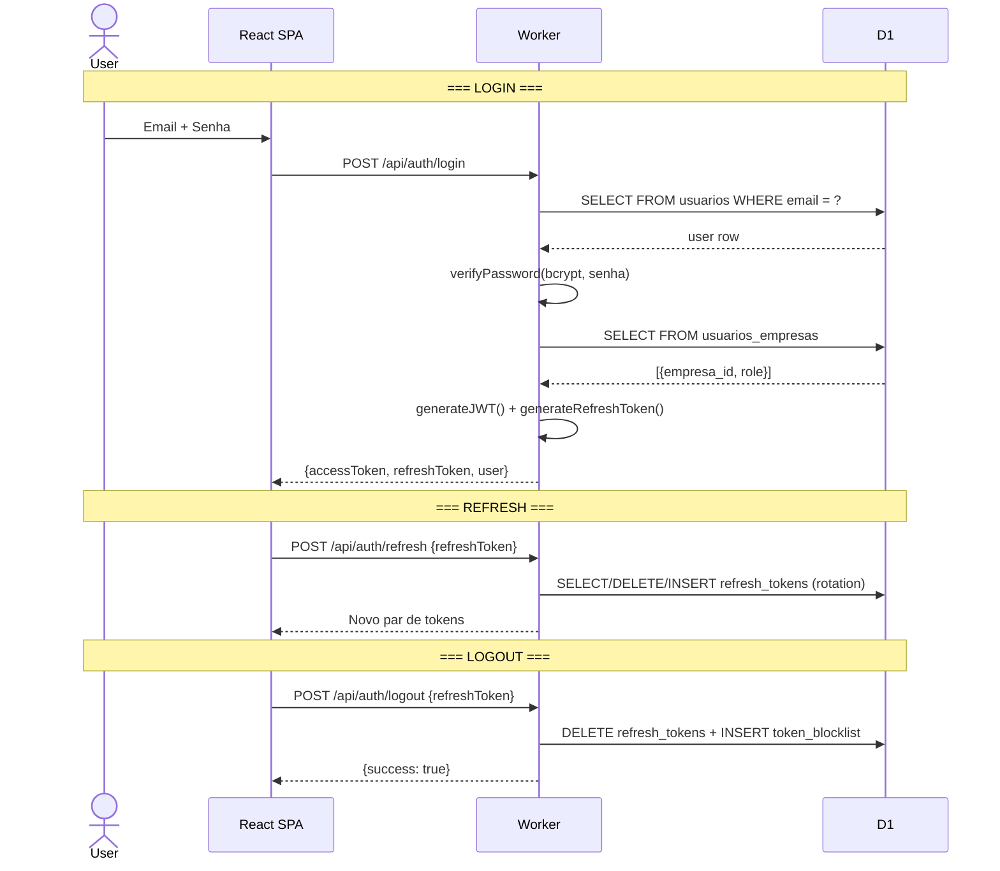

# AirTrust — Autenticação, RBAC e Multi-Tenancy

> **Versão:** 1.0 | **Data:** 2026-06-12 | **HEAD:** `5be104893`
>
> ⚠️ **[DOCUMENTO INTERNO]** Descreve autenticação, RBAC e isolamento multi-tenant.
> Não deve ser compartilhado externamente. Detalhes operacionais sensíveis são
> rastreados no registro interno de segurança.

## 1. Visão Geral da Autenticação

Autenticação stateless via **JWT HS256** assinado com `JWT_SECRET` (wrangler secret):

- **Access Token**: JWT com 1h de expiração, header `Authorization: Bearer <token>`
- **Refresh Token**: Opaque string de 64 chars hex (32 bytes aleatórios), 7 dias
- **Token Blocklist**: Tabela `token_blocklist` para invalidação imediata (logout)
- **Convites**: Tokens UUID hasheados com SHA-256, tabela `convites_usuarios`
- **Reset de Senha**: Tokens UUID hasheados com SHA-256, 60min, tabela `password_reset_tokens`

### Diagrama de fluxo



## 2. Fluxo de Login

**Endpoint**: `POST /api/auth/login` | **Rate limit**: 10 req/60s

**Resolução de empresa** (cadeia de fallback):
1. `usuarios_empresas` com `is_primary = 1`
2. Join `usuarios` → `funcionarios` → `empresa_id`
3. Platform admin fallback (primeira empresa ativa)
4. Se apenas 1 empresa ativa → usa essa
5. Email domain match com `empresas.dominio`
6. Erro: `USER_WITHOUT_EMPRESA`

**Armazenamento frontend**: memory-first, com fallback para sessionStorage/localStorage.
`fetchWithAuth()` injeta token automaticamente e faz refresh em 401.

## 3. JWT: Estrutura e Ciclo de Vida

```typescript
interface JwtPayload {
  sub: number;                    // user_id
  jti?: string;                   // JWT ID (UUID v4) → blocklist key
  email: string;
  role?: string;                  // Pode ser overridden por usuarios_empresas
  token_type?: 'access' | 'lms_asset';
  asset_scope?: 'pptx_viewer';
  asset_curso_id?: number;
  empresa_id?: number;            // Empresa ativa
  empresas?: number[];            // Empresas acessíveis
  permissions?: string[];         // Overrides: GRANT/DENY
  funcionario_id?: number | null;
  impersonated_by?: number;       // Admin impersonando
  iat: number;                    // Issued at
  exp: number;                    // Expiration
}
```

**Geração**: `jose/SignJWT` com HS256, `expiresIn: 3600` (1h), `jti: crypto.randomUUID()`

**Verificação**: `jose/jwtVerify` com `algorithms: ['HS256']`

**LMS Asset Token**: `token_type: 'lms_asset'`, TTL 15min, enviado como cookie
`HttpOnly; Secure; SameSite=Strict; Path=/api/lms/scorm/`

## 4. Token Blocklist

Tabela `token_blocklist` (jti UNIQUE, expires_at). No logout, o JTI do access token
é inserido. O middleware auth() verifica `SELECT 1 FROM token_blocklist WHERE jti = ?
AND expires_at > datetime('now')`. Limpeza probabilística (~2% das verificações).

## 5. Refresh Token Rotation

Cada refresh revoga o anterior e emite um novo (single-use). Se reutilizado,
todos os refresh tokens do usuário são revogados (anti-roubo).

## 6. Convites e Reset de Senha

- **Convites**: `convites_usuarios` (migration 0290). `GET /api/auth/invite/validate`,
  `POST /api/auth/invite/accept`
- **Reset**: `password_reset_tokens` (migration 0355). Rate limit 5/60s.
  `POST /api/auth/forgot-password` → Brevo email, `POST /api/auth/reset-password`
- **Troca de senha**: `POST /api/auth/change-password` (autenticado, requer senha atual)

## 7. RBAC — Role-Based Access Control

### Hierarquia

| Nível | Role | Valor | Permissões |
|---|---|---|---|
| 100 | `admin` | Total | `['*']` |
| 80 | `manager` | Gestão | `['read', 'write', 'delete', 'export', 'reports', 'manage_users']` |
| 60 | `instructor` | Instrutor | `['read', 'simulator_write', 'sign_sheets', 'view_students']` |
| 50 | `editor` | Editor | `['read', 'write']` |
| 20 | `student` | Aluno | `['read', 'sign_self_sheets', 'view_self']` |
| 10 | `viewer` | Observador | `['read']` |

### Implementação

```typescript
// middleware/rbac.ts
function requireRole(...roles: string[]): MiddlewareHandler {
  return async (c, next) => {
    const userLevel = ROLE_HIERARCHY[c.get('userRole')] || 0;
    const requiredLevel = Math.max(...roles.map(r => ROLE_HIERARCHY[r] || 0));
    if (userLevel < requiredLevel) throw forbidden('Permissão insuficiente');
    await next();
  };
}
```

### Mapeamento de roles (PT-BR ↔ RBAC)

| Role BD | Role RBAC | Nível |
|---|---|---|
| `admin`, `administrador` | `admin` | 100 |
| `gestor`, `manager` | `manager` | 80 |
| `instrutor`, `instructor` | `manager` ⚠️ | 80 |
| `editor` | `editor` | 50 |
| `usuario`, `user`, `aluno`, `student` | `student` | 20 |
| `viewer` | `viewer` | 10 |

> ⚠️ `instrutor` mapeado para `manager` (80) — possível over-provisioning.

### Resolução de role efetiva

1. `usuarios_empresas.role` (prioridade máxima)
2. JWT claim `role` (fallback)
3. Fallback para `ALUNO` (mínimo)

## 8. Multi-Tenancy

### Modelo

Coluna `empresa_id` em TODAS as tabelas + tabela associativa `usuarios_empresas` (N:N).

### TenantContext

```typescript
interface TenantContext {
  empresaId: number;
  empresaCodigo: string;
  empresaNome: string;
  role: string;
  plano: 'basic' | 'pro' | 'enterprise';
  permissions: string[];
}
```

### Isolamento

**Regra crítica**: Toda query DEVE incluir `WHERE empresa_id = ?`.

Helpers: `withTenantFilter(sql, empresaId)`, `verifyRecordOwnership(db, table, recordId, empresaId)`

### Platform Admin (cross-tenant)

`platformAccessState = 'PLATFORM_ADMIN'` (via `lib/rbac/platform-access.ts`) permite
acesso cross-tenant para operações administrativas com auditoria completa.

### Troca de empresa

`POST /api/auth/select-empresa` → novo JWT com `empresa_id` atualizado + limpeza
do cache TanStack Query.

## 9. Rotas Públicas vs Protegidas

### Whitelist (`isPublicPath` no index.ts)

- `/api/health`, `/api/version`, `/api/capabilities`
- `/api/public/*`, `/api/assets/*`
- `/api/lms/scorm/**`, `/api/lms/h5p/**`, `/api/lms/pptx/asset/*`
- `/api/certificados/validar*`
- `/api/auth/*`
- Webhooks de integrações externas (Twilio callback, EdApp — retorna 410)
- Rotas de manutenção internas (prefixo `/maintenance/`, autenticadas por secret)

### Rotas de manutenção (sem auth JWT)

Rotas sob prefixo `/maintenance/` são whitelisted do middleware JWT, mas protegidas
por verificação de `MAINTENANCE_SECRET` com comparação timing-safe.

> **[INTERNO]** Os paths exatos não são documentados aqui. Consultar `isPublicPath`
> em `index.ts` e o registro interno de segurança para avaliação de risco.

## 10. Rate Limiting por Contexto

| Contexto | Limite | Janela | Preset |
|---|---|---|---|
| `POST /api/auth/login` | 10 | 60s | `login` |
| `POST /api/auth/refresh` | 20 | 60s | (custom) |
| `POST /api/auth/forgot-password` | 5 | 60s | (custom) |
| `POST /api/auth/reset-password` | 5 | 60s | (custom) |
| Webhooks | 30 | 60s | `webhook` |
| Upload | 10 | 60s | `upload` |
| Importação | 5 | 300s | (custom) |

**Implementação**: D1-based (`rate_limit_store`, migration 0289) com fallback in-memory.
Headers: `X-RateLimit-Limit`, `X-RateLimit-Remaining`, `Retry-After`.

## 11. Dev Auth Bypass

**Condições**: `ENVIRONMENT === 'development'` **E** `ENABLE_DEV_AUTH_BYPASS === 'true'`.
Se ativo e sem header `Authorization`, usa primeiro admin do banco.
**Nunca ativo em staging/produção** (ENVIRONMENT !== 'development').

## 12. Impersonation

`POST /api/auth/impersonate` — admin assume identidade de usuário.
JWT com `impersonated_by: <admin_id>`. Todas as ações auditadas com flag `impersonated: true`.

## 13. Secrets e Segurança

Todos os secrets são gerenciados via `wrangler secret put` e nunca versionados.
O impacto de comprometimento de cada secret é rastreado no registro interno de
segurança — não documentado aqui.

**Práticas**: bcryptjs salt rounds=10, SHA-256 para tokens one-way, timing-safe comparisons,
refresh token rotation, JTI blocklist, cookies HttpOnly/Secure/SameSite.
