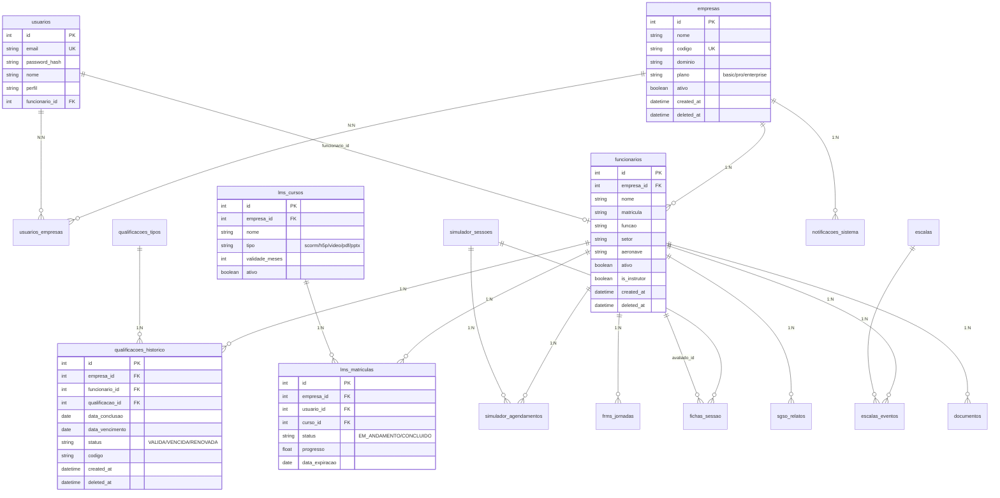

# AirTrust — Esquema de Banco de Dados

> **Versão:** 1.0 | **Data:** 2026-06-12 | **HEAD:** `5be104893`
> **Banco:** Cloudflare D1 (SQLite) | **Migrations:** 378 arquivos

## 1. Visão Geral

Cloudflare D1 (SQLite-compatível) com replicação automática na edge.

| Ambiente | Nome |
|---|---|
| Produção | `airtrust-db` (WEUR) |
| Staging | `airtrust-db-staging` |
| Development | `airtrust-db-dev` |
| Local | SQLite via Miniflare |

> **[INTERNO]** Os database IDs (UUIDs Cloudflare) são gerenciados via `wrangler.toml` e não
> devem ser documentados aqui. Consultar o painel Cloudflare ou `wrangler d1 list`.

## 2. Diagrama ER Principal



## 3. Tabelas por Módulo

### Core / Multi-Tenant
`empresas`, `usuarios`, `usuarios_empresas`, `convites_usuarios`, `password_reset_tokens`,
`refresh_tokens`, `token_blocklist`, `token_reset_tokens`, `rate_limit_store`

### Qualificações
`qualificacoes_tipos`, `qualificacoes_historico`, `qualificacoes_reclass_queue`,
`categorias`, `certificados`, `certificados_modelos`

### FRMS
`frms_jornada`, `frms_fatorizacao`, `frms_acumulo_rolling`, `frms_alerta`,
`frms_escala_quinzenal`, `frms_configuracao_limites`, `frms_fadiga_checkin`,
`frms_justificativas` (0356), `frms_explicacao_dia_cache` (0357),
`frms_jornada_origem_sigvoos` (0351), `frms_read_ack_events` (0384), `frms_fadiga_evento`

### Escalas
`escalas`, `escalas_eventos`, `escalas_tripulacoes`, `escalas_confirmacoes`

### LMS
`lms_cursos` (0335), `lms_matriculas` (0336), `lms_progresso_scorm` (0337),
`lms_h5p_conteudos` (0337), `lms_xapi_statements` (0339), `lms_matricula_ciclos` (0346),
`lms_historico_legado_edapp` (0342)

### Simuladores
`simuladores`, `simulador_sessoes`, `simulador_agendamentos`, `fichas_sessao`,
`fichas_sessao_edicoes`, `modelos_sessao`, `manobras`, `modelos_aeronave`

### SGSO
`sgso_relatos`, `sgso_auditorias`, `sgso_nao_conformidades`, `sgso_acoes`,
`sgso_avaliacoes_risco`, `sgso_fatores_humanos`

### Outras
`funcionarios`, `funcoes`, `setores`, `setores_gestores`, `aeronaves`,
`modelos_aeronave`, `licencas`, `habilitacoes`, `horas_voo`, `hospedagem`,
`pasta_virtual`, `documentos`, `notificacoes_sistema`, `alertas_whatsapp_templates`,
`backups_controle`, `backups_logs`, `matriz_treinamento_registros`,
`requisitos_compliance`, `integracoes_sigvoos_*` (4), `auditoria`, `auditoria_avancada_v2`

## 4. Migrations

### Nomenclatura: `NNNN_descricao_em_snake_case.sql`

Ordem de aplicação: **alfabética** pelo nome do arquivo.

### Migrations Recentes (0351–0398)

| # | Descrição |
|---|---|
| 0351 | FRMS origem SIGVOOS |
| 0352 | SIGVOOS pendências |
| 0353 | Sono fixo 8h + colunas sono |
| 0354 | — |
| 0355 | password_reset_tokens |
| 0356 | frms_justificativas |
| 0357 | FRMS AI cache |
| 0358 | HV 28d fix + 365 |
| 0361 | Fonte cálculo competência |
| 0362 | Daily fatigue v01 |
| 0367 (2×) ⚠️ | SK76 classificação + reaquisição |
| 0379–0383 | SK76 offshore + semestral + noturno |
| 0384 | FRMS read-ack storage |
| 0385 | Audit events v2 |
| 0386 | Solicitações → planejados link |
| 0387 | SIGVOOS base tables |
| 0388 | Documentos canonical schema |
| 0389 | Platform roles foundation |
| 0390 | Training class management |
| 0391 | FIRA histórico audit labels |
| 0392 | Tenant: notificações_sistema |
| 0393 | Tenant: licenças |
| 0394 | Tenant: catálogos F5 |
| 0395 | Platform admin backfill |
| 0396 | Hardening wave 1 |
| 0397 | Hardening wave 2 |
| 0398 | Reconcile wave 1/2 |
| 9999 | Modelo_sessao_id (sempre último) |

## 5. Migrations com Número Duplicado

**30 números** com duplicatas. Principais:

| Número | Arquivo A | Arquivo B |
|---|---|---|
| **0332** | `create_audit_logs_compatible` | `normalize_edapp_historical_renewals` |
| **0347** | `lms_cursos_content_filename` | `lms_edapp_tenant_indexes` |
| **0367** | `classificar_dificuldade_sk76` | `sk76_reaquisicao_experiencia` |

**Risco**: Ordem alfabética determina aplicação. Sem dependências cruzadas atualmente,
mas risco existe para futuras duplicatas.

## 6. Auto-Migration no Cold Start

`runApiBootstrap` (invocado no primeiro request) verifica e cria tabelas críticas
(ex: `documentos` se migration 0388 não aplicada).

## 7. Setup Local

```bash
npm run setup:local        # Primeira vez
npm run setup:local:reset  # Reset completo
npm run db:status          # Listar tabelas
```

Banco local: `.wrangler/state/v3/d1/miniflare-D1DatabaseObject/*.sqlite`

## 8. Índices

Padrão em todas as tabelas: `empresa_id`, `deleted_at`, composite `(empresa_id, deleted_at)`.

Específicos por performance:
- `qualificacoes_historico`: `(funcionario_id, deleted_at)`, `(qualificacao_id, deleted_at)`
- `frms_jornada`: `(tripulante_id, data)`
- `frms_alerta`: `(tripulante_id, nivel, resolvido)`
- `lms_matriculas`: `(usuario_id, deleted_at)`, `(curso_id, deleted_at)`
- `simulador_agendamentos`: `(sessao_id, deleted_at)`
- `escalas_eventos`: `(escala_id, data)`

Migrations de índices: 0261 (FRMS), 0338 (LMS), 0350 (composite deleted_at)

## 9. Soft Delete

Padrão: coluna `deleted_at TEXT` (NULL = ativo). "Delete" = `UPDATE ... SET deleted_at = datetime('now')`.

Exceções (hard delete): `token_blocklist`, `refresh_tokens`, `password_reset_tokens`, `rate_limit_store`

## 10. Convenções

| Elemento | Convenção | Exemplo |
|---|---|---|
| Tabelas | `snake_case` | `qualificacoes_tipos` |
| Colunas | `snake_case` | `data_conclusao` |
| PK | `id INTEGER PRIMARY KEY AUTOINCREMENT` | Padrão SQLite |
| FK | `entidade_id` | `funcionario_id` |
| Datas | `TEXT` ISO 8601 | `2026-06-12T14:30:00.000Z` |
| Booleanos | `INTEGER` 0/1 | `ativo`, `is_instrutor` |
| Soft delete | `deleted_at TEXT` | NULL = ativo |
| Timestamps | `created_at TEXT`, `updated_at TEXT` | ISO 8601 |
