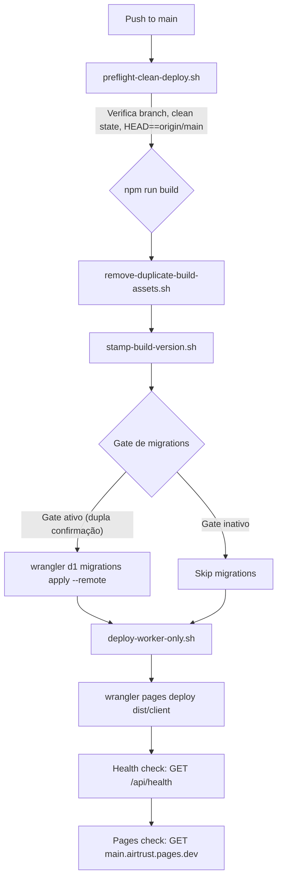

# AirTrust — Deployment & DevOps

> **Versão do documento:** 1.0 | **Data:** 2026-06-12 | **HEAD:** `5be104893`
>
> ⚠️ **[DOCUMENTO INTERNO]** Este documento descreve a arquitetura de deploy.
> Não é um manual operacional executável. Nenhum comando aqui autoriza deploy,
> migration ou acesso remoto a D1/R2/produção. Toda ação em produção requer
> autorização explícita do responsável técnico.

---

## Sumário

1. [Visão Geral do Pipeline](#1-visão-geral-do-pipeline)
2. [Scripts de Deploy](#2-scripts-de-deploy)
3. [Ambientes Cloudflare](#3-ambientes-cloudflare)
4. [CI/CD — GitHub Actions](#4-cicd--github-actions)
5. [Segurança do Deploy](#5-segurança-do-deploy)
6. [Migrações D1 em Produção](#6-migrações-d1-em-produção)
7. [Scripts de Guarda](#7-scripts-de-guarda)
8. [Monitoramento e Logs](#8-monitoramento-e-logs)
9. [Build e Bundle](#9-build-e-bundle)

---

## 1. Visão Geral do Pipeline

O deploy do AirTrust segue um pipeline de 4 estágios:

```
[1. Pre-flight Checks] → [2. Build] → [3. Deploy Worker + Migrations] → [4. Deploy Pages] → [5. Validação]
```

### Diagrama de deploy



---

## 2. Scripts de Deploy

### 2.1 Deploy principal (`npm run deploy`)

```bash
npm run deploy
# → generate-version.sh (APP_VERSION + APP_BUILD_TIME)
# → npm run build
# → npm run deploy:pages
# → npm run deploy:worker:only
```

### 2.2 Deploy do Worker (`scripts/deploy-worker-only.sh`)

**86 linhas** — Script principal de deploy do Worker:

1. **Guarda contra APP_VERSION externo**: Bloqueia se `AIRTRUST_ALLOW_APP_VERSION_OVERRIDE != 1`
2. **Gera DEPLOY_VERSION**: `git rev-parse --short HEAD` + UTC timestamp
3. **Gera BUILD_TIME**: UTC ISO timestamp
4. **Cria wrangler.toml temporário**: Node.js script que injeta `APP_VERSION` e `APP_BUILD_TIME`
   no template `wrangler.deploy.toml`
5. **Gate de migrations em produção**: O script verifica duas variáveis de ambiente
   com valores exatos (dupla confirmação). Se ambas estiverem presentes com os valores
   corretos, executa o apply de migrations em produção. Os nomes e valores das variáveis
   não são documentados aqui — ver seção 5.2 e consultar `scripts/deploy-worker-only.sh`
   diretamente.
6. **Deploy do Worker**: `wrangler deploy --env production`
7. **Limpeza**: Remove o arquivo `.toml` temporário (trap EXIT)

### 2.3 Deploy Safe (`scripts/deploy-worker-safe.sh`)

**82 linhas** — Deploy sem migrations:

- Requer branch == `main` e HEAD == `origin/main`
- Mesmo processo de versionamento
- **NÃO executa migrations**
- Apenas: `wrangler deploy --env production`

### 2.4 Pre-flight (`scripts/preflight-clean-deploy.sh`)

**40 linhas** — Verificações pré-deploy:

- Branch atual == `main`
- Sem alterações unstaged ou staged (`git status --porcelain` vazio)
- HEAD == `origin/main` (fetch do origin)
- Lista arquivos não trackeados (warning não-bloqueante)

### 2.5 Deploy do Frontend (`npm run deploy:pages`)

```bash
npm run deploy:pages
# → preflight-clean-deploy.sh
# → npm run build
# → remove-duplicate-build-assets.sh
# → stamp-build-version.sh dist/client/index.html
# → wrangler pages deploy dist/client --project-name=airtrust --branch=production
```

### 2.6 Deploy completo (`npm run deploy:all`)

```bash
npm run deploy:all
# → scripts/build-and-deploy.sh (combina build + deploy worker + deploy pages)
```

---

## 3. Ambientes Cloudflare

### 3.1 Workers (Backend)

| Ambiente | Worker Name | Domínio | D1 DB | R2 Bucket |
|---|---|---|---|---|
| **Produção** | `airtrust-api-production` | `api.airtrust.online` | `airtrust-db` | `airtrust-storage` |
| **Staging** | `airtrust-api-staging` | `*.workers.dev` | `airtrust-db-staging` | `airtrust-storage-staging` |
| **Development** | `airtrust-api-development` | `*.workers.dev` | `airtrust-db-dev` | `airtrust-storage-dev` |
| **Local** | `airtrust-api` | `localhost:8787` | Local SQLite (Miniflare) | Local R2 (Miniflare) |

### 3.2 Pages (Frontend)

| Ambiente | Projeto | Branch | Domínio |
|---|---|---|---|
| **Produção** | `airtrust` | `production` | `airtrust.pages.dev` + domínio customizado |
| **Staging** | `airtrust` | `main` (preview) | `*.airtrust.pages.dev` |

### 3.3 Configuração Wrangler

| Arquivo | Uso |
|---|---|
| `worker-airtrust/wrangler.toml` | Config base com 3 ambientes (dev/staging/prod) |
| `worker-airtrust/wrangler.dev.toml` | Config local (wrangler dev --local) |
| `worker-airtrust/wrangler.deploy.toml` | Template para deploy (versionado, com placeholders) |
| `worker-airtrust/wrangler.deploy.*.tmp.toml` | Gerado no deploy (NÃO versionado, limpo após deploy) |

### 3.4 Bindings por ambiente

| Binding | Dev | Staging | Prod |
|---|---|---|---|
| `DB` (D1) | `airtrust-db-dev` | `airtrust-db-staging` | `airtrust-db` |
| `BUCKET` (R2) | `airtrust-storage-dev` | `airtrust-storage-staging` | `airtrust-storage` |
| `AI` (Workers AI) | ✅ | ✅ | ✅ |

---

## 4. CI/CD — GitHub Actions

### 4.1 Workflows (9 arquivos em `.github/workflows/`)

| Workflow | Trigger | Ações |
|---|---|---|
| **ci.yml** | PR, push | Build + lint + LMS smoke test |
| **deploy.yml** | Push to `main` | Test → build → migrations → deploy worker → deploy pages → validate |
| **deploy-pages.yml** | Push to branches | Build + deploy Pages |
| **lint.yml** | PR, push | ESLint + Prettier check |
| **demo-data-prevention.yml** | PR to main/master/prod | Demo data check + lint + build + PR comment |
| **pr-check.yml** | PR | Install + lint + build |
| **test.yml** | Push, PR | Tests + coverage (30% threshold) + Codecov |
| **auto-fix.yml** | PR | ESLint fix + Prettier → commit via bot |
| **validate-secrets.yml** | Manual | Validates CLOUDFLARE_API_TOKEN |

### 4.2 Deploy pipeline (deploy.yml)

```yaml
jobs:
  test-and-build:
    # npm ci (root + worker)
    # setup local DB + worker
    # LMS smoke tests
    # lint (continue-on-error)
    # tests (continue-on-error)
    # build
    # upload artifacts

  deploy-worker:
    needs: test-and-build
    # wrangler d1 migrations apply (production)
    # wrangler deploy (via cloudflare/wrangler-action@v3)

  deploy-pages:
    needs: [test-and-build, deploy-worker]
    # download artifacts
    # wrangler pages deploy (branch=production)

  validate:
    needs: [deploy-worker, deploy-pages]
    # curl api.airtrust.online/api/health
    # curl main.airtrust.pages.dev
```

---

## 5. Segurança do Deploy

### 5.1 Gates de segurança

| Gate | Descrição |
|---|---|
| **Pre-flight** | Branch=main, clean state, HEAD=origin/main |
| **Migrations gate** | Dupla confirmação: `AIRTRUST_ALLOW_PROD_MIGRATIONS_APPLY=YES` + texto exato de confirmação |
| **APP_VERSION gate** | APP_VERSION só pode ser definido externamente com `AIRTRUST_ALLOW_APP_VERSION_OVERRIDE=1` |
| **Secrets guard** | `check-tracked-secrets.sh` antes de cada deploy |
| **Demo data guard** | `ci-demo-data-check.sh` no CI |
| **Auth boundary guard** | `guard-auth-boundaries.sh` verifica ordem de rotas |

### 5.2 Dupla confirmação para migrations

> **[INTERNO — não executável deste documento]**
>
> O script `deploy-worker-only.sh` exige dupla confirmação via variáveis de ambiente
> com valores exatos (definidos no script). Ambas as variáveis devem estar presentes
> com os valores corretos para que migrations sejam aplicadas em produção.
> Os valores exatos não são documentados aqui — consultar o script diretamente e o
> runbook operacional interno.

### 5.3 Wrangler config temporário

O script `deploy-worker-only.sh` gera um arquivo `.toml` temporário via Node.js:

```javascript
// Gera wrangler.deploy.production.toml com placeholders substituídos
const config = readTemplate('wrangler.deploy.toml');
config.vars.APP_VERSION = process.env.APP_VERSION;
config.vars.APP_BUILD_TIME = process.env.APP_BUILD_TIME;
writeTempConfig(config);
```

O arquivo temporário é removido via `trap EXIT`:

```bash
TMP_WRANGLER=$(mktemp /tmp/wrangler.deploy.XXXXXX.toml)
trap "rm -f $TMP_WRANGLER" EXIT
```

---

## 6. Migrações D1 em Produção

> **[INTERNO — não executável deste documento]**
>
> Migrações em produção requerem autorização explícita do responsável técnico.
> Nunca executar comandos D1 `--remote --env production` fora do fluxo de deploy
> autorizado. Consultar o runbook operacional interno (`docs/LOCAL_PROD_CLONE.md`
> e os scripts de gate) antes de qualquer ação.

### 6.1 Fluxo seguro (com gate)

O script `deploy-worker-only.sh` encapsula o gate de dupla confirmação.
Migrations só são aplicadas se as variáveis de gate corretas estiverem presentes.
Não executar `wrangler d1 migrations apply` diretamente sem passar pelo gate.

### 6.2 Aplicação de migration específica

Para aplicar uma migration específica fora do deploy completo, usar o fluxo
documentado no runbook operacional. Não execute comandos `--remote` sem
revisão e autorização explícita do responsável técnico.

### 6.3 Reset local

```bash
npm run setup:local:reset
# → bash scripts/setup-local-db.sh --reset
# → Recria o banco local e aplica TODAS as migrations
```

---

## 7. Scripts de Guarda

### 7.1 guard:auth-boundaries (`scripts/guard-auth-boundaries.sh`)

Verifica que:
- `/api/assets` é registrado ANTES do `app.route('/api', lookup)` genérico
- Rotas públicas não são acidentalmente protegidas por middleware global de auth

### 7.2 guard:tracked-secrets (`scripts/check-tracked-secrets.sh`)

Verifica com `git grep`:
- Senhas padrão hardcoded
- `ENABLE_DEV_AUTH_BYPASS=true` em arquivos trackeados
- `JWT_SECRET` hardcoded
- `CLOUDFLARE_API_TOKEN` exposto
- Segredos EdApp

### 7.3 guard:empresa-default1 (`scripts/guard-no-new-empresa-default1.sh`)

Scaneia migrations acima de `0394` por `empresa_id INTEGER DEFAULT 1`:
- Previne novas violações de multi-tenant no schema
- Bloqueia PRs que adicionam `DEFAULT 1` em coluna `empresa_id`

### 7.4 ops:guard (`scripts/audit-dangerous-ops.sh`)

**274 linhas** — 5 guards:
1. Detecta `--commit-dirty=true` em scripts
2. Detecta `git add .` / `git add -A` em scripts
3. Detecta execução remota D1 fora de allowlist (~30 scripts read-only + 4 self-protected)
4. Detecta DDL/DML colocalizado com `--remote`
5. Audita scripts legados para acesso D1 remoto desprotegido

### 7.5 check:demo-data (`scripts/ci-demo-data-check.sh`)

Verifica:
- Arquivos CSV de seed em `src/`
- Emails demo hardcoded
- `ENABLE_DEV_AUTH_BYPASS` em arquivos trackeados
- Chamadas de seed/fixture em código de produção

### 7.6 lint:api-base (`scripts/lint-api-base.sh`)

Verifica padrões de API base URL no frontend.

---

## 8. Monitoramento e Logs

### 8.1 Tail de logs (produção)

```bash
npm run logs:tail
# → wrangler tail --env production
# → Stream ao vivo de console.log/error do Worker em produção
```

### 8.2 Análise de erros

```bash
npm run logs:errors
# → scripts/analyze-logs.sh ERROR 60
# → Análise dos últimos 60 minutos de logs filtrando ERROR
```

### 8.3 Health check

```bash
npm run health
# → curl http://localhost:8787/health | python3 -m json.tool
```

### 8.4 Smoke tests

| Script | Descrição |
|---|---|
| `smoke:core:prod` | Smoke test core na produção |
| `smoke:core:local` | Smoke test core no worker local |
| `smoke:auth:login` | Teste de login |
| `smoke:assets-public` | Verifica assets públicos |
| `smoke:lms:local` | Smoke test LMS completo |

### 8.5 Telemetria de erros do frontend

**Endpoint**: `POST /api/telemetry/client-error`

Recebe erros do frontend (chunk-load failures, dynamic import errors, etc.) e loga
no console do Worker:

```json
{
  "type": "frontend_error",
  "scope": "chunk-load",
  "moduleKey": "FrmsDashboard",
  "message": "Failed to fetch dynamically imported module",
  "path": "/frms",
  "href": "https://airtrust.pages.dev/frms",
  "userAgent": "Mozilla/5.0 ..."
}
```

---

## 9. Build e Bundle

### 9.1 Comando de build

```bash
npm run build
# → PATH=/opt/homebrew/opt/node@22/bin:$PATH vite build
# → bash scripts/remove-duplicate-build-assets.sh
# → tsc --noEmit false (type check, ignora erros)
```

### 9.2 Métricas do bundle

| Métrica | Valor |
|---|---|
| Chunks JS | 287 |
| Chunks CSS | 2 |
| Tamanho total | ~12 MB |
| Maior chunk | `charts-<hash>.js` (432 KB — recharts) |
| Build time | ~5.73s |
| Target | ES2020 |
| Source maps | Apenas em dev |
| Minify | Apenas em produção |

### 9.3 Manual chunks (code splitting)

| Chunk | Dependências | Tamanho estimado |
|---|---|---|
| `vendor` | `react` + `react-dom` | ~130 KB |
| `router` | `react-router-dom` | ~60 KB |
| `query` | `@tanstack/react-query` | ~80 KB |
| `charts` | `recharts` | ~432 KB |
| `pdf` | `jspdf` | ~180 KB |
| `capture` | `html2canvas` | ~80 KB |
| `excel` | `xlsx` | ~500 KB |
| `forms` | `react-hook-form` + `zod` | ~40 KB |
| `dnd` | `@dnd-kit/*` | ~60 KB |

### 9.4 Remove duplicate build assets

O script `remove-duplicate-build-assets.sh` remove duplicatas no `dist/`:
- `forms*.js` (2 cópias)
- `capture*.js` (2 cópias)
- Outros chunks duplicados (artefato do Vite em algumas configurações)

### 9.5 Compatibility flags

```toml
compatibility_date = "2025-11-22"
compatibility_flags = ["nodejs_compat"]
```

### 9.6 Wrangler Pages config

```json
// wrangler-pages.json
{
  "build": { "command": "npm run build", "destination": "/dist/client" },
  "vars": { "API_BASE_URL": "https://api.airtrust.online" },
  "compatibility_date": "2025-06-17"
}
```

---

## Apêndice: Scripts NPM completos

| Categoria | Scripts |
|---|---|
| **Dev** | `dev`, `dev:safe`, `dev:worker`, `dev:worker:local`, `start` |
| **Build** | `prebuild`, `build`, `build:clean`, `preview` |
| **Deploy** | `deploy`, `deploy:pages`, `deploy:worker`, `deploy:worker:only`, `deploy:worker:safe`, `deploy:all` |
| **Test** | `test`, `test:run`, `test:worker`, `test:all`, `test:coverage`, `test:e2e`, `test:e2e:ui`, `test:e2e:headed`, `test:guard:sw-cache` |
| **Guard** | `ops:guard`, `guard:auth-boundaries`, `guard:tracked-secrets`, `guard:empresa-default1`, `check:demo-data`, `lint:api-base`, `lint`, `validate:data-quality-sql` |
| **DB** | `db:init`, `db:status`, `setup:dev`, `setup:local`, `setup:local:reset`, `sync:prod:local:safe`, `sync:prod:dev:safe` |
| **Seed** | `seed:lms:pdf:local`, `seed:lms:pptx:local` |
| **Smoke** | `smoke:lms:local`, `smoke:assets-public`, `smoke:auth:login`, `smoke:core:prod`, `smoke:core:local` |
| **Ops** | `health`, `logs:tail`, `logs:errors`, `storage:r2:bootstrap`, `data-quality:local` |
