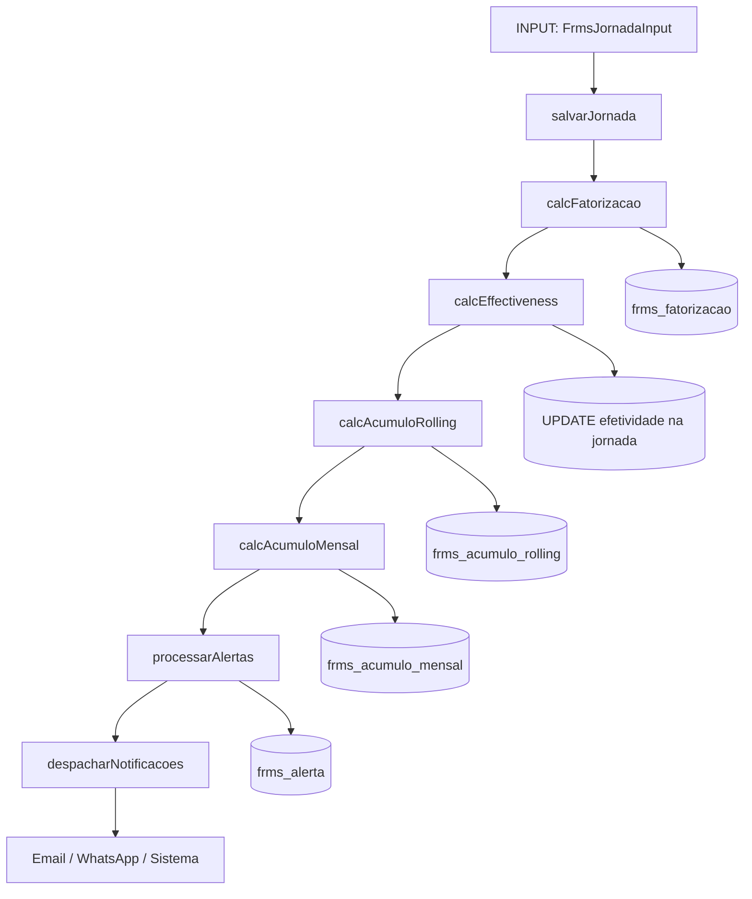

# AirTrust — Arquitetura do FRMS

> **Versão do documento:** 1.0 | **Data:** 2026-06-12 | **HEAD:** `5be104893`
> **Biblioteca:** `worker-airtrust/src/lib/frms/` (27 arquivos, ~6000+ linhas)
> **Migrations base:** 0212–0384 (29 migrations)

---

## Sumário

1. [Visão Geral](#1-visão-geral)
2. [Pipeline de Processamento de Jornada](#2-pipeline-de-processamento-de-jornada)
3. [Engine de Cálculos](#3-engine-de-cálculos)
4. [Engine de Alertas](#4-engine-de-alertas)
5. [Score de Fadiga (Check-in)](#5-score-de-fadiga-check-in)
6. [FIRA — Importação de Horas de Voo](#6-fira--importação-de-horas-de-voo)
7. [Efetividade (Effectiveness)](#7-efetividade-effectiveness)
8. [Acumulados Rolling](#8-acumulados-rolling)
9. [Fadiga Acumulada Legal](#9-fadiga-acumulada-legal)
10. [FRAT Bridge](#10-frat-bridge)
11. [Integração SIGVOOS](#11-integração-sigvoos)
12. [Source Policy](#12-source-policy)
13. [Configurações e Limites](#13-configurações-e-limites)
14. [Relatórios](#14-relatórios)
15. [Notificações](#15-notificações)
16. [Snapshot Operacional](#16-snapshot-operacional)
17. [Read-Ack Events](#17-read-ack-events)
18. [Premissa Sono Fixo 8h](#18-premissa-sono-fixo-8h)
19. [Cache AI de Explicações](#19-cache-ai-de-explicações)
20. [Arquivos de Rota](#20-arquivos-de-rota)

---

## 1. Visão Geral

O FRMS (Flight & Rest Management System) do AirTrust implementa gestão de
fadiga operacional para tripulações da aviação civil brasileira. O sistema utiliza
como referência normativa os seguintes documentos:

- **PRC-OPS-009** — Escala de Voo Diária
- **PRC-OPS-012** — Gerenciamento de Fadiga
- **RBAC-117** — Limites de Jornada (ANAC)
- **ICAO Doc 9966** — FRMS Manual

> **[AVISO — escopo interno]** Este documento descreve a implementação técnica do
> sistema. As referências normativas acima indicam as fontes dos parâmetros
> configuráveis. A conformidade regulatória efetiva depende de validação pela
> autoridade competente e não é declarada por este documento.

### Biblioteca FRMS

A lógica de negócio está concentrada em `worker-airtrust/src/lib/frms/` (27 arquivos):

```
lib/frms/
├── types.ts                    # Tipos centrais (418 linhas)
├── calculos.ts                 # Engine de cálculos (1100 linhas) ← maior arquivo
├── alertas.ts                  # Engine de alertas (234 linhas)
├── fadiga-score.ts             # Score de fadiga do check-in (321 linhas)
├── fira-parser.ts              # Parser de PDF FIRA (970 linhas)
├── fira-service.ts             # Orquestração de importação
├── fira-horas-voo.ts           # Sync horas de voo
├── db-service.ts               # Barrel re-export
├── db-service-config.ts        # CRUD de configurações
├── db-service-jornadas.ts      # Pipeline completo de jornada
├── db-service-acumulo.ts       # Acumulados por tripulante/frota
├── db-service-alertas.ts       # Query + self-healing
├── db-service-escalas.ts       # Escalas quinzenais
├── db-service-relatorios.ts    # Relatórios
├── db-service-notificacoes.ts  # Notificações por role
├── db-service-shared.ts        # Utilitários internos
├── fadiga-acumulada-legal.ts   # Limites PRC-OPS-012/RBAC-117
├── fadiga-frat-bridge.ts       # Check-in → FRAT
├── fadiga-frms-sync.ts         # Sync check-in ↔ jornadas
├── frms-config.ts              # Resolução de config
├── frms-source-policy.ts       # Política de fonte canônica
├── access.ts                   # RBAC: escopo de time
├── integridade.ts              # Checks de integridade
├── operational-snapshot.ts     # Snapshot operacional
├── fortnight-indicator.ts      # Indicadores quinzenais
├── read-ack-events.ts          # Eventos de leitura
├── read-ack-backfill.ts        # Backfill legado
```

---

## 2. Pipeline de Processamento de Jornada

Quando uma jornada é salva (`salvarJornada` em `db-service-jornadas.ts`), o pipeline
completo é executado:



### Pipeline de reprocessamento

```typescript
// db-service-jornadas.ts
async function reprocessarTripulanteCompleto(tripulanteId: number) {
  const jornadas = await buscarJornadas(tripulanteId); // Todas as jornadas
  for (const jornada of jornadas) {
    await salvarJornada(jornada); // Re-executa pipeline completo
  }
}
```

---

## 3. Engine de Cálculos

**Arquivo**: `calculos.ts` (1100 linhas) — o maior do FRMS.

### 3.1 Fatorização (`calcFatorizacao`)

Calcula 9 fatores de fadiga para cada jornada:

| Fator | Descrição | Peso |
|---|---|---|
| `FDP_DURATION` | Duração do FDP (Flight Duty Period) | Alto |
| `HV_DIARIA` | Horas de voo no dia | Alto |
| `HV_NOTURNA` | Horas de voo noturnas (22h–06h) | Alto |
| `REPOUSO_PREVIO` | Repouso antes da jornada | Médio |
| `JANELA_CIRCADIANA` | WOCL (Window of Circadian Low — 02h–06h) | Alto |
| `ACLIMATADO` | Adaptação ao fuso horário | Médio |
| `TRIPULACAO_AUMENTADA` | Tripulação aumentada reduz fadiga | Baixo |
| `BASE_AWAY` | Jornada fora da base | Baixo |
| `JORNADAS_CONSECUTIVAS` | Número de dias consecutivos de trabalho | Médio |

**Função pura**: `calcFatorizacao` não tem side effects. Recebe `LimitesMap` como
parâmetro (zero parâmetros hardcoded).

### 3.2 Efetividade (`calcEffectiveness`)

Calcula a efetividade (alertness) do tripulante usando um modelo proxy SAFTE/FAST:

- **Process S**: Pressão homeostática de sono (acumula com tempo acordado)
- **Process C**: Ritmo circadiano (oscilação de ~24h)
- **WOCL penalty**: Penalidade por estar acordado na janela circadiana baixa (02h–06h)
- **Sono**: Horas de sono (reportado ou presumido 8h)
- **Resultado**: Score de 0–100 (maior = mais alerta)

### 3.3 Acumulados (`calcAcumuloRolling`)

Calcula acumulados em janelas móveis:

| Janela | Métricas |
|---|---|
| **7 dias** | FDP minutos, HV minutos, HV noturna, repouso |
| **28 dias** | FDP minutos, HV minutos, HV noturna, dias de folga |
| **365 dias** | HV total, HV noturna total |

### 3.4 Validação de Escala Futura (`validarEscalaFutura`)

Simula o impacto de uma escala futura nos acumulados:

1. Projeta jornadas futuras com base na escala
2. Calcula acumulados projetados
3. Verifica violações de limites
4. Retorna alertas antecipados

---

## 4. Engine de Alertas

**Arquivo**: `alertas.ts` (234 linhas)

### 4.1 Níveis de alerta

| Nível | Threshold | Significado |
|---|---|---|
| `AVISO` | 80% do limite | Atenção preventiva |
| `ATENCAO` | 90% do limite | Próximo do limite |
| `CRITICO` | 95% do limite | Risco elevado |
| `VIOLACAO` | 100%+ do limite | Limite excedido |

### 4.2 Tipos de alerta

| Tipo | Descrição |
|---|---|
| `FDP_DIARIO` | Duração do FDP excede limite diário |
| `HV_DIARIA` | Horas de voo diárias excedem limite |
| `HV_7D` | Horas de voo em 7 dias consecutivos |
| `HV_28D` | Horas de voo em 28 dias consecutivos |
| `HV_365D` | Horas de voo em 365 dias |
| `REPOUSO_INSUFICIENTE` | Repouso menor que o mínimo |
| `FADIGA_ALTA` | Score de fadiga elevado |
| `EFETIVIDADE_BAIXA` | Efetividade abaixo do threshold |
| `JORNADAS_CONSECUTIVAS` | Muitos dias consecutivos de trabalho |

### 4.3 Bloqueio de lançamento

```typescript
function deveBloquearLancamento(alertas: FrmsAlerta[]): boolean {
  return alertas.some(a => a.nivel === 'CRITICO');
}
```

### 4.4 Self-healing

O sistema detecta alertas "stale" (que deveriam ter sido resolvidos automaticamente)
e os recalcula:

```typescript
// db-service-alertas.ts
const staleAlertas = await db
  .prepare(`SELECT * FROM frms_alerta WHERE resolvido = 0
            AND data_ref < date('now', '-7 days')`)
  .all();
for (const alerta of staleAlertas) {
  // Recalcula e fecha se necessário
}
```

---

## 5. Score de Fadiga (Check-in)

**Arquivo**: `fadiga-score.ts` (321 linhas)

### 5.1 Input do check-in

| Campo | Descrição |
|---|---|
| `kss_score` | Karolinska Sleepiness Scale (1–9) |
| `sono_horas` | Horas de sono nas últimas 24h |
| `sono_qualidade` | Qualidade do sono (1–5) |
| `sintomas` | Sintomas de fadiga (múltipla escolha) |
| `medicacao` | Uso de medicação que afeta alerta |
| `alcool` | Consumo de álcool nas últimas 12h |
| `hora_acordou` | Hora que acordou |
| `hora_dormiu` | Hora que dormiu |

### 5.2 Cálculo

```typescript
function calcularScoreFadiga(input: FadigaScoreInput): number {
  let score = input.kss_score * 10;                 // KSS (base)
  score += (8 - input.sono_horas) * 5;               // Sono insuficiente
  score += (5 - input.sono_qualidade) * 4;            // Qualidade ruim
  score += input.sintomas.length * 3;                 // Sintomas
  if (input.medicacao) score += 15;                   // Medicação
  if (input.alcool) score += 20;                      // Álcool
  score += calcularPenalidadeWOCL(input.hora_acordou); // WOCL
  return Math.min(100, Math.max(0, score));
}
```

### 5.3 Interpretação

| Score | Classificação | Ação |
|---|---|---|
| 0–30 | BAIXO | OK para voar |
| 31–50 | MODERADO | Atenção do gestor |
| 51–70 | ALTO | Avaliação obrigatória |
| 71–100 | CRÍTICO | Impedimento de voo |

---

## 6. FIRA — Importação de Horas de Voo

**Arquivos**: `fira-parser.ts` (970 linhas), `fira-service.ts`

### 6.1 O que é FIRA

FIRA (Ficha Individual de Registro de Atividade) é o relatório mensal de horas de
voo emitido pelo sistema SIGVOOS em formato PDF. Contém dados diários de:

- Horas de voo diurnas/noturnas
- Jornada (FDP)
- Repouso
- Base
- Tipo de aeronave
- Função (piloto/copiloto)

### 6.2 Parser PDF

O parser extrai dados de 31 dias do PDF usando 3 modos:

| Modo | Descrição |
|---|---|
| `compact` | Colapso de texto (unpdf → texto contínuo) |
| `table-row` | Extração por linhas de tabela |
| `columnal` | Extração por colunas |

### 6.3 Extração de metadados

- **Companhia**: Nome da empresa operadora
- **Nome**: Nome do tripulante
- **CANAC**: Código ANAC
- **Base**: Base operacional
- **Ano/Mês**: Período do relatório

### 6.4 Mapeamento de status

```typescript
function mapFiraSituacaoToFrmsStatus(situacao: string): FrmsStatus {
  // Mapeia códigos FIRA para status FRMS
  switch (situacao) {
    case 'VOO': return 'FDP';
    case 'FOLGA': return 'FOLGA';
    case 'RESERVA': return 'RESERVA';
    case 'TREINAMENTO': return 'TREINAMENTO';
    // ...
  }
}
```

### 6.5 Fluxo de importação

1. Upload do PDF → `POST /api/frms/importacao/fira/upload`
2. Parser extrai dados → preview (com detecção de duplicatas)
3. Confirmação → `POST /api/frms/importacao/fira/confirmar`
4. Gera registros `frms_jornada` para cada dia
5. Executa pipeline completo (fatorização + efetividade + acumulados + alertas)

---

## 7. Efetividade (Effectiveness)

A efetividade é calculada em `calculos.ts` (`calcEffectiveness`):

```typescript
interface EffectivenessResult {
  score: number;           // 0-100 (maior = mais alerta)
  nivel: string;           // 'OTIMA' | 'BOA' | 'REGULAR' | 'BAIXA' | 'CRITICA'
  fatores: {
    sono: number;
    circadiano: number;
    acumulo: number;
    jornada: number;
  };
}
```

### Thresholds

| Score | Nível | Cor |
|---|---|---|
| ≥ 85 | OTIMA | Verde |
| 70–84 | BOA | Azul |
| 50–69 | REGULAR | Amarelo |
| 30–49 | BAIXA | Laranja |
| < 30 | CRITICA | Vermelho |

---

## 8. Acumulados Rolling

### 8.1 Tabela

```sql
CREATE TABLE frms_acumulo_rolling (
  id INTEGER PRIMARY KEY AUTOINCREMENT,
  tripulante_id INTEGER NOT NULL,
  data_ref TEXT NOT NULL,      -- Data de referência
  empresa_id INTEGER NOT NULL,
  -- 7 dias
  fdp_minutos_7d INTEGER,
  hv_minutos_7d INTEGER,
  hv_noturna_7d INTEGER,
  -- 28 dias
  fdp_minutos_28d INTEGER,
  hv_minutos_28d INTEGER,
  hv_noturna_28d INTEGER,
  dias_trabalhados_28d INTEGER,
  dias_folga_28d INTEGER,
  -- 365 dias
  hv_total_365d INTEGER,
  hv_noturna_365d INTEGER,
  -- Metadados
  calculado_em TEXT NOT NULL DEFAULT (datetime('now'))
);
```

### 8.2 Janelas sobrepostas

O cálculo de 24h é feito com janelas sobrepostas (rolling), não por dia-calendário:

```
Jornada em 2026-06-12 14:00-22:00
→ HV nos últimos 7 dias: 2026-06-05 22:00 até 2026-06-12 22:00
→ HV nos últimos 28 dias: 2026-05-15 22:00 até 2026-06-12 22:00
```

---

## 9. Fadiga Acumulada Legal

**Arquivo**: `fadiga-acumulada-legal.ts`

### 9.1 Limites PRC-OPS-012 / RBAC-117

| Limite | Valor |
|---|---|
| Jornada máxima mensal | 176 horas |
| Horas de voo máximas mensais | 90 horas |
| Horas de voo máximas anuais | 1000 horas |

### 9.2 Fatores agravantes/atenuantes

| Fator | Tipo | Impacto |
|---|---|---|
| WOCL frequente (>3x/semana) | Agravante | +15% |
| Base longe de casa (>3h deslocamento) | Agravante | +10% |
| Tripulação aumentada | Atenuante | -10% |
| Repouso adequado (>10h entre jornadas) | Atenuante | -5% |
| Mais de 6 dias consecutivos | Agravante | +20% |

---

## 10. FRAT Bridge

**Arquivo**: `fadiga-frat-bridge.ts`

Mapeia o score do check-in de fadiga para o FRAT (Fatigue Risk Assessment Tool):

| Score Check-in | FRAT Level | Ações sugeridas |
|---|---|---|
| 0–30 | GREEN | Operação normal |
| 31–50 | YELLOW | Mitigações leves (café, alongamento) |
| 51–70 | ORANGE | Mitigações moderadas (co-piloto mais descansado, pausas) |
| 71–100 | RED | Impedimento — não voar |

---

## 11. Integração SIGVOOS

Ver `INTEGRATIONS.md` §2 para detalhes completos.

- **Source policy**: SIGVOOS é a fonte canônica operacional
- **Migrations**: 0351 (`frms_jornada_origem_sigvoos`), 0352 (pendências)
- **Chunking**: Sincronização em janelas de 1 dia

---

## 12. Source Policy

**Arquivo**: `frms-source-policy.ts`

Define hierarquia de confiança das fontes de jornada:

| Fonte | Confiança | Usa em Alertas | Usa em Rolling |
|---|---|---|---|
| `SIGVOOS` | CANONICAL | ✅ Sim | ✅ Sim |
| `MANUAL` (verificado) | HIGH | ✅ Sim | ✅ Sim |
| `MANUAL` (não verificado) | MEDIUM | ❌ Não | ✅ Sim |
| `APUS` | MEDIUM | ❌ Não | ✅ Sim |
| `SIMULADOR` | LOW | ❌ Não | ❌ Não |

---

## 13. Configurações e Limites

### 13.1 Tabela de limites

`frms_configuracao_limites` contém **50+ parâmetros configuráveis**:

| Parâmetro | Valor Default | Descrição |
|---|---|---|
| `FDP_MAXIMO_MINUTOS` | 660 | FDP máximo diário (11h) |
| `HV_MAXIMA_DIARIA_MINUTOS` | 540 | HV máxima diária (9h) |
| `HV_MAXIMA_7D_MINUTOS` | 2400 | HV máxima 7 dias (40h) |
| `HV_MAXIMA_28D_MINUTOS` | 6000 | HV máxima 28 dias (100h) |
| `HV_MAXIMA_365D_HORAS` | 1000 | HV máxima anual |
| `REPOUSO_MINIMO_MINUTOS` | 600 | Repouso mínimo (10h) |
| `REPOUSO_REDUZIDO_MINUTOS` | 480 | Repouso reduzido (8h) |
| `MINUTOS_ANTES_APRESENTACAO` | 90 | Tempo entre acordar e apresentação |
| `HORAS_SONO_PADRAO` | 8.0 | Sono presumido quando não reportado |
| `WOCL_INICIO_HORA` | 2 | Início da WOCL (2h) |
| `WOCL_FIM_HORA` | 6 | Fim da WOCL (6h) |
| `EFETIVIDADE_THRESHOLD_BAIXA` | 30 | Threshold de efetividade baixa |
| `FADIGA_THRESHOLD_ALTA` | 70 | Threshold de fadiga alta |

### 13.2 Restauração de defaults

**Endpoint**: `POST /api/frms/configuracoes/restaurar`

Restaura todos os limites para os valores padrão (definidos em constantes).

---

## 14. Relatórios

### 14.1 Tipos

| Relatório | Endpoint | Descrição |
|---|---|---|
| Individual | `GET /api/frms/relatorios/individual/:id` | Jornadas + fatores + acumulados + alertas |
| Compliance | `GET /api/frms/relatorios/compliance` | Conformidade da frota |
| Mapa de Fadiga | `GET /api/frms/relatorios/mapa-fadiga` | Heatmap de fadiga por dia/hora |
| Alertas Histórico | `GET /api/frms/relatorios/alertas-historico` | Histórico de alertas |

---

## 15. Notificações

**Arquivo**: `db-service-notificacoes.ts`

### 15.1 Destinatários por role

| Role | Notificações |
|---|---|
| `admin` / `manager` | Todos os alertas CRITICO e VIOLACAO |
| `instrutor` | Alertas dos seus alunos |
| `tripulante` | Apenas seus próprios alertas |

### 15.2 Canais

- **Email** (Brevo): Alertas diários (cron `0 8 * * *`)
- **Sistema**: `notificacoes_sistema` (badge no frontend)
- **WhatsApp** (Twilio): Apenas CRITICO (se configurado)

---

## 16. Snapshot Operacional

**Arquivo**: `operational-snapshot.ts`

Combina dados de múltiplas fontes para visão em tempo real:

```
Snapshot = Escala do dia + Check-in de fadiga + Jornadas SIGVOOS + Alertas ativos + Efetividade
```

**Endpoint**: `GET /api/frms/snapshot?data=YYYY-MM-DD&base=BASE`

---

## 17. Read-Ack Events

**Arquivo**: `read-ack-events.ts` | **Migration**: 0384

Sistema de eventos de leitura e acknowledgment para conformidade regulatória:

| Status | Descrição |
|---|---|
| `PENDING` | Aguardando leitura do tripulante |
| `ACKED` | Tripulante leu e confirmou |
| `STALE` | Expirado sem ação |
| `ARCHIVED_VIEW_ONLY` | Arquivado (somente leitura histórica) |

---

## 18. Premissa Sono Fixo 8h

**Migration**: 0353

Adiciona campos de sono à tabela `frms_jornada`:

| Coluna | Descrição |
|---|---|
| `hora_dormiu` | Hora que o tripulante dormiu (reportado) |
| `hora_acordou` | Hora que acordou |
| `sono_efetivo_min` | Minutos efetivos de sono |
| `fonte_sono` | `REPORTADO`, `PRESUMIDO_8H`, `CHECKIN` |
| `acordou_na_wocl` | TRUE se acordou durante WOCL |
| `repouso_regulatorio_min` | Minutos de repouso regulatório |

Quando o sono não é reportado, o sistema assume **8 horas de sono padrão**
(`HORAS_SONO_PADRAO` = 8.0) com 90 minutos entre acordar e apresentação
(`MINUTOS_ANTES_APRESENTACAO` = 90).

---

## 19. Cache AI de Explicações

**Migration**: 0357

Ver `INTEGRATIONS.md` §7.4 para detalhes da tabela `frms_explicacao_dia_cache`.

---

## 20. Arquivos de Rota

| Arquivo | Prefixo | Função |
|---|---|---|
| `routes/frms.ts` | `/api/frms` | Router principal (~1000+ linhas) |
| `routes/frms-shared.ts` | — | Helpers (safe(), asserts, auditoria) |
| `routes/frms-fira.ts` | `/api/frms` | Importação FIRA |
| `routes/frms-fadiga-checkin.ts` | `/api/frms` | Check-in diário |
| `routes/frms-fadiga-acumulada.ts` | `/api/frms` | Acumulado legal |
| `routes/frms-relatorios-config.ts` | `/api/frms` | Relatórios + configs |
| `routes/frms-operational-snapshot.ts` | `/api/frms` | Snapshot operacional |
| `routes/frms-read-ack.ts` | `/api/frms` | Read-ack events |
