# AirTrust — Integrações Externas

> **Versão:** 1.0 | **Data:** 2026-06-12 | **HEAD:** `5be104893`

## 1. Visão Geral

| Integração | Status | Função | Tipo |
|---|---|---|---|
| **SIGVOOS** | ✅ Ativa | Sincronização de jornadas FRMS | Pull (API → AirTrust) |
| **EdApp** | ❌ Desativada (410) | EAD externo (legado) | Push (Webhook → AirTrust) |
| **Brevo** | ✅ Ativa | Email transacional | Push (AirTrust → API) |
| **Twilio** | ✅ Ativa | WhatsApp (alertas) | Bidirecional |
| **Browser Rendering** | ✅ Ativa | Geração de PDFs | Push (AirTrust → API) |
| **Workers AI** | ✅ Ativa | Assistente IA + tradução | Push (AirTrust → API) |

## 2. SIGVOOS — Integração de Jornadas FRMS

Fonte canônica de dados operacionais de voo.

### Fluxo de sincronização

```mermaid
sequenceDiagram
    participant Cron as Cron Trigger
    participant Worker as AirTrust Worker
    participant SIGVOOS as SIGVOOS API
    participant D1 as D1 Database

    Cron->>Worker: POST /.../maintenance/sincronizar-frms
    Worker->>Worker: Valida x-maintenance-secret (timing-safe)
    Worker->>SIGVOOS: GET dados de jornada
    SIGVOOS-->>Worker: Dados (JSON/CSV)
    Worker->>Worker: Parser + validação + chunking (janelas 1 dia)
    Worker->>D1: UPSERT frms_jornada + frms_jornada_origem_sigvoos
    Worker->>Worker: Pipeline FRMS completo
    Worker->>D1: UPDATE fatorizacao, acumulo_rolling, alertas
    Worker-->>Cron: {success, importadas: 42, alertas: 3}
```



### Tabelas
`integracoes_sigvoos_config` (credenciais, redacted em logs),
`integracoes_sigvoos_historico`, `integracoes_sigvoos_mapeamento`,
`integracoes_sigvoos_pendencias`, `frms_jornada_origem_sigvoos`

### Source Policy (`frms-source-policy.ts`)

SIGVOOS é fonte CANONICAL para FRMS operacional:
- `SIGVOOS`: usado em alertas + rolling
- `MANUAL` (verificado): usado em alertas + rolling
- `MANUAL` (não verificado): usado apenas em rolling
- `APUS`, `SIMULADOR`: rolling apenas ou não usado

### Rotas (`routes/integracoes_sigvoos.ts`, 741 linhas)

| Método | Path | Auth |
|---|---|---|
| `GET` | `/ping` | ✅ |
| `GET/PUT` | `/config` | admin/manager |
| `GET` | `/historico`, `/pendentes` | admin/manager |
| `POST` | `/sincronizar-frms` | admin/manager |
| `POST` | `/maintenance/sincronizar-frms` | ❌ (MAINTENANCE_SECRET) |

## 3. EdApp — Integração EAD (Desativada)

**Status**: Todos os endpoints retornam **410 Gone**:
"Integração EdApp descontinuada. O EAD agora é nativo no AirTrust."

### Artefatos remanescentes

| Artefato | Estado |
|---|---|
| `routes/integracoes_edapp.ts` (1142 linhas) | Mantido, não montado |
| `edappRouter` no `index.ts` | Importado mas não usado (código morto) |
| Cron `*/10 * * * *` | Configurado, no-op |
| Tabelas `lms_edapp_*` | Histórico |
| `routes/lms-edapp-legado.ts` | Histórico de conclusões |

## 4. Brevo — Email Transacional

### Configuração

| Parâmetro | Fonte | Descrição |
|---|---|---|
| API Key | `BREVO_API_KEY` (secret) | Autenticação |
| From Email | `BREVO_FROM_EMAIL` | Remetente |
| From Name | `BREVO_FROM_NAME` (default: "AirTrust") | Nome exibido |
| API URL | `https://api.brevo.com/v3/smtp/email` | Hardcoded |

### Implementação (`lib/email.ts`, 57 linhas)

```typescript
async function enviarEmailAlert(env, para, assunto, html) {
  const res = await fetch('https://api.brevo.com/v3/smtp/email', {
    method: 'POST',
    headers: { 'api-key': env.BREVO_API_KEY },
    body: JSON.stringify({ sender, to: [{ email: para }], subject: assunto, htmlContent: html }),
  });
  return res.ok; // Graceful failure — nunca throw
}
```

### Casos de uso
Convites, reset de senha, notificações diárias (cron), convocações de treinamento,
alertas FRMS.

## 5. Twilio — WhatsApp

### Configuração
`TWILIO_ACCOUNT_SID`, `TWILIO_AUTH_TOKEN`, `TWILIO_WHATSAPP_FROM`,
`TWILIO_MESSAGING_SERVICE_SID`. Fallback genérico: `WHATSAPP_API_URL` + `WHATSAPP_API_TOKEN`.

### Arquivos
- `utils/twilio.ts` (126 linhas): Webhook signature (HMAC-SHA1), timing-safe verify
- `utils/twilio-content.ts` (93 linhas): Templates, WhatsApp approval
- `utils/whatsapp-send.ts` (187 linhas): Envio (Twilio ou genérico)
- `utils/whatsapp.ts` (45 linhas): Normalização +55

### Status Callback
**Endpoint público**: `POST /api/alertas/whatsapp/status-callback`
Rate limit: 30 req/60s. Validação: `verifyTwilioWebhookSignature()`.

## 6. Cloudflare Browser Rendering — PDF

### Configuração
`CF_ACCOUNT_ID`, `CF_BROWSER_API_TOKEN` (secrets).

### Casos de uso
Ficha de tripulante, certificados, relatórios, lista de presença.

### API
```
POST https://browser-rendering.cloudflare.com/pdf
{ "html": "...", "format": "a4" }
```

## 7. Workers AI — Llama 3.1 8B

### Configuração
Binding `AI` (automático via wrangler.toml). Modelo: `@cf/meta/llama-3.1-8b-instruct`.

### Casos de uso
- **Assistente IA**: `POST /api/assistente/home-perfil/chat` — contexto do tripulante
- **Tradução runtime**: `POST /api/public/translate` — PT→EN
- **Explicações FRMS**: Cache em `frms_explicacao_dia_cache` (migration 0357), TTL-based

### Fallback
Se `c.env.AI` indisponível → rule engine responde com padrões de texto.

### Cache FRMS (0357)
Tabela `frms_explicacao_dia_cache`: UNIQUE(empresa_id, tripulante_id, data_ref, origem_tela).
Armazena `payload_json` com expiração TTL.

## 8. APIs Públicas Auxiliares

- `GET /api/public/locale` — Detecção de locale (cache 24h)
- `POST /api/public/translate` — Tradução PT→EN via AI
- `POST /api/telemetry/client-error` — Telemetria de erros do frontend

## Apêndice: Variáveis de Ambiente de Integração

> **[INTERNO]** Secrets de integração são gerenciados via `wrangler secret put` e
> nunca versionados. Os nomes de variáveis listados nas seções acima são referências
> arquiteturais para identificar quais credenciais cada integração utiliza. Seus
> valores nunca devem aparecer em arquivos rastreados pelo repositório. A lista
> operacional completa de variáveis está nos arquivos de configuração do projeto.
