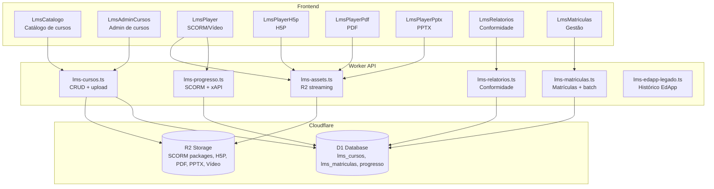
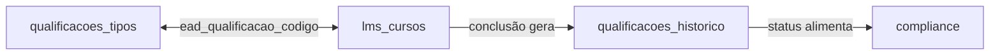

# AirTrust — Arquitetura do LMS Nativo

> **Versão do documento:** 1.0 | **Data:** 2026-06-12 | **HEAD:** `5be104893`
> **Migrations base:** 0335–0350

---

## Sumário

1. [Visão Geral](#1-visão-geral)
2. [Tipos de Conteúdo Suportados](#2-tipos-de-conteúdo-suportados)
3. [Arquitetura de Armazenamento](#3-arquitetura-de-armazenamento)
4. [Players Frontend](#4-players-frontend)
5. [Segurança de Assets](#5-segurança-de-assets)
6. [SSOT EAD — Single Source of Truth](#6-ssot-ead--single-source-of-truth)
7. [Ciclos de Matrícula](#7-ciclos-de-matrícula)
8. [Relatórios de Conformidade](#8-relatórios-de-conformidade)
9. [Histórico Legado EdApp](#9-histórico-legado-edapp)
10. [Rotas da API LMS](#10-rotas-da-api-lms)
11. [Dívida Técnica LMS](#11-dívida-técnica-lms)

---

## 1. Visão Geral

O AirTrust implementa um **LMS (Learning Management System) nativo** integrado ao
ecossistema Cloudflare. O LMS substituiu a integração externa com EdApp (descontinuada)
e oferece:

- **Multi-formato**: SCORM 1.2/2004, H5P, PDF, PPTX, Vídeo
- **SSOT**: Sincronização bidirecional com `qualificacoes_tipos`
- **Ciclos de matrícula**: Renovação automática com janela de 30 dias
- **Conformidade**: Relatórios de conformidade LMS por função
- **Segurança**: Assets servidos via cookie JWT com TTL de 15 minutos

### Diagrama de arquitetura



---

## 2. Tipos de Conteúdo Suportados

| Tipo | Player Frontend | Biblioteca | Armazenamento | Extração |
|---|---|---|---|---|
| **SCORM 1.2/2004** | `LmsPlayer` | `scorm-again` v3.0.3 | R2 (zip extraído) | Upload → unzip → extrai `imsmanifest.xml` → armazena assets no R2 |
| **H5P** | `LmsPlayerH5p` | `h5p-standalone` v3.8.2 | R2 (pacote H5P) | Upload → extrai `h5p.json` → armazena no R2 |
| **PDF** | `LmsPlayerPdf` | `react-pdf` v9.2.1 | R2 (arquivo PDF) | Upload → armazena PDF no R2 |
| **PPTX** | `LmsPlayerPptx` | `@jvmr/pptx-to-html` v1.0.1 | R2 (arquivo PPTX) | Upload → converte para HTML → armazena HTML + assets no R2 |
| **Vídeo** | `LmsPlayer` | HTML5 `<video>` | R2 (arquivo MP4/WebM) | Upload → armazena vídeo no R2 |

### 2.1 SCORM

- **Formatos**: SCORM 1.2 e 2004 (3rd/4th Edition)
- **Runtime**: `scorm-again` — biblioteca que implementa a SCORM API em JavaScript
- **Launch**: Página HTML gerada dinamicamente que carrega o player SCORM em um iframe
- **Comunicação**: SCORM API → `LMSCommit()` → `POST /api/lms/scorm/state/:matriculaId`
- **Tracking**: `cmi.core.lesson_status`, `cmi.core.score.raw`, `cmi.core.total_time`

### 2.2 H5P

- **Runtime**: `h5p-standalone` — player standalone que não requer backend H5P
- **Comunicação**: xAPI statements → `POST /api/lms/xapi/statements`
- **Tracking**: `lms_xapi_statements` (actor, verb, object, result, context)

### 2.3 PDF

- **Player**: `react-pdf` com navegação de páginas, zoom, fullscreen
- **Progresso**: Tracking de páginas visualizadas / total de páginas
- **Conclusão**: 100% das páginas visualizadas OU scroll até o final

### 2.4 PPTX

- **Conversão**: `@jvmr/pptx-to-html` converte PPTX → HTML no upload
- **Player**: Iframe com HTML renderizado + controles de slide
- **Segurança**: Token JWT `token_type: 'lms_asset'`, `asset_scope: 'pptx_viewer'`

### 2.5 Vídeo

- **Player**: HTML5 `<video>` com controles nativos
- **Tracking**: Eventos `play`, `pause`, `ended`, `timeupdate`
- **Conclusão**: 90% do vídeo assistido

---

## 3. Arquitetura de Armazenamento

### 3.1 Fluxo de upload

```
1. Admin faz upload do arquivo (SCORM zip, H5P, PDF, PPTX, vídeo)
2. Worker recebe o arquivo → valida tipo e tamanho
3. Extração (SCORM/H5P/PPTX):
   a. SCORM: unzip → parse imsmanifest.xml → extrai assets para /scorm/<curso_id>/
   b. H5P: unzip → parse h5p.json → extrai para /h5p/<curso_id>/
   c. PPTX: converte para HTML → armazena HTML + imagens em /pptx/<curso_id>/
4. Upload dos assets extraídos para R2
5. Registro no D1: lms_cursos (nome, tipo, conteudo_url, validade_meses)
6. Se tiver código EAD, sync com qualificacoes_tipos
```

### 3.2 Estrutura no R2

```
airtrust-files/
├── lms/
│   ├── <empresa_id>/
│   │   ├── scorm/
│   │   │   └── <curso_id>/
│   │   │       ├── imsmanifest.xml
│   │   │       ├── index.html
│   │   │       └── assets/...
│   │   ├── h5p/
│   │   │   └── <curso_id>/
│   │   │       ├── h5p.json
│   │   │       └── content/...
│   │   ├── pdf/
│   │   │   └── <curso_id>/
│   │   │       └── documento.pdf
│   │   ├── pptx/
│   │   │   └── <curso_id>/
│   │   │       └── slides/...
│   │   └── video/
│   │       └── <curso_id>/
│   │           └── video.mp4
```

### 3.3 Tabelas D1

| Tabela | Descrição | Migration |
|---|---|---|
| `lms_cursos` | Catálogo de cursos (nome, tipo, conteúdo, validade) | 0335 |
| `lms_matriculas` | Matrículas (usuário, curso, status, progresso, datas) | 0336 |
| `lms_progresso_scorm` | Dados cmi do SCORM (por matrícula) | 0337 |
| `lms_h5p_conteudos` | Conteúdos H5P associados a cursos | 0337 |
| `lms_xapi_statements` | Declarações xAPI (H5P e SCORM) | 0339 |
| `lms_matricula_ciclos` | Ciclos de renovação (SSOT) | 0346 |
| `lms_historico_legado_edapp` | Histórico importado do EdApp | 0342 |

---

## 4. Players Frontend

### 4.1 LmsPlayer (SCORM + Vídeo)

**Rota**: `/lms/player/:matriculaId`
**Componente**: `LmsPlayer`

- Carrega dados da matrícula (curso, progresso)
- Se SCORM: monta iframe com launch page do servidor
- Se Vídeo: renderiza `<video>` com tracking de progresso
- SCORM API bridge: `scorm-again` gerencia comunicação com o LMS
- Commit de progresso via `POST /api/lms/scorm/state/:matriculaId`

### 4.2 LmsPlayerH5p

**Rota**: `/lms/player/h5p/:matriculaId`
**Componente**: `LmsPlayerH5p`

- Carrega `h5p-standalone` com os assets do R2
- xAPI statements enviados automaticamente pelo player
- Tracking de conclusão via `lms_xapi_statements`

### 4.3 LmsPlayerPdf

**Rota**: `/lms/player/pdf/:matriculaId`
**Componente**: `LmsPlayerPdf`

- `react-pdf` com `<Document>`, `<Page>`
- Navegação de páginas, zoom, fullscreen
- Tracking: número de páginas visualizadas
- Conclusão: 100% visualizado OU scroll até o fim

### 4.4 LmsPlayerPptx

**Rota**: `/lms/player/pptx/:matriculaId`
**Componente**: `LmsPlayerPptx`

- Iframe com HTML pré-convertido do PPTX
- Navegação de slides (anterior/próximo)
- Token JWT para acesso aos assets (15min TTL)
- Preview mode: `/lms/player/preview/:cursoId` (admin)

---

## 5. Segurança de Assets

### 5.1 Cookie JWT para assets

Assets SCORM e H5P são servidos de rotas públicas, mas protegidos por **cookie JWT**:

1. Frontend acessa `/lms/player/:matriculaId`
2. Worker gera token JWT especial:
   - `token_type: 'lms_asset'`
   - `exp`: now + 15 minutos
   - `asset_curso_id`: ID do curso (para escopo limitado)
3. Token é setado como cookie:
   ```
   Set-Cookie: airtrust_lms_token=<jwt>;
     HttpOnly; Secure; SameSite=Strict;
     Path=/api/lms/scorm/; Max-Age=900
   ```
4. Iframe do player SCORM faz requisições para `/api/lms/scorm/assets/*`
5. Middleware `auth()` detecta `token_type: 'lms_asset'` → autoriza acesso a assets

### 5.2 CSP diferenciada para SCORM/H5P

```http
Content-Security-Policy: frame-ancestors *; script-src 'self' 'unsafe-inline';
  style-src 'self' 'unsafe-inline'; default-src 'self' blob: data: https: http:
```

> **Nota**: CSP relaxada é necessária porque SCORM e H5P usam iframes e scripts
> inline. A proteção principal é o cookie JWT com TTL curto e escopo limitado.

### 5.3 Rotas públicas LMS

As seguintes rotas são whitelisted no `isPublicPath`:

- `/api/lms/scorm/assets/*`
- `/api/lms/scorm/assets-by-curso/*`
- `/api/lms/scorm/launch/*`
- `/api/lms/scorm/preview/*`
- `/api/lms/h5p/assets/*`
- `/api/lms/pptx/asset/*`

Todas validam o cookie JWT internamente.

---

## 6. SSOT EAD — Single Source of Truth

### 6.1 Sincronização bidirecional



- **Criação de curso LMS** → se tiver `ead_qualificacao_codigo`, vincula a um tipo
  de qualificação existente (ou cria um novo)
- **Conclusão de curso** → `createLmsQualificationOnCompletion()` gera registro em
  `qualificacoes_historico` com status `VALIDA`
- **Criação de tipo de qualificação** → verifica se existe curso LMS correspondente
  com mesmo `codigo` no campo `ead_qualificacao_codigo`

### 6.2 Reconciliação

**Endpoint**: `POST /api/lms/cursos/reconcile-ead`

Força reconciliação entre `qualificacoes_tipos` e `lms_cursos`:
- Cursos sem tipo correspondente → cria tipo
- Tipos sem curso correspondente → cria curso
- Mismatch de validade → atualiza

---

## 7. Ciclos de Matrícula

### 7.1 Tabela de ciclos

```sql
CREATE TABLE lms_matricula_ciclos (
  id INTEGER PRIMARY KEY AUTOINCREMENT,
  empresa_id INTEGER NOT NULL,
  usuario_id INTEGER NOT NULL,
  curso_id INTEGER NOT NULL,
  matricula_ativa_id INTEGER REFERENCES lms_matriculas(id),
  data_inicio TEXT NOT NULL,
  data_expiracao TEXT,
  status TEXT NOT NULL DEFAULT 'ATIVO',  -- ATIVO, RENOVADO, EXPIRADO
  created_at TEXT NOT NULL DEFAULT (datetime('now')),
  updated_at TEXT NOT NULL DEFAULT (datetime('now'))
);
```

### 7.2 Renovação automática

- **Janela**: 30 dias antes do vencimento
- **Trigger**: Cron diário (`0 8 * * *`) verifica ciclos próximos da expiração
- **Ação**: Cria nova matrícula no mesmo curso, vinculada ao ciclo
- **Status**: Ciclo marcado como `RENOVADO`, matrícula antiga mantida como histórico

### 7.3 Matrícula em lote

**Endpoint**: `POST /api/lms/matriculas` com `funcionario_ids: number[]`

Matricula múltiplos funcionários em um curso de uma vez, criando ciclos individuais.

---

## 8. Relatórios de Conformidade

### 8.1 Endpoints

| Endpoint | Descrição |
|---|---|
| `GET /api/lms/relatorios/conformidade?funcao=` | Conformidade LMS por função |
| `GET /api/lms/relatorios/cursos-conformidade` | Conformidade por curso |
| `GET /api/lms/relatorios/expiracoes?dias=30` | Expirações próximas |

### 8.2 Lógica

Para cada funcionário com uma função:
1. Identifica cursos obrigatórios para a função (via matriz de treinamento)
2. Verifica matrículas ativas/concluídas
3. Compara datas de expiração com o período
4. Calcula percentual de conformidade
5. Lista cursos pendentes/vencidos

### 8.3 Integração com Compliance

Os relatórios LMS alimentam o módulo de Compliance, que consolida:
- Qualificações
- Licenças
- Cursos LMS

---

## 9. Histórico Legado EdApp

**Arquivo**: `routes/lms-edapp-legado.ts`
**Frontend**: `LmsHistoricoEdApp` → `/lms/legado-edapp`

Mantém registros de conclusões de curso importadas do EdApp antes da migração
para o LMS nativo. Esses dados são usados para:
- Histórico completo do tripulante (não perder dados antigos)
- Cálculo de conformidade (cursos concluídos no EdApp contam)
- Referência para migração manual

> Esses registros são **read-only** no LMS atual — a integração EdApp está
> descontinuada e retorna 410.

---

## 10. Rotas da API LMS

### 10.1 Cursos (`routes/lms-cursos.ts`)

| Método | Path | Descrição |
|---|---|---|
| `GET` | `/api/lms/cursos` | Catálogo |
| `GET` | `/api/lms/cursos/:id` | Detalhes |
| `POST` | `/api/lms/cursos` | Criar curso |
| `PUT` | `/api/lms/cursos/:id` | Atualizar |
| `DELETE` | `/api/lms/cursos/:id` | Soft delete |
| `POST` | `/api/lms/cursos/upload` | Upload de conteúdo |
| `POST` | `/api/lms/cursos/reconcile-ead` | Reconciliar EAD |

### 10.2 Matrículas (`routes/lms-matriculas.ts`)

| Método | Path | Descrição |
|---|---|---|
| `GET` | `/api/lms/matriculas` | Listar |
| `POST` | `/api/lms/matriculas` | Matricular (individual) |
| `POST` | `/api/lms/matriculas` (batch) | Matricular em lote |

### 10.3 Progresso (`routes/lms-progresso.ts`)

| Método | Path | Descrição |
|---|---|---|
| `GET` | `/api/lms/scorm/state/:matriculaId` | Estado SCORM |
| `POST` | `/api/lms/scorm/state/:matriculaId` | Commit SCORM |
| `POST` | `/api/lms/xapi/statements` | xAPI statement |

### 10.4 Assets (`routes/lms-assets.ts`)

| Método | Path | Auth | Descrição |
|---|---|---|---|
| `GET` | `/api/lms/scorm/launch/:matriculaId` | 🍪 | Launch SCORM |
| `GET` | `/api/lms/scorm/assets/*` | 🍪 | Assets SCORM |
| `GET` | `/api/lms/scorm/preview/:cursoId` | ✅ admin | Preview |
| `GET` | `/api/lms/h5p/assets/*` | 🍪 | Assets H5P |
| `GET` | `/api/lms/pptx/asset/*` | 🍪 | Assets PPTX |

### 10.5 Relatórios (`routes/lms-relatorios.ts`)

| Método | Path | Descrição |
|---|---|---|
| `GET` | `/api/lms/relatorios/conformidade` | Por função |
| `GET` | `/api/lms/relatorios/cursos-conformidade` | Por curso |
| `GET` | `/api/lms/relatorios/expiracoes` | Expirações |

---

## 11. Dívida Técnica LMS

### 11.1 Erros TypeScript em lms-matriculas.ts

**6 erros TS2552** — todos o mesmo padrão:

```
TS2552: Cannot find name 'dataExpiracao'. Did you mean 'data_expiracao'?
```

**Causa**: A variável `data_expiracao` (snake_case) é destructured de schemas Zod
validados, mas o código subsequente referencia `dataExpiracao` (camelCase).

**Localizações**: Linhas 765, 824, 890, 1005, 1061, 1139 — todas em chamadas a
`sendMatriculaEmail()`.

**Risco de runtime**: 🟡 MÉDIO. Se o TypeScript compila com `noEmit` e os erros
não são bloqueantes, o código ainda executa. Mas `dataExpiracao` seria `undefined`
em runtime, potencialmente quebrando o envio de emails de matrícula.

**Solução**: Renomear `dataExpiracao` → `data_expiracao` nas chamadas, ou ajustar
a destructuring para usar camelCase.

### 11.2 Erros em lms-relatorios.ts

**Nenhum erro TypeScript específico neste arquivo.** Os relatórios são servidos via
`repositories/lmsRelatoriosRepository.ts`.

### 11.3 Outros débitos

- **Migrations duplicadas**: 0347 (2 arquivos: `lms_cursos_content_filename` e
  `lms_edapp_tenant_indexes`)
- **Histórico EdApp legado**: Dados mantidos mas sem integração ativa
- **Falta de testes de integração** para o fluxo SCORM completo (upload → launch →
  progresso → conclusão → qualificação)

---

## Apêndice: Smoke Tests LMS

Scripts disponíveis:

```bash
npm run seed:lms:pdf:local     # Seed de cursos PDF demo
npm run seed:lms:pptx:local    # Seed de cursos PPTX demo
npm run smoke:lms:local        # Smoke test do LMS completo
```

Os smoke tests verificam:
1. Criação de curso (SCORM, H5P, PDF, PPTX)
2. Upload de conteúdo para R2
3. Matrícula de aluno
4. Launch do player
5. Commit de progresso SCORM
6. Conclusão e geração de qualificação
