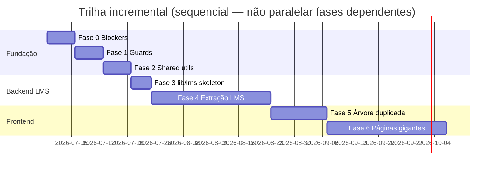

# AirTrust — Roadmap de refactor arquitetural (incremental)

> **Status:** Plano aprovado — execução **não iniciada** neste documento.
> **Data:** 2026-06-29 | **ADR:** [0001](adr/0001-airtrust-module-architecture-pattern.md) | **Contexto:** [CONTEXT.md](CONTEXT.md)

---

## Princípios invioláveis

| # | Regra |
|---|---|
| R1 | Sem deploy até validação completa da fase |
| R2 | Sem migrations de schema |
| R3 | Sem toque em produção / dados remotos |
| R4 | Sem alterar RBAC, auth, multi-tenant, backup, certificados |
| R5 | FRMS operacional e SIGVOOS congelados |
| R6 | Árvore legacy frontend **não apagada** até Fase 5 GO |
| R7 | Contrato HTTP e LMS/SCORM público inalterado |
| R8 | Sem trocar client HTTP funcional sem testes |
| R9 | Um concern por PR — sem cosmético misturado |
| R10 | Rollback = revert de PR (patches pequenos) |

---

## Visão das fases



> Datas ilustrativas. Cada fase só inicia após **GO** formal da anterior.

---

## Matriz de fases

| Fase | Nome | Objetivo | Entregáveis | Zona de código | Risco |
|---|---|---|---|---|---|
| **0** | Segurança e blockers | Eliminar impedimentos antes de mover código | Inventário de blockers; fixes mínimos documentados | Docs + issues | Baixo |
| **1** | Guards | Automatizar regras do ADR 0001 | Novos testes em `__tests__/architecture/` | Worker tests | Baixo |
| **2** | Shared utils | Uma fonte para CPF, datas, db helpers | `utils/` consolidado; re-exports; testes | `worker-airtrust/src/utils/` | Baixo |
| **3** | Skeleton `lib/lms` | Estrutura vazia + tipos + 1 extração piloto | `lib/lms/types.ts`, barrel, 1 `db-service-*.ts` | `lib/lms/`, 1 route mínima | Médio |
| **4** | Extração LMS | Mover SQL/regra de LMS para `lib/lms/` | PRs incrementais por subdomínio | `routes/lms-*.ts` | Médio–Alto |
| **5** | Árvore frontend | Convergir imports `@/components` → `react-app` | Inventário, redirects, zero apagar legado | `src/components/`, imports | Médio |
| **6** | Páginas gigantes | Decompor pages >2000 LOC | Subcomponentes/hooks por domínio | `pages/Qualificacoes.tsx`, etc. | Médio |

---

## Fase 0 — Segurança e blockers

### Objetivo

Garantir baseline verde e inventariar impedimentos reais antes de qualquer movimentação de código.

### Escopo

- Confirmar baseline: `lint`, `test:run`, `test:worker`, `build`, `tsc --noEmit`
- Inventariar blockers conhecidos:
  - Árvore frontend duplicada (`src/components/` vs `src/react-app/components/`)
  - Rotas LMS monolíticas (~13.450 LOC combinadas)
  - Débitos LMS documentados (`LMS_ARCHITECTURE.md` §11 — ex.: `dataExpiracao` vs `data_expiracao`)
- Registrar módulos congelados (auth, FRMS ops, SIGVOOS, backup, certificados)
- **Não** corrigir blockers funcionais nesta fase — apenas documentar e priorizar

### Entregáveis

- [x] `docs/adr/0001-airtrust-module-architecture-pattern.md`
- [x] `docs/CONTEXT.md`
- [x] `docs/ARCHITECTURE_REFACTOR_ROADMAP.md` (este arquivo)
- [ ] Issue tracker: 1 issue por blocker P0/P1 identificado

### GO / NO-GO

| | Critério |
|---|---|
| **GO** | `npm run lint` ✅; `npm run test:run` ✅; `npm run build` ✅; ADR + CONTEXT + ROADMAP merged; inventário de blockers publicado |
| **NO-GO** | Qualquer regressão no baseline; blockers P0 sem issue; tentativa de refactor funcional nesta fase |

### Baseline registrado (2026-06-29)

```
npm run lint     → OK
npm run test:run → 994 passed (115 files)
npm run build    → OK (~6.5s)
```

---

## Fase 1 — Guards de arquitetura

### Objetivo

Codificar regras do ADR 0001 em testes automatizados para impedir regressão durante extrações.

### Escopo proposto

Novos guards em `worker-airtrust/src/__tests__/architecture/`:

| Guard | Regra |
|---|---|
| `no-large-sql-in-routes.test.ts` | Nenhum `.prepare(` multi-linha (>15 linhas) em `routes/lms-*.ts` **novos**; baseline allowlist para código existente |
| `no-direct-audit-insert.test.ts` | Proibir `INSERT INTO audit_` fora de `lib/audit/` |
| `lms-route-delegates-to-lib.test.ts` | Após Fase 3: rotas LMS devem importar de `lib/lms/` (crescendo incrementalmente) |

Guards existentes a manter verdes:

- `no-internal-error-details`
- `no-sensitive-audit-payloads`
- `no-runtime-ddl-hot-paths`
- `architecture-performance-guard`

### Fora de escopo

- Guards para FRMS, EVD, importação (congelados)
- Alteração de RBAC/auth

### GO / NO-GO

| | Critério |
|---|---|
| **GO** | ≥2 novos guards implementados; `npm run test:worker` ✅; allowlist documentada para dívida existente; zero mudança de runtime behavior |
| **NO-GO** | Guard flaky; guard que exige refactor massivo para passar (usar allowlist + ratchet) |

---

## Fase 2 — Shared utils (CPF, dates, db helpers)

### Objetivo

Consolidar utilitários transversais antes de extrações LMS (evitar copiar helpers para `lib/lms/`).

### Escopo

| Util | Ação |
|---|---|
| `utils/cpf.ts` | Fonte única: `normalizeCPF`, `formatCPF`, `isValidCPF` — delegar de `security.ts` |
| `utils/dates.ts` | Consolidar parsing/format timezone-safe usado em LMS matrículas |
| `utils/db.ts` | Helpers: `firstRow`, `allRows`, paginação padrão — sem mudar queries existentes |

### Regras

- Re-exports de compatibilidade nos paths antigos (deprecation comment, sem quebrar imports)
- Testes unitários para cada util consolidado
- **Zero** alteração de comportamento de endpoints

### GO / NO-GO

| | Critério |
|---|---|
| **GO** | Testes unitários novos ≥3; `test:worker` ✅; nenhum diff em payloads HTTP; imports antigos continuam funcionando |
| **NO-GO** | Mudança de validação CPF em produção sem teste; remoção de export sem re-export |

---

## Fase 3 — Skeleton `lib/lms`

### Objetivo

Criar estrutura `lib/lms/` e provar o padrão com **uma** extração piloto de baixo risco.

### Estrutura alvo

```
worker-airtrust/src/lib/lms/
├── types.ts                    # LmsCurso, LmsMatricula, enums de status
├── db-service.ts               # barrel
├── db-service-cursos-read.ts   # (piloto) queries GET simples
└── __tests__/
    └── db-service-cursos-read.test.ts
```

### Candidatos piloto (escolher 1)

| Candidato | Risco | Motivo |
|---|---|---|
| Listagem/read de cursos (`GET /api/lms/cursos`) | Baixo | Read-only; testes existentes (`lms-cursos-beta-contract`) |
| Relatórios (`lms-relatorios.ts` → 89 LOC) | Baixo | Já parcialmente em `repositories/lmsRelatoriosRepository` |
| SCORM progresso commit | **Alto — FORA** | Contrato público; cookie auth |

**Recomendação:** piloto em read-path de cursos ou completar migração de `lmsRelatoriosRepository` → `lib/lms/db-service-relatorios.ts`.

### GO / NO-GO

| | Critério |
|---|---|
| **GO** | `lib/lms/types.ts` + ≥1 `db-service-*.ts` + testes; route delega ao lib; contrato HTTP byte-identical em teste de contrato; `test:worker` ✅ |
| **NO-GO** | Alteração em SCORM launch/assets/progresso; SQL movido sem teste; route ainda >90% inline após PR |

---

## Fase 4 — Extração incremental LMS

### Objetivo

Reduzir LOC e SQL inline em `routes/lms-*.ts` movendo subdomínios para `lib/lms/`.

### Ordem de extração (incremental — 1 subdomínio por PR)

| # | PR | Origem | Destino | LOC approx | Pré-requisito teste |
|---|---|---|---|---|---|
| 4.1 | Relatórios | `lms-relatorios.ts` + repository | `lib/lms/db-service-relatorios.ts` | ~500 | `lms-relatorios-repository-contract` ✅ |
| 4.2 | Cursos read | `lms-cursos.ts` (GET handlers) | `lib/lms/db-service-cursos-read.ts` | ~800 | `lms-cursos-beta-contract` ✅ |
| 4.3 | Cursos write | `lms-cursos.ts` (POST/PUT) | `lib/lms/db-service-cursos-write.ts` | ~1200 | upload tests ✅ |
| 4.4 | Matrículas read | `lms-matriculas.ts` (GET) | `lib/lms/db-service-matriculas-read.ts` | ~1000 | matriculas status tests ✅ |
| 4.5 | Matrículas write | `lms-matriculas.ts` (POST/batch) | `lib/lms/db-service-matriculas-write.ts` | ~1500 | progress-integrity tests ✅ |
| 4.6 | Progresso SCORM | `lms-progresso.ts` | `lib/lms/scorm-state-service.ts` | ~450 | `lms-progresso.test` ✅ |
| 4.7 | Assets streaming | `lms-assets.ts` | `lib/lms/db-service-assets.ts` + stream helpers | ~2400 | assets scorm/range tests ✅ |

### Explicitamente congelado na Fase 4

- Paths e payloads SCORM/xAPI públicos
- Cookie JWT `lms_asset` e launch pages
- Sync SSOT com `qualificacoes_tipos`
- `lms-edapp-legado.ts`

### Métricas de progresso

| Métrica | Baseline | Meta Fase 4 |
|---|---|---|
| LOC total `routes/lms-*.ts` | ~13.450 | <8.000 (≥40% redução) |
| Handlers com SQL inline >15 linhas | ~dezenas | <5 (restante allowlisted) |
| Arquivos em `lib/lms/` | 0 | ≥8 |
| Testes colocalizados em `lib/lms/__tests__/` | 0 | ≥6 |

### GO / NO-GO (por PR e fase)

| | Critério |
|---|---|
| **GO (PR)** | Diff <600 LOC; testes de contrato passando; smoke LMS local opcional; sem mudança de response schema |
| **GO (fase)** | ≥5 subdomínios extraídos; guards Fase 1 verdes; smoke `npm run smoke:lms:local` ✅ se disponível |
| **NO-GO** | Regressão SCORM; alteração de auth asset; falha em teste de matrícula/progresso; PR mistura frontend |

### Pós-LMS (fora desta fase, mesma trilha)

- `treinamentos-planejados.ts` → `lib/treinamentos/` (replicar padrão)
- `escalas-alocacoes.ts` / helpers → `lib/escalas/` (somente após LMS GO)

---

## Fase 5 — Árvore frontend duplicada

### Objetivo

Eliminar dependência de `src/components/` (legado) nos imports ativos, **sem apagar** a árvore legada.

### Diagnóstico

```
vite/tsconfig:  @/ → ./src
Canônico:       src/react-app/components/
Legado:         src/components/          (~25 arquivos)
                src/lib/sw-manager.tsx

Imports ativos de legado: ~24 arquivos em react-app usam @/components/*
Componentes legado mais importados: ui/Modal, ui/Button, ui/DataTable, ui/Form
```

### Plano incremental

| # | Ação | Risco |
|---|---|---|
| 5.1 | Inventário completo: script `grep -r '@/components' src/react-app` → CSV | Nulo |
| 5.2 | Para cada primitivo legado usado: confirmar equivalente em `react-app/components/` ou mover (copy, não duplicar) | Baixo |
| 5.3 | PR por componente: trocar imports `@/components/ui/Modal` → `@/react-app/components/...` ou path relativo | Baixo |
| 5.4 | Adicionar ESLint rule / codemod guard: proibir **novos** imports de `@/components/` | Baixo |
| 5.5 | Marcar `src/components/` como `@deprecated` em README interno | Nulo |
| 5.6 | **Não deletar** `src/components/` — apenas zerar imports ativos | — |

### Alias (decisão diferida)

Opções documentadas, escolha na Fase 5.1:

- **A)** Manter `@/` → `./src`; migrar imports explicitamente
- **B)** Adicionar `@app/` → `./src/react-app` para novos imports (coexistência)

### GO / NO-GO

| | Critério |
|---|---|
| **GO** | Zero imports `@/components/*` em `src/react-app/`; `test:run` ✅; `build` ✅; legado intacto no disco |
| **NO-GO** | Deleção de arquivos legado; mudança de branding/cores; refactor visual misturado; alteração de SW behavior |

---

## Fase 6 — Páginas gigantes

### Objetivo

Decompor pages >2000 LOC em subcomponentes e hooks colocalizados, seguindo padrão FRMS/Escalas.

### Alvos (ordem sugerida)

| Page | LOC | Padrão a seguir |
|---|---|---|
| `Qualificacoes.tsx` | ~5.153 | `pages/qualificacoes/` (já iniciado) |
| `TreinamentosPlanejadosPage.tsx` | ~3.714 | extrair modals, rules (`treinamentos-planejados-rules.ts` ✅) |
| `escalas/EvdPage.tsx` | ~2.640 | `pages/escalas/components/` |
| `pages/lms/*` | variável | players já separados |

### Regras

- Extrair por **feature vertical** (modal, tab, hook), não por tipo de arquivo global
- Colocalizar: `pages/<modulo>/components/`, `hooks/`, `__tests__/`
- Sem alterar UX, branding, ou fluxos
- Backend correspondente deve estar ≥Fase 4 GO antes de decompor pages LMS

### GO / NO-GO

| | Critério |
|---|---|
| **GO (PR)** | Page reduz ≥200 LOC; testes existentes passando; sem mudança de comportamento |
| **GO (fase)** | Nenhuma page >3000 LOC; cobertura de testes mantida ou aumentada |
| **NO-GO** | Refactor visual; mudança de API calls; page split que altera state management global |

---

## Riscos e mitigações

| Risco | Prob. | Impacto | Mitigação |
|---|---|---|---|
| Regressão SCORM silenciosa | Média | Alto | Testes contrato + smoke LMS; Fase 4.6 congelada até testes verdes |
| Import circular lib/lms | Média | Médio | Barrels finos; import direto de submódulos |
| PR muito grande | Alta | Médio | Limite 600 LOC; 1 subdomínio por PR |
| Guard bloqueia CI | Baixa | Baixo | Allowlist com ratchet (reduzir allowlist a cada PR) |
| Duplicação utils Fase 2 + lib/lms | Baixa | Baixo | lib/lms importa de utils/, nunca copia |

---

## Checklist de encerramento do programa

- [ ] Fase 0–6 todas com GO documentado
- [ ] `lib/lms/` cobre ≥80% da lógica LMS
- [ ] Zero imports `@/components/*` em react-app
- [ ] Nenhuma page >3000 LOC
- [ ] Guards de arquitetura verdes
- [ ] Documentação FRMS/LMS/CONTEXT atualizada
- [ ] Retrospectiva: lições para `lib/treinamentos/`, `lib/escalas/`

---

## Referências

- [ADR 0001](adr/0001-airtrust-module-architecture-pattern.md)
- [CONTEXT.md](CONTEXT.md)
- `docs/AIRTRUST_ARCHITECTURE_MODULARIZATION_PLAN_H33_v0_5.md`
- `LMS_ARCHITECTURE.md` §10–11 (contratos e dívida)
- `FRMS_ARCHITECTURE.md` §1 (referência lib/)
