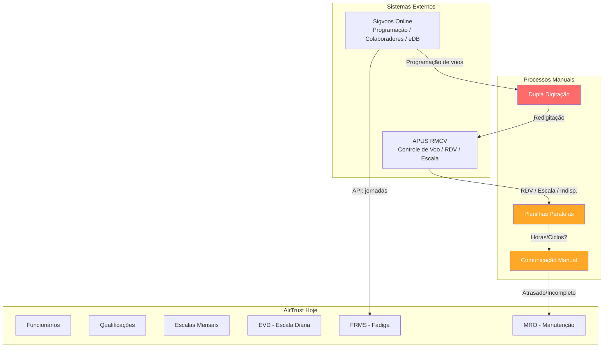
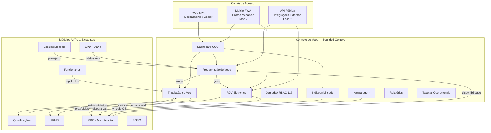
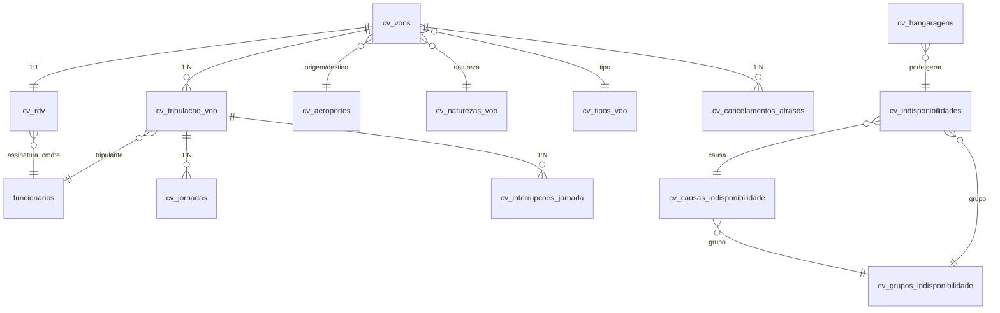

# Controle de Voos — Benchmark, Requisitos e Proposta de Arquitetura

> **Status:** Documento técnico/produto para validação com gestor operacional
> **Data:** 2026-06-13
> **Autor:** AirTrust Engineering
> **Versão:** v1.0
> **Substitui:** `docs/FLIGHTOPS_MODULE_LEVANTAMENTO_INICIAL.md` (v0.1)

---

## Índice

1. [Visão Executiva](#1-visão-executiva)
2. [Situação Atual — AS IS](#2-situação-atual--as-is)
3. [Inventário APUS RMCV](#3-inventário-apus-rmcv)
4. [Inventário Sigvoos](#4-inventário-sigvoos)
5. [Benchmark de Mercado](#5-benchmark-de-mercado)
6. [Proposta do Módulo Controle de Voos no AirTrust](#6-proposta-do-módulo-controle-de-voos-no-airtrust)
7. [Submódulos Propostos](#7-submódulos-propostos)
8. [Modelo de Dados Conceitual](#8-modelo-de-dados-conceitual)
9. [Fluxos Operacionais Principais](#9-fluxos-operacionais-principais)
10. [MVP — 60 a 90 dias](#10-mvp--60-a-90-dias)
11. [Fase 2](#11-fase-2)
12. [Backlog em Epics](#12-backlog-em-epics)
13. [Proposta de Rotas Frontend](#13-proposta-de-rotas-frontend)
14. [Proposta de APIs](#14-proposta-de-apis)
15. [Perguntas para o Gestor Operacional](#15-perguntas-para-o-gestor-operacional)
16. [Prints Pendentes](#16-prints-pendentes)
17. [Recomendação Final](#17-recomendação-final)

---

## 1. Visão Executiva

### 1.1 O problema atual

A empresa opera hoje com **dois sistemas desconectados** para controle operacional de voo:

| Sistema | Função | Limitação |
|---------|--------|-----------|
| **Sigvoos** (online) | Programação de voos, cadastro de colaboradores, eDB | Focado em cadastros e programação; não cobre RDV regulatório completo |
| **APUS RMCV** (legado) | Controle de voo, RDV, escala, indisponibilidade, hangaragem | Sistema legado desktop; exige redigitação de dados já existentes no Sigvoos |

O resultado é um **fluxo duplicado**: dados de voo, tripulação, RDV, indisponibilidade e hangaragem são lançados no Sigvoos e depois **redigitados manualmente** no APUS RMCV. Isso gera:

- **Retrabalho operacional:** horas/semana desperdiçadas com dupla digitação.
- **Divergência de dados:** os dois sistemas podem conter informações diferentes sobre o mesmo voo.
- **Dificuldade de auditoria:** não há fonte única de verdade; relatórios regulatórios exigem conferência cruzada.
- **Atraso na cadeia de manutenção:** horas, ciclos e pousos do RDV não alimentam automaticamente o controle de manutenção (MRO).
- **Baixa integração com FRMS:** dados reais de jornada podem não refletir o que foi planejado.
- **Custo de licenciamento:** dois sistemas com sobreposição funcional significativa.

### 1.2 A oportunidade

O AirTrust já possui módulos que cobrem parte da cadeia operacional:

| Módulo AirTrust existente | O que já cobre |
|---------------------------|----------------|
| **Funcionários** | Cadastro completo de tripulantes, cargos, designações |
| **Qualificações** | Habilitações, CMA, ASO, vencimentos, validades |
| **Escalas Mensais** | Planejamento mensal de escalas de tripulantes |
| **EVD** (Escala de Voo Diária) | Visão diária de eventos de voo, alocações |
| **FRMS** | Controle de fadiga, jornadas, check-in, score de risco |
| **MRO** (protótipo) | Controle de manutenção, ordens de serviço, tracking de componentes |
| **SGSO** | Gestão de segurança operacional |
| **LMS** | Treinamentos |

O que **falta** é o elo central: um módulo de **Controle de Voos** que unifique programação, tripulação, execução (RDV) e relatórios, servindo como **fonte canônica** de dados operacionais e integrando-se nativamente aos módulos existentes.

### 1.3 O que o módulo Controle de Voos resolve

1. **Fonte única de verdade:** o voo é cadastrado uma única vez, no AirTrust.
2. **RDV eletrônico integrado:** ao fechar o RDV, horas, ciclos e pousos alimentam automaticamente MRO e FRMS.
3. **Validação automática de tripulação:** antes de alocar um tripulante, o sistema verifica qualificações, CMA, ASO, FRMS e jornada.
4. **Dashboard OCC diário:** visão unificada do dia operacional com alertas de conflito, indisponibilidade e vencimentos.
5. **Eliminação do APUS RMCV:** o AirTrust substitui progressivamente as rotinas do APUS, começando pelas mais críticas.
6. **Integração com Sigvoos mantida onde necessário:** aproveitar a integração existente de jornadas até que o Controle de Voos a substitua completamente.

### 1.4 Princípio fundamental

> **O Controle de Voos do AirTrust não é uma cópia do APUS nem do Sigvoos.**
>
> É uma versão moderna, integrada e mais eficiente, usando APUS e Sigvoos apenas como referência de rotinas existentes. O objetivo é **substituir processos legados**, não replicar telas antigas.

O nome público do módulo é **"Controle de Voos"**. O nome técnico/domínio é `controle_voos`. O termo "FlightOps" é usado apenas para referência de benchmark internacional de mercado.

---

## 2. Situação Atual — AS IS

### 2.1 Fluxo atual provável

Com base nos prints e contexto observados, o fluxo operacional atual segue este padrão:

1. **Programação** nasce no **Sigvoos** (cadastro de voos, colaboradores, designações).
2. Os **mesmos dados** (ou parte deles) são **redigitados no APUS RMCV** para registro regulatório.
3. **Escala de tripulantes** é montada no APUS RMCV (RMCV0401) ou em planilhas paralelas.
4. **RDV** é lançado no APUS RMCV (RMCV0201) após o voo.
5. **Indisponibilidade e hangaragem** são registradas no APUS RMCV, sem integração automática com manutenção.
6. **Jornadas** do Sigvoos são integradas ao FRMS do AirTrust via API (`POST /api/integracoes/sigvoos/sincronizar`).
7. **MRO** ainda não recebe horas/ciclos automaticamente — depende de comunicação manual.

### 2.2 Diagrama AS IS



### 2.3 Riscos do fluxo atual

| Risco | Severidade | Impacto |
|-------|-----------|---------|
| **Dupla digitação** | Alta | Retrabalho, erro humano, inconsistência entre sistemas |
| **Divergência de dados** | Alta | RDV no APUS pode divergir do voo no Sigvoos — risco regulatório (ANAC) |
| **Dificuldade de auditoria** | Média | Não há trilha única; reconciliar sistemas é manual |
| **Atraso no envio de horas/ciclos ao MRO** | Alta | Manutenção pode operar com dados desatualizados, risco de segurança de voo |
| **Baixa integração com FRMS** | Média | Jornada real pode não ser capturada em tempo real |
| **Dependência de sistema legado** | Média | APUS é desktop, sem API, sem mobile, sem cloud |
| **Planilhas paralelas** | Média | Dados operacionais críticos fora de qualquer sistema |

---

## 3. Inventário APUS RMCV

### 3.1 Controle de Voo (RMCV02xx)

| Código | Nome | Grupo | Interpretação funcional | Prioridade MVP | Observação / Equivalência AirTrust |
|--------|------|-------|------------------------|----------------|-------------------------------------|
| RMCV0201 | Inclusão do Relatório de Voo | Controle de Voo | Lançamento do RDV pós-voo: horários, pousos, combustível, ocorrências | **Alta** | `POST /api/controle-voos/voos/:id/rdv` — RDV eletrônico com pré-preenchimento |
| RMCV0202 | Distância entre Aeroportos | Controle de Voo | Tabela de pares de aeroportos e distâncias para cálculo de tempo de voo | **Baixa** | Tabela `cv_aeroportos_distancias` — Fase 2 |
| RMCV0203 | Impressão de Relatório de Voo | Controle de Voo | Geração do RDV em PDF no formato oficial ANAC | **Alta** | `GET /api/controle-voos/rdv/:id/pdf` — template oficial |
| RMCV0204 | Relatórios | Controle de Voo | Consultas parametrizadas: voos, horas, tripulantes | **Média** | Submódulo de Relatórios — MVP com relatórios básicos |
| RMCV0206 | Cancelamento de Relatório de Voo | Controle de Voo | Estorno de RDV com motivo e auditoria | **Alta** | `POST /api/controle-voos/rdv/:id/cancelar` — soft delete com motivo |
| RMCV0207 | Cadastramento de Bloco de RDV | Controle de Voo | Agrupamento de voos para lançamento em lote | **Baixa** | Funcionalidade de batch — Fase 2 |
| RMCV0208 | Indisponibilidade de Aeronave | Controle de Voo | Registro de aeronave fora de operação: causa, grupo, período | **Alta** | `POST /api/controle-voos/indisponibilidades` — integração com MRO |
| RMCV0210 | Controle Diário de Operação | Controle de Voo | Visão OCC do dia: voos programados, status, tripulação, aeronaves | **Alta** | Dashboard OCC — `/controle-voos/dashboard` |
| RMCV0211 | Registro de Hangaragem | Controle de Voo | Entrada/saída de aeronave em hangar | **Média** | `POST /api/controle-voos/hangaragem` — vinculado a OS do MRO |
| RMCV0212 | Ordem de Programação | Controle de Voo | Sequenciamento/ordenação dos voos do dia | **Média** | Ordenação na tela de programação — MVP |
| RMCV0213 | Gráficos de Causas de Indisponibilidade | Controle de Voo | Dashboard visual de motivos de indisponibilidade | **Baixa** | Submódulo de Relatórios — Fase 2 |

### 3.2 Coordenação de Voo (RMCV04xx)

| Código | Nome | Grupo | Interpretação funcional | Prioridade MVP | Observação / Equivalência AirTrust |
|--------|------|-------|------------------------|----------------|-------------------------------------|
| RMCV0401 | Escala de Tripulante | Coordenação de Voo | Alocação de tripulantes (PIC, SIC, comissário) aos voos do dia | **Alta** | `POST /api/controle-voos/voos/:id/tripulacao` — com validação automática |
| RMCV0402 | Fechar Escala | Coordenação de Voo | Bloqueio/finalização da escala do dia — após fechamento, não permite alterações | **Alta** | `POST /api/controle-voos/escala/fechar` — com registro de auditoria |
| RMCV0403 | Mapa de Voo | Coordenação de Voo | Visualização geográfica de rotas e voos | **Baixa** | Nice-to-have visual — Fase 2 |
| RMCV0405 | Voo | Coordenação de Voo | Cadastro/edição/consulta de voos individuais (prefixo, rota, horário) | **Alta** | `POST/GET/PATCH /api/controle-voos/voos` — CRUD completo |
| RMCV0408 | Interrupções de Jornada | Coordenação de Voo | Registro de exceções: troca de tripulante, atraso, cancelamento, desvio | **Média** | Tabela `cv_interrupcoes_jornada` — Fase 2, requer entender regras de negócio |

### 3.3 Tabelas Complementares (RMCV01xx)

| Código | Nome | Grupo | Interpretação funcional | Prioridade MVP | Onde já existe ou existirá no AirTrust |
|--------|------|-------|------------------------|----------------|----------------------------------------|
| RMCV0101 | Aeroportos / Plataformas | Tabelas | Cadastro de aeroportos (ICAO, IATA, nome, cidade, país) e plataformas | **Alta** | ❌ Novo: `cv_aeroportos` |
| RMCV0102 | HOTRAM | Tabelas | Horários de transporte aéreo e movimentação (hotel, transporte) | **Baixa** | ❌ Novo: `cv_hotram` — Fase 2 |
| RMCV0103 | Voos | Tabelas | Cadastro base de voos (prefixo, rota, natureza, tipo) | **Alta** | ❌ Novo: `cv_voos` — será expandido pela programação |
| RMCV0104 | Feriados | Tabelas | Calendário de feriados para alertas operacionais | **Baixa** | ❌ Novo: `cv_feriados` — Fase 2 |
| RMCV0105 | Tripulantes | Tabelas | Cadastro de tripulantes com designação | **Alta** | ✅ Já existe: `funcionarios` |
| RMCV0111 | Tipo de Voo | Tabelas | Classificação de tipo de voo (regular, charter, ferry, etc.) | **Alta** | ❌ Novo: `cv_tipos_voo` |
| RMCV0112 | Natureza do Voo | Tabelas | Natureza da operação (passageiro, carga, ambulância, etc.) | **Alta** | ❌ Novo: `cv_naturezas_voo` |
| RMCV0114 | Terceirizado | Tabelas | Cadastro de operadores/empresas terceirizadas | **Baixa** | ❌ Novo: `cv_terceirizados` — Fase 2 |
| RMCV0115 | Grupos de Indisponibilidade | Tabelas | Agrupamento de causas de indisponibilidade | **Alta** | ❌ Novo: `cv_grupos_indisponibilidade` |
| RMCV0116 | Causas de Indisponibilidade | Tabelas | Catálogo de motivos de aeronave indisponível | **Alta** | ❌ Novo: `cv_causas_indisponibilidade` |

---

## 4. Inventário Sigvoos

### 4.1 Funcionalidades observadas

Com base nos prints do Sigvoos online (`sigvoos.com.br`):

| Menu/Tela | Função provável | Dados envolvidos | Como aparece no AirTrust |
|-----------|----------------|------------------|-------------------------|
| **Lista de colaboradores** | Visão geral de todos os colaboradores com exportação CSV | Nome, matrícula, designação/cargo, licença, CANAC | ✅ `Funcionarios.tsx` — já existe |
| **Lista de colaboradores ativos** | Filtro de apenas colaboradores ativos | Status ativo/inativo | ✅ Já existe via filtros em Funcionários |
| **Listagem de colaboradores sem cargo** | Identificação de gaps de cadastro | Colaboradores sem designação | ⚠️ Possível via relatório/filtro |
| **Cadastrar** | CRUD completo de colaborador | Todos os campos cadastrais | ✅ Já existe em Funcionários |
| **Pesquisa de habilitações** | Consulta de qualificações/habilitações por tripulante | Licenças, validades, tipos | ✅ `Qualificacoes.tsx` — já existe |
| **Lista de tripulantes por designação** | Tripulantes agrupados por função (PIC, SIC, comissário) | Designação, senioridade | ⚠️ Parcial — possível via filtro em Funcionários |
| **Vencimento de ASO e Eletrocardiograma** | Alertas de vencimento de exames médicos | Data de vencimento, tipo de exame | ✅ Qualificações (ASO/CMA) — já existe |
| **Senioridade** | Ordenação/ranking de tripulantes para alocação | Número de senioridade, data de admissão | ❌ Não existe — necessário para alocação justa |
| **Menu Voos** | Acesso a programação, lista e cadastro de voos | Prefixo, rota, horário, aeronave | ❌ Será o core do Controle de Voos |
| **eDB (Diário de Bordo)** | Registro digital de ocorrências em voo | Eventos, defeitos, observações | ❌ Será o submódulo RDV/eDB |

### 4.2 Exportação CSV existente

O Sigvoos oferece **exportação CSV da lista de colaboradores**, com campos como:
- Nome
- Matrícula
- Designação/cargo
- Licença
- CANAC

**Oportunidade:** Esse CSV pode ser usado como **fonte inicial de migração** de tripulantes para o AirTrust, complementando ou validando os dados já existentes em Funcionários.

### 4.3 Integração Sigvoos ↔ AirTrust existente

O AirTrust já possui uma integração ativa com o Sigvoos para **dados de jornada FRMS**:

| Item | Detalhe |
|------|---------|
| **Rota** | `POST /api/integracoes/sigvoos/sincronizar` |
| **Serviço** | `worker-airtrust/src/services/sigvoos-frms.ts` (2500+ linhas) |
| **Dados trafegados** | Jornadas de voo (horas, pernas, aeronaves, tripulantes) |
| **Tabelas** | `integracoes_sigvoos_config`, `integracoes_sigvoos_eventos`, `integracoes_sigvoos_mapeamentos`, `sigvoos_mapeamento_manual` |

> ⚠️ **Ponto de atenção:** O contrato atual com o Sigvoos precisa ser entendido. A integração de jornadas será mantida, mas o objetivo de longo prazo é que o Controle de Voos do AirTrust seja a fonte primária de dados de voo, reduzindo a dependência do Sigvoos.

---

## 5. Benchmark de Mercado

### 5.1 Sistemas de referência

#### 5.1.1 Leon Software

**Foco:** Flight Watch, Journey Log, Crew Management, FDP/FTL.

**Funcionalidades relevantes:**
- Flight Watch / acompanhamento operacional do voo em tempo real.
- Journey Log integrado ao acompanhamento do voo.
- Crew roster / crew calendar com drag-and-drop.
- Cálculo automático de FDP (Flight Duty Period) e FTL (Flight Time Limitations).
- Alertas de legalidade em tempo real.
- Fonte única de dados operacionais — tudo integrado.

**Lições para o AirTrust:**
- O Dashboard OCC do Controle de Voos deve ser o centro de acompanhamento diário.
- RDV/Journey Log deve ser o registro operacional principal, não um formulário à parte.
- Tripulação e jornada devem ser integradas ao voo, não módulos separados.
- Alertas de legalidade (FRMS, qualificações, jornada) devem ser proativos, não reativos.

---

#### 5.1.2 Veryon Flight Operations (ex-Flightdocs Ops)

**Foco:** Scheduling, Dispatch, Aircraft Availability, Ops-Maintenance Integration.

**Funcionalidades relevantes:**
- Agendamento e dispatch de voos.
- Tracking operacional completo.
- Dashboard central de disponibilidade de aeronaves e recursos.
- Integração entre operações e manutenção (flight logs → maintenance tracking).
- Compartilhamento eletrônico de flight logs, non-routines e mudanças de programação.

**Lições para o AirTrust:**
- Controle de Voos deve conversar diretamente com MRO.
- Dashboard deve mostrar disponibilidade da aeronave em tempo real.
- Aeronave com restrição operacional ou de manutenção **não pode** ser alocada a voo.
- Flight logs devem alimentar automaticamente o tracking de componentes.

---

#### 5.1.3 ForeFlight Dispatch

**Foco:** Flight Planning, APIs, EFB Integration, Release.

**Funcionalidades relevantes:**
- APIs abertas para integração com sistemas terceiros.
- Criação/atualização de voos via API.
- Release operacional para pilotos (briefing digital).
- Integração com EFB (Electronic Flight Bag).

**Lições para o AirTrust:**
- O módulo deve nascer com APIs bem definidas e documentadas.
- Preparado para integração futura com EFB, despacho e sistemas externos.
- Release de voo digital é um diferencial competitivo (Fase 2).

---

#### 5.1.4 Jeppesen/Boeing Crew Tracking

**Foco:** Day-of-Ops, Crew Alerts, Legality, Recovery.

**Funcionalidades relevantes:**
- Day-of-ops: visão do que está acontecendo agora.
- Alertas de tripulação: check-in perdido, documentos vencidos, conflitos de conexão.
- Legalidade instantânea: FDP, FTL, qualificações.
- Recuperação de escala: sugestão de substituições quando há indisponibilidade.

**Lições para o AirTrust:**
- Controle de Voos deve **alertar antes** de publicar/alterar voo se tripulante estiver inválido.
- Validações: qualificação, ASO, CMA, FRMS, jornada, conflito de escala.
- Recuperação de escala (sugerir tripulante substituto) é um diferencial para Fase 2.

---

#### 5.1.5 FL3XX + CAMP

**Foco:** Ops-MRO Integration, Due Lists, Dispatch Restrictions.

**Funcionalidades relevantes:**
- Pós-voo validado envia horas/ciclos ao CAMP automaticamente.
- Due lists e work orders retornam ao dispatch.
- Timeline de despacho mostra restrições de manutenção.
- Integração bidirecional em tempo real.

**Lições para o AirTrust (referência prioritária para integração Controle de Voos ↔ MRO):**
- Ao validar RDV, o AirTrust deve gerar evento para MRO com: horas, ciclos, pousos, aeronave, data, vínculo com voo/RDV.
- MRO deve recalcular vencimentos e devolver disponibilidade da aeronave.
- Restrições de manutenção devem ser visíveis no dashboard OCC.

---

#### 5.1.6 IFS Maintenix eLogbook / REDiFly eTechLog / TRAX PilotLog

**Foco:** eDB/eTechLog, Defect Recording, MEL/HIL, Mobile/Offline.

**Funcionalidades relevantes:**
- Diário de bordo eletrônico (eDB/eTechLog) completo.
- Registro de defeitos (defects) com classificação.
- MEL (Minimum Equipment List) e HIL (Hold Item List).
- Ação corretiva e fechamento de defeitos.
- Assinatura eletrônica do comandante e mecânico.
- Integração quase instantânea com MRO.
- Funcionamento mobile/offline (tablet no cockpit).

**Lições para o AirTrust:**
- MVP começa com RDV eletrônico.
- Fase 2 evolui para eDB/eTechLog completo integrado ao MRO.
- Mobile/offline é essencial para adoção pelo piloto em voo.

---

#### 5.1.7 OASES

**Foco:** MRO completo, Tech Ops, Engineering, Planning.

**Relevância:** Referência de como o MRO consome dados operacionais (horas, ciclos, pousos) para planejamento de manutenção. O AirTrust MRO deve ser o consumidor natural dos dados gerados pelo Controle de Voos.

---

#### 5.1.8 SITA eWAS

**Foco:** Weather Awareness, Turbulence Risk, OCC Support.

**Funcionalidades relevantes:**
- Integração meteorológica.
- Consciência operacional (situational awareness).
- Risco de turbulência e clima adverso.
- Apoio ao OCC e pilotos.

**Lições para o AirTrust:**
- Não entra no MVP.
- Roadmap futuro: integração de flight watch/clima como camada adicional de segurança operacional.

---

### 5.2 Tabela comparativa por eixo funcional

| Eixo | Leon | Veryon | ForeFlight | Jeppesen | FL3XX+CAMP | IFS/REDiFly/TRAX | Prioridade AirTrust |
|------|------|--------|------------|----------|------------|-------------------|-------------------|
| **Programação de voo** | ✅ | ✅ | ✅ | ✅ | ✅ | — | MVP |
| **OCC / Flight Watch** | ✅ | ✅ | ✅ | ✅ | ✅ | — | MVP |
| **Tripulação e escala** | ✅ | — | — | ✅ | — | — | MVP |
| **Jornada e fadiga** | ✅ | — | — | ✅ | — | — | MVP (via FRMS) |
| **RDV / Journey Log** | ✅ | ✅ | — | — | ✅ | ✅ | MVP |
| **eDB / eTechLog** | — | — | — | — | — | ✅ | Fase 2 |
| **Integração com MRO** | — | ✅ | — | — | ✅ | ✅ | MVP (conceitual) / Fase 2 (real) |
| **Combustível** | ✅ | ✅ | ✅ | — | ✅ | ✅ | Fase 2 |
| **Relatórios e auditoria** | ✅ | ✅ | ✅ | ✅ | ✅ | ✅ | MVP |
| **Mobile / Offline** | ✅ | ✅ | ✅ | — | — | ✅ | Fase 2 |
| **Clima / Flight Watch** | — | — | ✅ | — | — | — | Fase 2+ (SITA) |

### 5.3 Conclusão do benchmarking

O **Controle de Voos do AirTrust** deve superar APUS + Sigvoos em quatro pontos fundamentais:

1. **Fonte única de verdade:** o voo é criado uma vez, no AirTrust, e todos os módulos consomem essa informação.
2. **RDV eletrônico alimentando MRO e FRMS:** ao validar o RDV, horas, ciclos e pousos disparam automaticamente atualizações nos módulos dependentes.
3. **Validação automática de tripulação e aeronave antes do voo:** ninguém sobe em voo sem que o sistema confirme qualificações, CMA, ASO, FRMS, jornada e disponibilidade da aeronave.
4. **Dashboard OCC diário com alertas operacionais:** visão unificada do dia com alertas proativos de conflitos, vencimentos e indisponibilidades.

---

## 6. Proposta do Módulo Controle de Voos no AirTrust

### 6.1 Bounded context

O Controle de Voos é um **bounded context próprio** dentro do domínio AirTrust. Ele é dono dos dados de voo, programação, tripulação operacional, RDV, indisponibilidade e hangaragem. Os demais módulos (FRMS, MRO, Escalas, Qualificações, Funcionários) são **contextos parceiros** que consomem e fornecem dados via APIs internas.

### 6.2 Integração com módulos existentes

| Módulo | Tipo de integração | Dados que fluem |
|--------|-------------------|-----------------|
| **Funcionários** | Leitura | Tripulantes, designações, senioridade, status (ativo/inativo) |
| **Qualificações** | Leitura + Validação | Habilitações, CMA, ASO, validades — validação pré-alocação |
| **Escalas Mensais** | Leitura | Escala planejada do mês — referência para programação diária |
| **EVD** | Bidirecional | Programação do dia aparece na EVD; status real do voo retorna ao Controle de Voos |
| **FRMS** | Bidirecional | Jornada planejada → FRMS; horas reais do RDV → FRMS; score de fadiga → bloqueio de alocação |
| **MRO** | Bidirecional | Horas/ciclos/pousos do RDV → MRO; disponibilidade da aeronave → Controle de Voos |
| **SGSO** | Leitura | Eventos de segurança relacionados a voos; relatórios de ocorrências |

### 6.3 Diagrama de arquitetura macro



### 6.4 Convenções de nomenclatura

| Convenção | Valor |
|-----------|-------|
| **Nome público** | Controle de Voos |
| **Nome técnico/domínio** | `controle_voos` |
| **Rota frontend** | `/controle-voos` |
| **Pasta frontend** | `src/react-app/pages/controle-voos/` |
| **Prefixo API** | `/api/controle-voos` |
| **Prefixo tabelas** | `cv_` |
| **Arquivo de rotas backend** | `worker-airtrust/src/routes/controle-voos.ts` (e derivados) |

> ⚠️ Não usar "FlightOps" como nome do módulo. Esse termo é usado apenas em contexto de benchmark internacional.

---

## 7. Submódulos Propostos

### 7.1 Dashboard OCC / Visão Diária

| Campo | Descrição |
|-------|-----------|
| **Objetivo** | Visão unificada do dia operacional: todos os voos, status, tripulação, aeronaves e alertas em uma única tela |
| **Usuários principais** | Despachante operacional, Gestor de operações, Coordenador de voo |
| **Dados principais** | Voos do dia (programados, em voo, pousados, cancelados), status de aeronaves (disponível, indisponível, hangar), tripulação alocada, alertas (vencimento, conflito, FRMS bloqueado) |
| **Telas sugeridas** | Timeline horizontal por aeronave (estilo OCC clássico), cards de voo com status colorido, painel lateral de alertas, filtros por data/base/aeronave |
| **Integrações** | EVD, FRMS (alerta de score), Qualificações (vencimentos próximos), MRO (disponibilidade) |
| **Prioridade** | **MVP** — é a tela mais importante para substituir o RMCV0210 (Controle Diário de Operação) |

---

### 7.2 Programação de Voos

| Campo | Descrição |
|-------|-----------|
| **Objetivo** | CRUD completo de voos: cadastro base, programação diária, ordenação, ciclo de vida do voo |
| **Usuários principais** | Despachante operacional, Programador de voo |
| **Dados principais** | Prefixo do voo, origem/destino, aeronave, horário previsto, natureza, tipo, status (planejado → liberado → em voo → pousado → concluído/cancelado) |
| **Telas sugeridas** | Lista de voos (tabela com filtros), formulário de cadastro/edição (modal ou página), detalhe do voo com timeline de status, ordenação drag-and-drop dos voos do dia |
| **Integrações** | Aeroportos, Natureza/Tipo de Voo, MRO (disponibilidade da aeronave), Escalas (referência mensal) |
| **Prioridade** | **MVP** — core do módulo |

---

### 7.3 Tripulação do Voo

| Campo | Descrição |
|-------|-----------|
| **Objetivo** | Alocação de tripulantes ao voo com validação automática de qualificações, CMA, ASO, FRMS e jornada |
| **Usuários principais** | Despachante operacional, Coordenador de tripulação |
| **Dados principais** | PIC, SIC, comissários, horário de apresentação, horário de dispensa, função a bordo, senioridade |
| **Telas sugeridas** | Tela de alocação (voos do dia → tripulantes disponíveis), busca de tripulantes por qualificação/disponibilidade, painel de conflitos (mostra quem NÃO pode ser alocado e por quê) |
| **Integrações** | Funcionários (cadastro, senioridade), Qualificações (validação de habilitações/CMA/ASO), FRMS (score, bloqueio), Escalas (conflito de horário) |
| **Prioridade** | **MVP** — a validação automática é um dos diferenciais do AirTrust |

---

### 7.4 RDV / Relatório Diário de Voo

| Campo | Descrição |
|-------|-----------|
| **Objetivo** | Registro eletrônico completo do voo realizado: horários reais, pousos, ciclos, combustível, ocorrências, assinatura |
| **Usuários principais** | Comandante (preenchimento), Despachante (conferência), Gestor (validação) |
| **Dados principais** | Horário de decolagem real, horário de pouso real, horas voadas, número de pousos/ciclos, combustível (decolagem, pouso, consumo), ocorrências/divergências, assinatura do comandante, data/hora do registro |
| **Telas sugeridas** | Formulário de RDV pré-preenchido com dados da programação, tela de detalhe do RDV, lista de RDVs do dia, visualização/impressão do PDF oficial |
| **Integrações** | Programação (pré-preenchimento), FRMS (horas reais), MRO (horas/ciclos/pousos → tracking), Qualificações (horas de voo para revalidação) |
| **Prioridade** | **MVP** — é o registro operacional mais importante |

---

### 7.5 Jornada e Controle RBAC 117

| Campo | Descrição |
|-------|-----------|
| **Objetivo** | Controle de limites de jornada, repouso e fadiga conforme regulação (integração com FRMS existente) |
| **Usuários principais** | Gestor de FRMS, Despachante, Coordenador |
| **Dados principais** | FDP (Flight Duty Period), FTL (Flight Time Limitations), repouso mínimo, interrupções de jornada, exceções |
| **Telas sugeridas** | Visão de jornada por tripulante (dia/semana/mês), alertas de estouro de limite, registro de interrupção/exceção |
| **Integrações** | FRMS (score, jornadas registradas), RDV (horas reais), Tripulação (alocação) |
| **Prioridade** | **MVP** (leitura/validação via FRMS) / **Fase 2** (registro de interrupções/exceções) |

---

### 7.6 Indisponibilidade de Aeronave

| Campo | Descrição |
|-------|-----------|
| **Objetivo** | Registrar e controlar períodos em que uma aeronave está fora de operação, com causa, impacto e integração com MRO |
| **Usuários principais** | Despachante, Mecânico/Engenheiro, Gestor de frota |
| **Dados principais** | Aeronave, causa, grupo de indisponibilidade, data/hora início, data/hora fim prevista e real, observação, impacto em voos programados |
| **Telas sugeridas** | Lista de indisponibilidades ativas, formulário de registro (aeronave + causa + período), timeline de indisponibilidade por aeronave, alerta de aeronave voltando à disponibilidade |
| **Integrações** | MRO (cria/atualiza OS), Programação (bloqueia alocação da aeronave), Dashboard OCC (alerta visual) |
| **Prioridade** | **MVP** — funcionalidade básica; integração profunda com MRO na Fase 2 |

---

### 7.7 Hangaragem

| Campo | Descrição |
|-------|-----------|
| **Objetivo** | Registrar entrada e saída de aeronave em hangar, vinculando a ordens de serviço do MRO |
| **Usuários principais** | Mecânico, Engenheiro de manutenção, Gestor de frota |
| **Dados principais** | Aeronave, data/hora entrada, data/hora saída, motivo, OS vinculada, observações |
| **Telas sugeridas** | Lista de hangaragens ativas, formulário de entrada/saída, visão de ocupação do hangar |
| **Integrações** | MRO (OS vinculada), Indisponibilidade (hangaragem implica indisponibilidade), Dashboard OCC |
| **Prioridade** | **Fase 2** — depende de maturidade do MRO |

---

### 7.8 Cancelamentos / Atrasos / Motivos

| Campo | Descrição |
|-------|-----------|
| **Objetivo** | Registro de cancelamentos e atrasos de voo com motivo, para relatórios de pontualidade e auditoria |
| **Usuários principais** | Despachante, Gestor operacional |
| **Dados principais** | Voo, tipo (cancelamento/atraso), motivo, tempo de atraso, data/hora, responsável pelo registro |
| **Telas sugeridas** | Registro de cancelamento/atraso no detalhe do voo, lista de cancelamentos/atrasos com filtros, relatório de pontualidade |
| **Integrações** | RDV (cancelamento de RDV), Programação (status do voo), Relatórios |
| **Prioridade** | **MVP** — fluxo de cancelamento simples; motivos de atraso na Fase 2 |

---

### 7.9 Tabelas Operacionais

| Campo | Descrição |
|-------|-----------|
| **Objetivo** | Cadastro de tabelas de referência: aeroportos, tipos de voo, naturezas de voo, causas e grupos de indisponibilidade, feriados, HOTRAM, terceirizados |
| **Usuários principais** | Administrador do sistema, Gestor operacional |
| **Dados principais** | Catálogos de valores padronizados usados em todo o módulo |
| **Telas sugeridas** | CRUD simples para cada tabela (tabela + modal de cadastro/edição), seguindo o padrão AirTrust existente |
| **Integrações** | Todos os submódulos consomem essas tabelas |
| **Prioridade** | **MVP** (aeroportos, tipos, naturezas, causas/grupos) / **Fase 2** (feriados, HOTRAM, terceirizados) |

---

### 7.10 Relatórios

| Campo | Descrição |
|-------|-----------|
| **Objetivo** | Relatórios operacionais e gerenciais: horas, ciclos, jornadas, indisponibilidade, cancelamentos, exportação |
| **Usuários principais** | Gestor operacional, Auditoria, ANAC (relatórios regulatórios) |
| **Dados principais** | Voos por período, horas/ciclos por aeronave, horas por tripulante, cancelamentos/atrasos por motivo, indisponibilidade, resumo operacional diário |
| **Telas sugeridas** | Página de relatórios com filtros (período, aeronave, tripulante), visualização em tabela, exportação CSV e PDF |
| **Integrações** | Todos os submódulos (fonte de dados), MRO (horas de componente), FRMS (jornadas) |
| **Prioridade** | **MVP** (relatórios básicos: voos, horas) / **Fase 2** (avançados, gráficos, exportações regulatórias) |

---

### 7.11 Integração MRO

| Campo | Descrição |
|-------|-----------|
| **Objetivo** | Ponte automatizada entre operações e manutenção: RDV validado → horas/ciclos/pousos → tracking MRO → disponibilidade |
| **Usuários principais** | Sistema (automático), Engenheiro de manutenção |
| **Dados principais** | Horas de célula, ciclos de pouso, data do voo, aeronave, vínculo RDV, componentes afetados |
| **Telas sugeridas** | Não é uma tela, é um fluxo automático. Log de integração visível no detalhe do RDV e no MRO |
| **Integrações** | RDV → MRO (tracking), MRO → Programação (disponibilidade), Indisponibilidade → MRO (OS) |
| **Prioridade** | **MVP** (conceitual/evento) / **Fase 2** (integração real bidirecional) |

---

### 7.12 Futuro eDB / eTechLog

| Campo | Descrição |
|-------|-----------|
| **Objetivo** | Diário de bordo eletrônico completo: registro de defeitos, MEL/HIL, ação corretiva, assinatura eletrônica, mobile/offline |
| **Usuários principais** | Comandante (preenchimento em voo), Mecânico (consulta e ação), Auditoria |
| **Dados principais** | Defeitos reportados, itens MEL, ações corretivas, assinaturas, timestamps, fotos/anexos |
| **Telas sugeridas** | App mobile/PWA com formulário de eDB, consulta de histórico de defeitos por aeronave, workflow de correção |
| **Integrações** | RDV (evolução natural), MRO (defeitos → OS), SGSO (ocorrências de segurança) |
| **Prioridade** | **Fase 2** — MVP cobre RDV; eDB/eTechLog é a evolução natural |

---

## 8. Modelo de Dados Conceitual

### 8.1 Tabelas novas (prefixo `cv_`)

#### Tabelas Core

##### `cv_voos`

| Campo | Tipo | Descrição |
|-------|------|-----------|
| `id` | INTEGER PK | Identificador único |
| `prefixo` | TEXT | Prefixo/designador do voo (ex: "PT-XXX 123") |
| `origem_id` | INTEGER FK → `cv_aeroportos` | Aeroporto de origem |
| `destino_id` | INTEGER FK → `cv_aeroportos` | Aeroporto de destino |
| `natureza_id` | INTEGER FK → `cv_naturezas_voo` | Natureza do voo |
| `tipo_id` | INTEGER FK → `cv_tipos_voo` | Tipo de voo |
| `aeronave_id` | INTEGER FK → tabela de aeronaves (MRO) | Aeronave alocada |
| `horario_previsto` | TEXT (ISO datetime) | Horário previsto de partida |
| `horario_chegada_previsto` | TEXT (ISO datetime) | Horário previsto de chegada |
| `status` | TEXT | planejado / liberado / em_voo / pousado / concluido / cancelado |
| `data_programacao` | TEXT (ISO date) | Data da programação |
| `observacoes` | TEXT | Observações gerais |
| `empresa_id` | INTEGER FK → `empresas` | Tenant |
| `criado_por` | INTEGER FK → `usuarios` | Usuário que criou |
| `created_at` | TEXT (ISO datetime) | Data de criação |
| `updated_at` | TEXT (ISO datetime) | Data de atualização |

**Relacionamentos:**
- N:1 com `cv_aeroportos` (origem, destino)
- N:1 com `cv_naturezas_voo`
- N:1 com `cv_tipos_voo`
- N:1 com tabela de aeronaves
- 1:N com `cv_tripulacao_voo`
- 1:1 com `cv_rdv` (um voo tem um RDV)

---

##### `cv_tripulacao_voo`

| Campo | Tipo | Descrição |
|-------|------|-----------|
| `id` | INTEGER PK | Identificador único |
| `voo_id` | INTEGER FK → `cv_voos` | Voo |
| `funcionario_id` | INTEGER FK → `funcionarios` | Tripulante |
| `funcao` | TEXT | PIC / SIC / COM (comissário) / OUTRO |
| `horario_apresentacao` | TEXT (ISO datetime) | Horário de apresentação |
| `horario_dispensa` | TEXT (ISO datetime) | Horário de dispensa |
| `empresa_id` | INTEGER FK → `empresas` | Tenant |
| `created_at` | TEXT | Data de criação |

**Relacionamentos:**
- N:1 com `cv_voos`
- N:1 com `funcionarios` (tabela existente)

---

##### `cv_rdv`

| Campo | Tipo | Descrição |
|-------|------|-----------|
| `id` | INTEGER PK | Identificador único |
| `voo_id` | INTEGER FK → `cv_voos` | Voo vinculado |
| `data_voo` | TEXT (ISO date) | Data do voo |
| `horario_decolagem_real` | TEXT (ISO datetime) | Horário real de decolagem |
| `horario_pouso_real` | TEXT (ISO datetime) | Horário real de pouso |
| `horas_voadas` | REAL | Total de horas voadas (decimal) |
| `numero_pousos` | INTEGER | Número de pousos/ciclos |
| `combustivel_decolagem` | REAL | Combustível na decolagem |
| `combustivel_pouso` | REAL | Combustível no pouso |
| `combustivel_consumo` | REAL | Consumo total |
| `ocorrencias` | TEXT | Ocorrências/observações do voo |
| `divergencias` | TEXT | Divergências em relação ao planejado |
| `status` | TEXT | rascunho / finalizado / cancelado |
| `assinatura_cmdte_id` | INTEGER FK → `funcionarios` | Comandante que assinou |
| `assinatura_data` | TEXT (ISO datetime) | Data/hora da assinatura |
| `validado_por` | INTEGER FK → `usuarios` | Quem validou (gestor/despachante) |
| `validado_em` | TEXT (ISO datetime) | Data/hora da validação |
| `enviado_mro_em` | TEXT (ISO datetime) | Quando foi enviado ao MRO |
| `empresa_id` | INTEGER FK → `empresas` | Tenant |
| `created_at` | TEXT | Data de criação |
| `updated_at` | TEXT | Data de atualização |
| `cancelado_por` | INTEGER FK → `usuarios` | Quem cancelou |
| `cancelado_em` | TEXT (ISO datetime) | Data/hora do cancelamento |
| `motivo_cancelamento` | TEXT | Motivo do cancelamento |

**Relacionamentos:**
- 1:1 com `cv_voos`
- N:1 com `funcionarios` (assinatura_cmdte_id)
- N:1 com `usuarios` (validado_por, cancelado_por)

---

##### `cv_jornadas`

| Campo | Tipo | Descrição |
|-------|------|-----------|
| `id` | INTEGER PK | Identificador único |
| `tripulacao_voo_id` | INTEGER FK → `cv_tripulacao_voo` | Vínculo com tripulação do voo |
| `funcionario_id` | INTEGER FK → `funcionarios` | Tripulante |
| `data_jornada` | TEXT (ISO date) | Data da jornada |
| `horario_inicio` | TEXT (ISO datetime) | Início da jornada (apresentação) |
| `horario_fim` | TEXT (ISO datetime) | Fim da jornada (dispensa) |
| `horas_jornada` | REAL | Total de horas de jornada |
| `horas_voo` | REAL | Horas efetivamente voadas |
| `tipo` | TEXT | normal / interrompida / excedida |
| `frms_score` | REAL | Score FRMS (importado/calculado) |
| `empresa_id` | INTEGER FK → `empresas` | Tenant |
| `created_at` | TEXT | Data de criação |

**Observação:** Esta tabela complementa, não substitui, os registros de jornada do FRMS. O fluxo ideal é: RDV → `cv_jornadas` → FRMS (sincronização).

---

#### Tabelas de Indisponibilidade e Hangaragem

##### `cv_indisponibilidades`

| Campo | Tipo | Descrição |
|-------|------|-----------|
| `id` | INTEGER PK | Identificador único |
| `aeronave_id` | INTEGER FK → tabela aeronaves | Aeronave |
| `causa_id` | INTEGER FK → `cv_causas_indisponibilidade` | Causa |
| `grupo_id` | INTEGER FK → `cv_grupos_indisponibilidade` | Grupo |
| `data_inicio` | TEXT (ISO datetime) | Início da indisponibilidade |
| `data_fim_prevista` | TEXT (ISO datetime) | Fim previsto |
| `data_fim_real` | TEXT (ISO datetime) | Fim real (quando liberada) |
| `status` | TEXT | ativa / encerrada |
| `observacao` | TEXT | Observações |
| `os_mro_id` | INTEGER FK → OS MRO (opcional) | Ordem de serviço vinculada |
| `empresa_id` | INTEGER FK → `empresas` | Tenant |
| `criado_por` | INTEGER FK → `usuarios` | Usuário |
| `created_at` | TEXT | Data de criação |
| `updated_at` | TEXT | Data de atualização |

---

##### `cv_hangaragens`

| Campo | Tipo | Descrição |
|-------|------|-----------|
| `id` | INTEGER PK | Identificador único |
| `aeronave_id` | INTEGER FK → tabela aeronaves | Aeronave |
| `data_entrada` | TEXT (ISO datetime) | Entrada no hangar |
| `data_saida` | TEXT (ISO datetime) | Saída do hangar |
| `motivo` | TEXT | Motivo da hangaragem |
| `os_mro_id` | INTEGER FK → OS MRO (opcional) | OS vinculada |
| `status` | TEXT | hangarada / liberada |
| `observacao` | TEXT | Observações |
| `empresa_id` | INTEGER FK → `empresas` | Tenant |
| `criado_por` | INTEGER FK → `usuarios` | Usuário |
| `created_at` | TEXT | Data de criação |
| `updated_at` | TEXT | Data de atualização |

---

#### Tabelas de Referência

##### `cv_aeroportos`

| Campo | Tipo | Descrição |
|-------|------|-----------|
| `id` | INTEGER PK | Identificador único |
| `codigo_icao` | TEXT | Código ICAO (4 letras) |
| `codigo_iata` | TEXT | Código IATA (3 letras) |
| `nome` | TEXT | Nome do aeroporto |
| `cidade` | TEXT | Cidade |
| `uf` | TEXT | Estado/UF |
| `pais` | TEXT | País |
| `tipo` | TEXT | aeroporto / plataforma / heliponto |
| `empresa_id` | INTEGER FK → `empresas` | Tenant (NULL = compartilhado) |
| `created_at` | TEXT | Data de criação |

**Observação:** Idealmente esta tabela pode ser pré-povoada com dados da ANAC/ICAO e compartilhada entre tenants.

##### `cv_aeroportos_distancias`

| Campo | Tipo | Descrição |
|-------|------|-----------|
| `id` | INTEGER PK | Identificador único |
| `origem_id` | INTEGER FK → `cv_aeroportos` | Origem |
| `destino_id` | INTEGER FK → `cv_aeroportos` | Destino |
| `distancia_nm` | REAL | Distância em milhas náuticas |
| `tempo_estimado` | INTEGER | Tempo estimado em minutos |

##### `cv_tipos_voo`

| Campo | Tipo | Descrição |
|-------|------|-----------|
| `id` | INTEGER PK | Identificador único |
| `nome` | TEXT | Nome do tipo (Regular, Charter, Ferry, etc.) |
| `descricao` | TEXT | Descrição |
| `empresa_id` | INTEGER FK → `empresas` | Tenant |

##### `cv_naturezas_voo`

| Campo | Tipo | Descrição |
|-------|------|-----------|
| `id` | INTEGER PK | Identificador único |
| `nome` | TEXT | Nome (Passageiro, Carga, Ambulância, etc.) |
| `descricao` | TEXT | Descrição |
| `empresa_id` | INTEGER FK → `empresas` | Tenant |

##### `cv_causas_indisponibilidade`

| Campo | Tipo | Descrição |
|-------|------|-----------|
| `id` | INTEGER PK | Identificador único |
| `nome` | TEXT | Nome da causa |
| `grupo_id` | INTEGER FK → `cv_grupos_indisponibilidade` | Grupo |
| `empresa_id` | INTEGER FK → `empresas` | Tenant |

##### `cv_grupos_indisponibilidade`

| Campo | Tipo | Descrição |
|-------|------|-----------|
| `id` | INTEGER PK | Identificador único |
| `nome` | TEXT | Nome do grupo |
| `empresa_id` | INTEGER FK → `empresas` | Tenant |

##### `cv_interrupcoes_jornada`

| Campo | Tipo | Descrição |
|-------|------|-----------|
| `id` | INTEGER PK | Identificador único |
| `tripulacao_voo_id` | INTEGER FK → `cv_tripulacao_voo` | Tripulação afetada |
| `funcionario_id` | INTEGER FK → `funcionarios` | Tripulante |
| `tipo` | TEXT | troca / atraso / cancelamento / desvio |
| `motivo` | TEXT | Motivo detalhado |
| `data_hora` | TEXT (ISO datetime) | Data/hora da interrupção |
| `empresa_id` | INTEGER FK → `empresas` | Tenant |
| `created_at` | TEXT | Data de criação |

##### `cv_cancelamentos_atrasos`

| Campo | Tipo | Descrição |
|-------|------|-----------|
| `id` | INTEGER PK | Identificador único |
| `voo_id` | INTEGER FK → `cv_voos` | Voo |
| `tipo` | TEXT | cancelamento / atraso |
| `motivo` | TEXT | Motivo |
| `tempo_atraso_minutos` | INTEGER | Tempo de atraso (se aplicável) |
| `data_hora_registro` | TEXT (ISO datetime) | Data/hora do registro |
| `empresa_id` | INTEGER FK → `empresas` | Tenant |
| `criado_por` | INTEGER FK → `usuarios` | Usuário |
| `created_at` | TEXT | Data de criação |

##### `cv_feriados`

| Campo | Tipo | Descrição |
|-------|------|-----------|
| `id` | INTEGER PK | Identificador único |
| `data` | TEXT (ISO date) | Data do feriado |
| `nome` | TEXT | Nome do feriado |
| `tipo` | TEXT | nacional / estadual / municipal |
| `empresa_id` | INTEGER FK → `empresas` | Tenant |

##### `cv_hotram`

| Campo | Tipo | Descrição |
|-------|------|-----------|
| `id` | INTEGER PK | Identificador único |
| `aeroporto_id` | INTEGER FK → `cv_aeroportos` | Aeroporto |
| `horario` | TEXT | Horário de transporte |
| `tipo_transporte` | TEXT | Tipo (hotel, van, etc.) |
| `hotel` | TEXT | Nome do hotel (se aplicável) |
| `empresa_id` | INTEGER FK → `empresas` | Tenant |

##### `cv_terceirizados`

| Campo | Tipo | Descrição |
|-------|------|-----------|
| `id` | INTEGER PK | Identificador único |
| `nome` | TEXT | Nome do terceirizado/empresa |
| `tipo` | TEXT | Tipo de serviço |
| `contato` | TEXT | Informações de contato |
| `empresa_id` | INTEGER FK → `empresas` | Tenant |

##### `cv_audit_log`

| Campo | Tipo | Descrição |
|-------|------|-----------|
| `id` | INTEGER PK | Identificador único |
| `entidade` | TEXT | Nome da tabela/entidade |
| `entidade_id` | INTEGER | ID do registro |
| `acao` | TEXT | criar / editar / cancelar / validar / excluir |
| `dados_anteriores` | TEXT (JSON) | Dados antes da alteração |
| `dados_novos` | TEXT (JSON) | Dados depois da alteração |
| `usuario_id` | INTEGER FK → `usuarios` | Quem fez |
| `empresa_id` | INTEGER FK → `empresas` | Tenant |
| `created_at` | TEXT | Data/hora |

**Observação:** Esta tabela pode ser substituída ou complementada pela tabela `auditoria` já existente no AirTrust, se aplicável.

---

### 8.2 Tabelas existentes a reaproveitar

| Tabela existente | Como usar | Extensões necessárias |
|-----------------|-----------|----------------------|
| `funcionarios` | Fonte de tripulantes para alocação | Adicionar campo `senioridade` (INTEGER) para ordenação na alocação |
| `qualificacoes` (e relacionadas) | Validação de habilitações, CMA, ASO, validades | Nenhuma — consumir via API existente |
| `escalas_eventos` | Referência de planejamento mensal na programação diária | Avaliar FK opcional para `cv_voos` |
| `frms_jornada` | Registro de jornadas e scores | Sincronização bidirecional com `cv_jornadas` |
| `usuarios` | Autenticação e permissões | Novos papéis: `despachante`, `coordenador_voo` |
| `empresas` | Tenant isolation | Nenhuma |
| `aeronaves` (MRO) | Aeronave alocada ao voo | Garantir que a tabela existe e está populada |
| `auditoria` | Trilha de auditoria | Reutilizar ou complementar com `cv_audit_log` |

### 8.3 Diagrama ER simplificado



---

## 9. Fluxos Operacionais Principais

### 9.1 Fluxo 1 — Programar voo

```
INÍCIO
  │
  ▼
┌─────────────────────────────┐
│ 1. Despachante acessa        │
│    /controle-voos/voos       │
└─────────────┬───────────────┘
              │
              ▼
┌─────────────────────────────┐
│ 2. Clica "Novo Voo"          │
│    - Preenche prefixo        │
│    - Seleciona origem/destino│
│    - Seleciona natureza/tipo │
│    - Define horário previsto │
│    - Seleciona aeronave      │
└─────────────┬───────────────┘
              │
              ▼
┌─────────────────────────────┐
│ 3. Validações automáticas    │
│    ✅ Aeroportos cadastrados?│
│    ✅ Aeronave disponível?   │
│    ✅ Conflito de horário?   │
│    ⚠️ Feriado? (alerta)      │
└─────────────┬───────────────┘
              │
         ┌────┴────┐
         │ VÁLIDO?  │
         └────┬────┘
          NÃO │     │ SIM
              ▼     ▼
    ┌─────────┐  ┌─────────────────────────────┐
    │ Corrigir │  │ 4. Voo criado com status     │
    │ dados    │  │    "planejado"               │
    └─────────┘  │    - Visível no Dashboard OCC │
                 │    - Visível na EVD           │
                 │    - Disponível para tripulação│
                 └───────────────────────────────┘
```

---

### 9.2 Fluxo 2 — Atribuir tripulação

```
INÍCIO (voo programado)
  │
  ▼
┌─────────────────────────────┐
│ 1. Despachante acessa        │
│    detalhe do voo            │
│    /controle-voos/voos/:id   │
└─────────────┬───────────────┘
              │
              ▼
┌─────────────────────────────┐
│ 2. Clica "Alocar Tripulação" │
│    - Busca tripulantes       │
│      disponíveis             │
│    - Seleciona PIC, SIC,     │
│      comissários             │
│    - Define horário de       │
│      apresentação/dispensa   │
└─────────────┬───────────────┘
              │
              ▼
┌─────────────────────────────────────────┐
│ 3. Validação automática POR tripulante   │
│                                          │
│    🔍 Qualificações:                     │
│       ✅ Habilitação válida para modelo? │
│       ✅ CMA válido?                     │
│       ✅ ASO válido?                     │
│                                          │
│    🔍 FRMS:                              │
│       ✅ Score dentro do limite?         │
│       ✅ Horas dentro do FDP/FTL?        │
│       ✅ Repouso mínimo cumprido?        │
│                                          │
│    🔍 Escala:                            │
│       ✅ Sem conflito de horário?        │
│                                          │
│    🔍 Funcionário:                       │
│       ✅ Ativo?                          │
│       ✅ Designação compatível?          │
└──────────────────┬──────────────────────┘
                   │
              ┌────┴──────────────┐
              │ TODOS VÁLIDOS?    │
              └────┬──────────────┘
               NÃO │         │ SIM
                   ▼         ▼
    ┌────────────────────┐  ┌────────────────────────┐
    │ ⚠️ Bloqueio         │  │ 4. Tripulação alocada   │
    │ Motivo exibido:     │  │    - Salva na tabela    │
    │ "CMA vencido"       │  │      cv_tripulacao_voo │
    │ "FRMS BLOQUEADO"    │  │    - Status voo:        │
    │ "Conflito escala"   │  │      "tripulado"       │
    │ Sugere substituto?  │  │    - Visível OCC/EVD    │
    └────────────────────┘  └────────────────────────┘
```

---

### 9.3 Fluxo 3 — Executar voo / atualizar status

```
ESTADOS DO VOO:

  ┌──────────┐    ┌──────────┐    ┌──────────┐    ┌──────────┐    ┌───────────┐
  │PLANEJADO │───▶│ LIBERADO │───▶│ EM VOO   │───▶│ POUSADO  │───▶│ CONCLUÍDO │
  └──────────┘    └──────────┘    └──────────┘    └──────────┘    └───────────┘
       │                                                               │
       │                                                               │
       ▼                                                               ▼
  ┌──────────┐                                                  ┌──────────┐
  │CANCELADO │                                                  │ RDV      │
  └──────────┘                                                  │ ABERTO   │
                                                                └──────────┘

Transições:
- PLANEJADO → LIBERADO: despachante libera o voo (tripulação ok, aeronave ok)
- LIBERADO → EM VOO: voo decolou (atualizado pelo despachante ou integração)
- EM VOO → POUSADO: voo pousou
- POUSADO → CONCLUÍDO: despachante conclui e abre RDV
- Qualquer estado → CANCELADO: com motivo obrigatório
```

---

### 9.4 Fluxo 4 — Preencher RDV

```
INÍCIO (voo concluído)
  │
  ▼
┌─────────────────────────────┐
│ 1. Sistema pré-preenche RDV  │
│    com dados da programação: │
│    - Prefixo, origem, destino│
│    - Aeronave                │
│    - Tripulação alocada      │
│    - Horários previstos      │
└─────────────┬───────────────┘
              │
              ▼
┌─────────────────────────────┐
│ 2. Despachante/Comandante    │
│    preenche dados reais:     │
│    - Horário decolagem real  │
│    - Horário pouso real      │
│    - Número de pousos/ciclos │
│    - Combustível (dec/pouso) │
│    - Ocorrências             │
│    - Divergências            │
└─────────────┬───────────────┘
              │
              ▼
┌─────────────────────────────┐
│ 3. Validações:               │
│    ✅ Campos obrigatórios?   │
│    ✅ Horários coerentes?    │
│    ✅ Horas voadas > 0?      │
└─────────────┬───────────────┘
              │
              ▼
┌─────────────────────────────┐
│ 4. Finalizar RDV             │
│    - Status: "finalizado"    │
│    - Assinatura do cmdte     │
│    - Gera PDF oficial        │
│    - Dispara:                │
│      → MRO (horas/ciclos)    │
│      → FRMS (jornada real)   │
│      → Qualificações (horas) │
└─────────────────────────────┘
```

---

### 9.5 Fluxo 5 — Enviar dados ao MRO

```
INÍCIO (RDV finalizado)
  │
  ▼
┌─────────────────────────────┐
│ 1. Evento pós-RDV gerado     │
│    automaticamente:          │
│    - aeronave_id             │
│    - data_voo                │
│    - horas_voadas            │
│    - numero_pousos           │
│    - rdv_id (vínculo)        │
│    - voo_id (vínculo)        │
└─────────────┬───────────────┘
              │
              ▼
┌─────────────────────────────┐
│ 2. MRO recebe evento         │
│    - Atualiza horas de       │
│      célula (airframe)       │
│    - Atualiza ciclos de      │
│      pouso                   │
│    - Atualiza horas de       │
│      componentes             │
│    - Recalcula vencimentos   │
│      (due lists)             │
└─────────────┬───────────────┘
              │
              ▼
┌─────────────────────────────┐
│ 3. MRO retorna status:       │
│    - Disponibilidade da      │
│      aeronave                │
│    - Próximas manutenções    │
│    - Itens vencidos/vencendo │
│    - Restrições operacionais │
└─────────────┬───────────────┘
              │
              ▼
┌─────────────────────────────┐
│ 4. Controle de Voos atualiza │
│    - Status da aeronave no   │
│      Dashboard OCC           │
│    - Alertas se restrições   │
│    - Bloqueia alocação se    │
│      aeronave indisponível   │
└─────────────────────────────┘
```

---

### 9.6 Fluxo 6 — Registrar indisponibilidade

```
INÍCIO
  │
  ▼
┌─────────────────────────────┐
│ 1. Usuário acessa            │
│    /controle-voos/           │
│    indisponibilidades        │
│    Clica "Nova"              │
└─────────────┬───────────────┘
              │
              ▼
┌─────────────────────────────┐
│ 2. Preenche formulário:      │
│    - Aeronave                │
│    - Causa (catálogo)        │
│    - Grupo                   │
│    - Data/hora início        │
│    - Data/hora fim previsto  │
│    - Observação              │
└─────────────┬───────────────┘
              │
              ▼
┌─────────────────────────────┐
│ 3. Sistema automaticamente:  │
│    ✅ Altera status aeronave │
│       → "indisponível"       │
│    ✅ Identifica voos        │
│       impactados no período  │
│    ✅ Alerta no Dashboard    │
│    ⚠️ Cria/vincula OS no MRO │
│       (se integração ativa)  │
└─────────────┬───────────────┘
              │
              ▼
┌─────────────────────────────┐
│ 4. Encerramento:             │
│    - Usuário informa data    │
│      fim real                │
│    - Aeronave volta a        │
│      "disponível"            │
│    - OS do MRO é atualizada  │
│    - Registro em auditoria   │
└─────────────────────────────┘
```

---

### 9.7 Fluxo 7 — Relatórios

```
┌─────────────────────────────────────────────────────┐
│              FONTE DE DADOS UNIFICADA                │
│                                                      │
│  cv_voos ──────┬──────┬──────┬──────┬──────┐        │
│  cv_rdv ───────┤      │      │      │      │        │
│  cv_tripulacao ┼──────┼──────┼──────┼──────┼─────▶  │
│  cv_jornadas ──┤      │      │      │      │        │
│  cv_indisp. ───┘      │      │      │      │        │
│  cv_hangaragem ───────┘      │      │      │        │
│  cv_cancelamentos ───────────┘      │      │        │
│  funcionarios ──────────────────────┘      │        │
│  qualificacoes ────────────────────────────┘        │
│                                                      │
└─────────────────────────────────────────────────────┘

Relatórios MVP:
• Voos por período (dia, semana, mês)
• Horas voadas por aeronave
• Horas voadas por tripulante
• Cancelamentos por motivo
• Resumo operacional diário

Relatórios Fase 2:
• Indisponibilidade por causa/grupo (gráficos)
• Pontualidade (previsto vs. real)
• Jornadas por tripulante (limites RBAC 117)
• Exportação CSV/PDF para órgãos reguladores
• Relatórios customizáveis (filtros avançados)
```

---

## 10. MVP — 60 a 90 dias

### 10.1 Estratégia

O MVP deve seguir a mesma abordagem do protótipo MRO:

1. **Protótipo navegável primeiro** (dados mockados realistas).
2. **Validar com gestor operacional** (entender o que funciona, o que falta, o que está errado).
3. **Só depois implementar banco e API** (com certeza do que precisa ser construído).

Prazo: 60 a 90 dias para protótipo + validação + primeira versão funcional com dados reais.

### 10.2 Escopo do MVP

| # | Funcionalidade | Descrição | Critérios de aceite | Rotas sugeridas | APIs sugeridas | Risco |
|---|---------------|-----------|---------------------|-----------------|----------------|-------|
| 1 | **Menu Controle de Voos** | Entrada no menu lateral com submenus | Menu visível para perfil `despachante` e `admin` | `/controle-voos` | — | Baixo |
| 2 | **Dashboard OCC** | Visão diária de voos, status, alertas | Cards de voo por aeronave com status colorido; indicador de disponibilidade; alertas visíveis | `/controle-voos/dashboard` | `GET /api/controle-voos/dashboard` | Médio — UX crítico |
| 3 | **Lista de Voos** | Tabela com filtros de voos cadastrados | Lista paginada, filtro por data/status/origem/aeronave, ações (ver, editar, cancelar) | `/controle-voos/voos` | `GET /api/controle-voos/voos` | Baixo |
| 4 | **Cadastro/Edição de Voo** | Formulário de criação e edição | Validação de campos obrigatórios, validação de disponibilidade da aeronave, feedback visual | `/controle-voos/voos/novo`, `/controle-voos/voos/:id` | `POST /api/controle-voos/voos`, `PATCH /api/controle-voos/voos/:id` | Baixo |
| 5 | **Detalhe do Voo** | Tela de detalhe com timeline de status, tripulação, ações | Exibir dados completos do voo, status atual, tripulação alocada, botão de RDV | `/controle-voos/voos/:id` | `GET /api/controle-voos/voos/:id` | Baixo |
| 6 | **Tripulação do Voo** | Alocação de tripulantes com validação | Selecionar PIC/SIC/comissário; validação visual de qualificações/FRMS; alerta se bloqueado | Modal em `/controle-voos/voos/:id` | `POST /api/controle-voos/voos/:id/tripulacao`, `GET /api/controle-voos/voos/:id/tripulacao` | Médio — validação automática |
| 7 | **RDV Eletrônico Básico** | Formulário de RDV com pré-preenchimento | Dados da programação pré-preenchidos; campos reais editáveis; validação de obrigatórios; status rascunho/finalizado | `/controle-voos/rdv/:id` | `GET /api/controle-voos/voos/:id/rdv`, `POST /api/controle-voos/voos/:id/rdv`, `POST /api/controle-voos/rdv/:id/validar` | Alto — formulário complexo |
| 8 | **Cancelamento de RDV** | Fluxo de cancelamento com motivo | Motivo obrigatório; soft delete; registro em auditoria | Botão no detalhe do RDV | `POST /api/controle-voos/rdv/:id/cancelar` | Baixo |
| 9 | **Indisponibilidade de Aeronave** | Registro básico | CRUD com catálogo de causas; status da aeronave alterado automaticamente; visível no dashboard | `/controle-voos/indisponibilidades` | `GET/POST /api/controle-voos/indisponibilidades`, `PATCH /api/controle-voos/indisponibilidades/:id` | Médio — integração com MRO |
| 10 | **Relatórios Básicos** | Voos por período, horas por aeronave | Filtros de data e aeronave; tabela de resultados; exportação CSV | `/controle-voos/relatorios` | `GET /api/controle-voos/relatorios/voos`, `GET /api/controle-voos/relatorios/horas-aeronave` | Baixo |
| 11 | **Tabelas Operacionais** | CRUD de aeroportos, tipos, naturezas, causas | CRUD padrão AirTrust (tabela + modal); tenant isolation | `/controle-voos/tabelas` | `GET/POST/PATCH/DELETE /api/controle-voos/tabelas/*` | Baixo |
| 12 | **Integração MRO (conceitual)** | Evento gerado ao finalizar RDV | RDV finalizado gera registro de evento para MRO; simulado ou com endpoint real | — | `POST /api/controle-voos/integracoes/mro/usage` | Médio — definir contrato |

### 10.3 O que NÃO entra no MVP

| Funcionalidade | Justificativa | Quando entra |
|---------------|---------------|-------------|
| Hangaragem | Depende de integração MRO madura | Fase 2 |
| Interrupções de Jornada | Requer entender regras de negócio específicas | Fase 2 |
| Fechamento de Escala | Workflow complexo | Fase 2 |
| HOTRAM / Feriados / Terceirizados | Tabelas auxiliares não críticas | Fase 2 |
| Distância entre aeroportos | Cálculo de tempo só faz sentido com volume | Fase 2 |
| Blocos de RDV | Otimização, não essencial | Fase 2 |
| Mapa de Voo | Nice-to-have visual | Fase 2 |
| Gráficos de indisponibilidade | Requer volume de dados | Fase 2 |
| eDB / eTechLog | Escopo complexo próprio | Fase 2 |
| Mobile / PWA | Infraestrutura offline | Fase 2 |
| Impressão PDF oficial ANAC | Depende de validação do formato exato | MVP (versão simplificada) / Fase 2 (oficial) |

### 10.4 Estimativa de esforço

| Fase | Duração | Entregável |
|------|---------|------------|
| Protótipo navegável (mock) | 2-3 semanas | Telas navegáveis com dados mockados |
| Validação com gestor | 1-2 semanas | Feedback documentado, ajustes no escopo |
| Backend — tabelas base + voos + tripulação | 2-3 semanas | API funcional, CRUD completo |
| Backend — RDV + indisponibilidade + relatórios | 2-3 semanas | API funcional, fluxos completos |
| Frontend real (consumindo API) | 2-3 semanas | UI completa integrada |
| Testes + ajustes | 1-2 semanas | Testes passando, bugs corrigidos |
| **Total estimado** | **10-16 semanas** | **MVP funcional** |

> ⚠️ A estimativa depende de 2 devs dedicados e da clareza dos requisitos após validação com gestor.

---

## 11. Fase 2

### 11.1 Escopo previsto

| # | Funcionalidade | Descrição |
|---|---------------|-----------|
| 1 | **eDB / eTechLog** | Diário de bordo eletrônico: registro de defeitos, MEL/HIL, ação corretiva |
| 2 | **Mobile / PWA** | App para tripulação: consultar escala, preencher RDV, registrar eDB, offline-first |
| 3 | **Assinatura eletrônica avançada** | Assinatura digital com validade jurídica no RDV e eDB |
| 4 | **Integração MRO real** | Sincronização bidirecional: RDV → tracking → disponibilidade |
| 5 | **Integração FRMS profunda** | Horas reais do RDV alimentam score; bloqueio automático; recuperação de escala |
| 6 | **Fuel management** | Planejamento e registro detalhado de combustível |
| 7 | **Integração clima / Flight Watch** | Dados meteorológicos no dashboard OCC e planejamento de rota (referência SITA eWAS) |
| 8 | **Hangaragem** | Registro completo com vínculo OS MRO |
| 9 | **Fechamento de Escala** | Workflow de bloqueio/finalização com notificações |
| 10 | **Interrupções de Jornada** | Gestão completa de exceções e trocas |
| 11 | **Ordem de Programação** | Sequenciamento/ordenação dos voos do dia com drag-and-drop |
| 12 | **Blocos de RDV** | Lançamento em lote para otimização |
| 13 | **Relatórios avançados** | Gráficos de indisponibilidade, pontualidade, dashboards customizáveis |
| 14 | **Relatórios regulatórios** | Formatos oficiais para ANAC e órgãos reguladores |
| 15 | **Integração externa (API pública)** | Endpoints documentados para sistemas terceiros (EFB, despacho, etc.) |
| 16 | **Exportação CSV/PDF** | Exportação completa de dados operacionais |

### 11.2 Diferenciais AirTrust

Funcionalidades que NÃO existem no APUS nem no Sigvoos e posicionam o AirTrust à frente:

| Diferencial | Descrição |
|-------------|-----------|
| **Validação automática integrada** | CMA, ASO, FRMS, qualificações, conflito de escala — tudo validado em tempo real |
| **RDV → MRO automático** | Horas e ciclos alimentam manutenção sem intervenção humana |
| **Offline-first** | Tablet no cockpit funciona sem internet; sincroniza ao reconectar |
| **Workflow de aprovação** | RDV com fluxo de aprovação (comandante → gestor) |
| **Fonte única de verdade** | Um sistema para programar, tripular, executar e reportar |
| **APIs públicas** | Preparado para integração com EFB, sistemas de despacho e terceiros |

---

## 12. Backlog em Epics

### Epic 1 — Dashboard OCC

| Campo | Descrição |
|-------|-----------|
| **Objetivo** | Visão unificada do dia operacional com timeline de aeronaves, status de voos e alertas |
| **Entidades** | `cv_voos`, `cv_indisponibilidades`, `cv_tripulacao_voo` |
| **Rotas frontend** | `/controle-voos/dashboard` |
| **Endpoints backend** | `GET /api/controle-voos/dashboard` |
| **Critérios de aceite** | Timeline horizontal com aeronaves; cards de voo coloridos por status; painel de indisponibilidade; alertas de vencimento/conflito |
| **Testes sugeridos** | Renderização com 0, 5, 20+ voos; filtro por data; status de aeronave atualiza ao registrar indisponibilidade |
| **Fase** | **MVP** |

---

### Epic 2 — Programação de Voos

| Campo | Descrição |
|-------|-----------|
| **Objetivo** | CRUD completo de voos com validações de disponibilidade de aeronave e conflitos |
| **Entidades** | `cv_voos`, `cv_aeroportos`, `cv_naturezas_voo`, `cv_tipos_voo` |
| **Rotas frontend** | `/controle-voos/voos`, `/controle-voos/voos/novo`, `/controle-voos/voos/:id` |
| **Endpoints backend** | `GET /api/controle-voos/voos`, `POST /api/controle-voos/voos`, `GET /api/controle-voos/voos/:id`, `PATCH /api/controle-voos/voos/:id` |
| **Critérios de aceite** | Criar voo com prefixo, origem, destino, natureza, tipo, aeronave, horário; validar disponibilidade da aeronave; filtrar/listar voos; editar; ciclo completo de status |
| **Testes sugeridos** | CRUD completo; validação de campos obrigatórios; conflito de horário; aeronave indisponível rejeitada |
| **Fase** | **MVP** |

---

### Epic 3 — Tripulação e Legalidade

| Campo | Descrição |
|-------|-----------|
| **Objetivo** | Alocação de tripulantes com validação automática de qualificações, CMA, ASO, FRMS e conflitos |
| **Entidades** | `cv_tripulacao_voo`, `funcionarios` |
| **Rotas frontend** | Modal de alocação em `/controle-voos/voos/:id` |
| **Endpoints backend** | `GET /api/controle-voos/voos/:id/tripulacao`, `POST /api/controle-voos/voos/:id/tripulacao`, `DELETE /api/controle-voos/voos/:id/tripulacao/:tripulacaoId` |
| **Critérios de aceite** | Alocar PIC/SIC/comissário; validação visual (ícone verde/vermelho) de qualificações, CMA, ASO, FRMS, conflito de escala; bloqueio com motivo exibido |
| **Testes sugeridos** | Alocação válida; rejeição por CMA vencido; rejeição por FRMS bloqueado; conflito de escala detectado; teste de todos os critérios de validação |
| **Fase** | **MVP** |

---

### Epic 4 — RDV Eletrônico

| Campo | Descrição |
|-------|-----------|
| **Objetivo** | Registro eletrônico completo do voo realizado com pré-preenchimento e validação |
| **Entidades** | `cv_rdv`, `cv_voos` |
| **Rotas frontend** | `/controle-voos/rdv/:id` |
| **Endpoints backend** | `GET /api/controle-voos/voos/:id/rdv`, `POST /api/controle-voos/voos/:id/rdv`, `POST /api/controle-voos/rdv/:id/validar`, `POST /api/controle-voos/rdv/:id/cancelar`, `GET /api/controle-voos/rdv/:id/pdf` |
| **Critérios de aceite** | Pré-preenchimento dos dados da programação; edição de campos reais; validação de obrigatórios; finalização com assinatura; cancelamento com motivo; PDF simplificado |
| **Testes sugeridos** | Criar RDV pré-preenchido; validar campos obrigatórios; finalizar e verificar integração MRO (evento); cancelar e verificar soft delete; gerar PDF |
| **Fase** | **MVP** |

---

### Epic 5 — Jornada / RBAC 117 / FRMS

| Campo | Descrição |
|-------|-----------|
| **Objetivo** | Controle de jornada e limites regulatórios integrado ao FRMS existente |
| **Entidades** | `cv_jornadas`, `cv_interrupcoes_jornada`, `frms_jornada` |
| **Rotas frontend** | `/controle-voos/jornadas` |
| **Endpoints backend** | `GET /api/controle-voos/jornadas`, `GET /api/controle-voos/jornadas/:tripulanteId` |
| **Critérios de aceite** | Visualização de jornadas por tripulante/dia/semana/mês; indicadores de limites FDP/FTL; alerta de estouro |
| **Testes sugeridos** | Visualizar jornada; detectar estouro de limite; integração com dados do FRMS |
| **Fase** | **MVP** (leitura via FRMS) / **Fase 2** (registro de interrupções) |

---

### Epic 6 — Indisponibilidade e Hangaragem

| Campo | Descrição |
|-------|-----------|
| **Objetivo** | Controle de disponibilidade de aeronave com catálogo de causas e integração MRO |
| **Entidades** | `cv_indisponibilidades`, `cv_hangaragens`, `cv_causas_indisponibilidade`, `cv_grupos_indisponibilidade` |
| **Rotas frontend** | `/controle-voos/indisponibilidades`, `/controle-voos/hangaragem` |
| **Endpoints backend** | `GET/POST /api/controle-voos/indisponibilidades`, `PATCH /api/controle-voos/indisponibilidades/:id`, `GET/POST /api/controle-voos/hangaragem` |
| **Critérios de aceite** | Registrar indisponibilidade; catálogo de causas; status da aeronave atualizado automaticamente; impacto em voos visível; hangaragem vinculada a OS |
| **Testes sugeridos** | Criar indisponibilidade e verificar bloqueio de alocação; encerrar e verificar liberação; hangaragem → indisponibilidade automática |
| **Fase** | **MVP** (indisponibilidade básica) / **Fase 2** (hangaragem completa + integração MRO) |

---

### Epic 7 — Relatórios e Exportações

| Campo | Descrição |
|-------|-----------|
| **Objetivo** | Relatórios operacionais, gerenciais e regulatórios com exportação CSV/PDF |
| **Entidades** | Todas as tabelas `cv_*` |
| **Rotas frontend** | `/controle-voos/relatorios` |
| **Endpoints backend** | `GET /api/controle-voos/relatorios/voos`, `GET /api/controle-voos/relatorios/horas-aeronave`, `GET /api/controle-voos/relatorios/horas-tripulante`, `GET /api/controle-voos/relatorios/jornadas`, `GET /api/controle-voos/relatorios/cancelamentos` |
| **Critérios de aceite** | Filtros por período/aeronave/tripulante; tabela de resultados; exportação CSV; gráficos (Fase 2) |
| **Testes sugeridos** | Filtros retornam dados corretos; CSV gerado com colunas corretas; tenant isolation nos relatórios |
| **Fase** | **MVP** (relatórios básicos) / **Fase 2** (avançados, gráficos, formatos oficiais) |

---

### Epic 8 — Integração com MRO

| Campo | Descrição |
|-------|-----------|
| **Objetivo** | Ponte automatizada entre operações e manutenção via eventos pós-RDV |
| **Entidades** | `cv_rdv`, tabelas MRO |
| **Rotas frontend** | Log de integração no detalhe do RDV |
| **Endpoints backend** | `POST /api/controle-voos/integracoes/mro/usage` |
| **Critérios de aceite** | RDV finalizado gera evento; MRO atualiza tracking; disponibilidade retorna ao Controle de Voos |
| **Testes sugeridos** | Finalizar RDV → verificar evento gerado; horas/ciclos atualizados no MRO; aeronave com restrição → bloqueio de alocação |
| **Fase** | **MVP** (evento/conceitual) / **Fase 2** (integração bidirecional real) |

---

### Epic 9 — eDB / eTechLog

| Campo | Descrição |
|-------|-----------|
| **Objetivo** | Diário de bordo eletrônico: registro de defeitos, MEL/HIL, ações corretivas, assinatura |
| **Entidades** | Novas tabelas `cv_edb_*` (a definir) |
| **Rotas frontend** | `/controle-voos/edb`, `/controle-voos/edb/:id` |
| **Endpoints backend** | `GET/POST /api/controle-voos/edb`, `GET/PATCH /api/controle-voos/edb/:id` |
| **Critérios de aceite** | Registro de defeito; classificação MEL/HIL; ação corretiva; assinatura eletrônica; integração com MRO |
| **Testes sugeridos** | Fluxo completo: defeito → classificação → correção → fechamento |
| **Fase** | **Fase 2** |

---

### Epic 10 — Mobile / Offline

| Campo | Descrição |
|-------|-----------|
| **Objetivo** | App PWA para tripulação com funcionamento offline (tablet/celular) |
| **Entidades** | `cv_rdv`, `cv_edb_*` |
| **Rotas frontend** | PWA autônomo ou seção mobile do SPA |
| **Endpoints backend** | Mesmos endpoints, com suporte a sincronização offline |
| **Critérios de aceite** | Preencher RDV offline; preencher eDB offline; sincronizar ao reconectar; indicador de sincronização |
| **Testes sugeridos** | Modo offline → preencher → reconectar → dados sincronizados; conflito de edição |
| **Fase** | **Fase 2** |

---

## 13. Proposta de Rotas Frontend

### 13.1 Estrutura de rotas

| Rota | Componente | Descrição | Fase |
|------|-----------|-----------|------|
| `/controle-voos` | `ControleVoosLayout.tsx` | Layout base com submenu | MVP |
| `/controle-voos/dashboard` | `DashboardOCC.tsx` | Dashboard OCC diário | MVP |
| `/controle-voos/voos` | `VoosList.tsx` | Lista de voos com filtros | MVP |
| `/controle-voos/voos/novo` | `VooForm.tsx` | Cadastro de novo voo | MVP |
| `/controle-voos/voos/:id` | `VooDetail.tsx` | Detalhe do voo + tripulação + timeline | MVP |
| `/controle-voos/voos/:id/editar` | `VooForm.tsx` | Edição de voo | MVP |
| `/controle-voos/rdv` | `RdvList.tsx` | Lista de RDVs | MVP |
| `/controle-voos/rdv/:id` | `RdvDetail.tsx` | Detalhe/preenchimento do RDV | MVP |
| `/controle-voos/jornadas` | `JornadasList.tsx` | Lista de jornadas por tripulante | MVP |
| `/controle-voos/indisponibilidades` | `IndisponibilidadesList.tsx` | Lista de indisponibilidades | MVP |
| `/controle-voos/indisponibilidades/nova` | `IndisponibilidadeForm.tsx` | Registro de indisponibilidade | MVP |
| `/controle-voos/hangaragem` | `HangaragemList.tsx` | Lista de hangaragens | Fase 2 |
| `/controle-voos/relatorios` | `RelatoriosPage.tsx` | Página de relatórios | MVP |
| `/controle-voos/tabelas` | `TabelasLayout.tsx` | Gestão de tabelas auxiliares | MVP |
| `/controle-voos/tabelas/aeroportos` | `TabelaAeroportos.tsx` | CRUD de aeroportos | MVP |
| `/controle-voos/tabelas/tipos-voo` | `TabelaTiposVoo.tsx` | CRUD de tipos de voo | MVP |
| `/controle-voos/tabelas/naturezas` | `TabelaNaturezas.tsx` | CRUD de naturezas | MVP |
| `/controle-voos/tabelas/causas` | `TabelaCausas.tsx` | CRUD de causas de indisp. | MVP |
| `/controle-voos/edb` | `EdbList.tsx` | Lista de eDBs | Fase 2 |
| `/controle-voos/edb/:id` | `EdbDetail.tsx` | Detalhe/preenchimento do eDB | Fase 2 |

### 13.2 Estrutura de pasta sugerida

```
src/react-app/pages/controle-voos/
├── index.ts                        # lazy exports
├── ControleVoosLayout.tsx           # Layout com submenu
├── components/                      # Componentes compartilhados
│   ├── VooStatusBadge.tsx           # Badge de status do voo
│   ├── VooTimeline.tsx              # Timeline de status
│   ├── TripulacaoAlocacao.tsx       # Modal/componente de alocação
│   ├── ValidacaoTripulante.tsx      # Indicador visual de validação
│   ├── AeronaveStatusIndicator.tsx  # Status da aeronave
│   ├── RdvForm.tsx                  # Formulário de RDV
│   └── DashboardCard.tsx            # Card do dashboard OCC
├── dashboard/
│   └── DashboardOCC.tsx
├── voos/
│   ├── VoosList.tsx
│   ├── VooForm.tsx
│   └── VooDetail.tsx
├── rdv/
│   ├── RdvList.tsx
│   └── RdvDetail.tsx
├── jornadas/
│   └── JornadasList.tsx
├── indisponibilidades/
│   ├── IndisponibilidadesList.tsx
│   └── IndisponibilidadeForm.tsx
├── hangaragem/
│   └── HangaragemList.tsx
├── relatorios/
│   └── RelatoriosPage.tsx
├── tabelas/
│   ├── TabelasLayout.tsx
│   ├── TabelaAeroportos.tsx
│   ├── TabelaTiposVoo.tsx
│   ├── TabelaNaturezas.tsx
│   └── TabelaCausas.tsx
└── edb/
    ├── EdbList.tsx
    └── EdbDetail.tsx
```

---

## 14. Proposta de APIs

### 14.1 Endpoints — Dashboard

| Método | Rota | Descrição | Fase |
|--------|------|-----------|------|
| `GET` | `/api/controle-voos/dashboard` | Dados do dashboard OCC: voos do dia, status aeronaves, alertas | MVP |

**Response `GET /dashboard`:**
```json
{
  "success": true,
  "data": {
    "data": "2026-06-13",
    "voos": [{ "id": 1, "prefixo": "PT-XXX 123", "origem": "SBGL", "destino": "SBSP", "status": "em_voo", "aeronave": "PR-ABC", "tripulacao": ["PIC Nome", "SIC Nome"], "alertas": [] }],
    "aeronaves": [{ "id": 1, "matricula": "PR-ABC", "status": "disponivel", "voos_hoje": 2 }],
    "indisponibilidades_ativas": [],
    "alertas": [{ "tipo": "vencimento_cma", "tripulante": "Nome", "data": "2026-06-15" }]
  }
}
```

### 14.2 Endpoints — Voos

| Método | Rota | Descrição | Fase |
|--------|------|-----------|------|
| `GET` | `/api/controle-voos/voos` | Listar voos (com filtros: data, status, origem, destino, aeronave) | MVP |
| `POST` | `/api/controle-voos/voos` | Criar voo | MVP |
| `GET` | `/api/controle-voos/voos/:id` | Detalhe do voo | MVP |
| `PATCH` | `/api/controle-voos/voos/:id` | Atualizar voo | MVP |
| `DELETE` | `/api/controle-voos/voos/:id` | Excluir voo (soft delete) | MVP |
| `POST` | `/api/controle-voos/voos/:id/liberar` | Liberar voo (status → liberado) | MVP |
| `POST` | `/api/controle-voos/voos/:id/cancelar` | Cancelar voo (status → cancelado) com motivo | MVP |

### 14.3 Endpoints — Tripulação

| Método | Rota | Descrição | Fase |
|--------|------|-----------|------|
| `GET` | `/api/controle-voos/voos/:id/tripulacao` | Listar tripulação alocada ao voo | MVP |
| `POST` | `/api/controle-voos/voos/:id/tripulacao` | Alocar tripulante ao voo (com validação automática) | MVP |
| `DELETE` | `/api/controle-voos/voos/:id/tripulacao/:tripulacaoId` | Remover tripulante do voo | MVP |
| `GET` | `/api/controle-voos/tripulantes/disponiveis` | Listar tripulantes disponíveis para alocação (filtros: data, função, qualificação) | MVP |
| `GET` | `/api/controle-voos/tripulantes/:id/validar` | Validar tripulante para voo específico (retorna status de cada critério) | MVP |

### 14.4 Endpoints — RDV

| Método | Rota | Descrição | Fase |
|--------|------|-----------|------|
| `GET` | `/api/controle-voos/voos/:id/rdv` | Obter RDV do voo (pré-preenchido se ainda não existe) | MVP |
| `POST` | `/api/controle-voos/voos/:id/rdv` | Criar/atualizar rascunho do RDV | MVP |
| `POST` | `/api/controle-voos/rdv/:id/validar` | Finalizar/validar RDV (dispara eventos MRO, FRMS) | MVP |
| `POST` | `/api/controle-voos/rdv/:id/cancelar` | Cancelar RDV com motivo e auditoria | MVP |
| `GET` | `/api/controle-voos/rdv/:id/pdf` | Gerar PDF do RDV | MVP |

### 14.5 Endpoints — Jornadas

| Método | Rota | Descrição | Fase |
|--------|------|-----------|------|
| `GET` | `/api/controle-voos/jornadas` | Listar jornadas (filtros: tripulante, data, período) | MVP |
| `GET` | `/api/controle-voos/jornadas/:tripulanteId` | Jornadas de um tripulante específico | MVP |

### 14.6 Endpoints — Indisponibilidade

| Método | Rota | Descrição | Fase |
|--------|------|-----------|------|
| `GET` | `/api/controle-voos/indisponibilidades` | Listar indisponibilidades (filtros: aeronave, status, período) | MVP |
| `POST` | `/api/controle-voos/indisponibilidades` | Registrar indisponibilidade | MVP |
| `GET` | `/api/controle-voos/indisponibilidades/:id` | Detalhe da indisponibilidade | MVP |
| `PATCH` | `/api/controle-voos/indisponibilidades/:id` | Atualizar indisponibilidade (ex: informar fim real) | MVP |

### 14.7 Endpoints — Hangaragem

| Método | Rota | Descrição | Fase |
|--------|------|-----------|------|
| `GET` | `/api/controle-voos/hangaragem` | Listar hangaragens | Fase 2 |
| `POST` | `/api/controle-voos/hangaragem` | Registrar hangaragem | Fase 2 |
| `PATCH` | `/api/controle-voos/hangaragem/:id` | Atualizar (saída do hangar) | Fase 2 |

### 14.8 Endpoints — Relatórios

| Método | Rota | Descrição | Fase |
|--------|------|-----------|------|
| `GET` | `/api/controle-voos/relatorios/voos` | Relatório de voos por período | MVP |
| `GET` | `/api/controle-voos/relatorios/horas-aeronave` | Horas/ciclos por aeronave | MVP |
| `GET` | `/api/controle-voos/relatorios/horas-tripulante` | Horas por tripulante | MVP |
| `GET` | `/api/controle-voos/relatorios/jornadas` | Relatório de jornadas | Fase 2 |
| `GET` | `/api/controle-voos/relatorios/cancelamentos` | Cancelamentos/atrasos por motivo | MVP |
| `GET` | `/api/controle-voos/relatorios/indisponibilidade` | Indisponibilidade por causa/grupo | Fase 2 |

### 14.9 Endpoints — Integrações

| Método | Rota | Descrição | Fase |
|--------|------|-----------|------|
| `POST` | `/api/controle-voos/integracoes/mro/usage` | Enviar horas/ciclos/pousos ao MRO | MVP |
| `GET` | `/api/controle-voos/integracoes/mro/aeronave/:id/status` | Consultar status MRO da aeronave | Fase 2 |

### 14.10 Endpoints — Tabelas

| Método | Rota | Descrição | Fase |
|--------|------|-----------|------|
| `GET` | `/api/controle-voos/tabelas/aeroportos` | Listar aeroportos | MVP |
| `POST` | `/api/controle-voos/tabelas/aeroportos` | Criar aeroporto | MVP |
| `PATCH` | `/api/controle-voos/tabelas/aeroportos/:id` | Atualizar aeroporto | MVP |
| `DELETE` | `/api/controle-voos/tabelas/aeroportos/:id` | Excluir aeroporto | MVP |
| `GET` | `/api/controle-voos/tabelas/tipos-voo` | Listar tipos de voo | MVP |
| `GET` | `/api/controle-voos/tabelas/naturezas` | Listar naturezas de voo | MVP |
| `GET` | `/api/controle-voos/tabelas/causas` | Listar causas de indisponibilidade | MVP |
| `GET` | `/api/controle-voos/tabelas/grupos` | Listar grupos de indisponibilidade | MVP |

### 14.11 Padrão de resposta

Todos os endpoints seguem o padrão AirTrust:

```json
{
  "success": true,
  "data": { ... }
}
```

```json
{
  "success": false,
  "error": "Mensagem de erro"
}
```

---

## 15. Perguntas para o Gestor Operacional

### 15.1 Entendimento do fluxo atual

| # | Pergunta | Por que importa |
|---|----------|----------------|
| 1 | Quais dados exatamente são lançados no Sigvoos E também no APUS? Liste os campos. | Dimensionar o retrabalho real e garantir que o AirTrust cubra todos |
| 2 | Quem lança cada sistema? (cargo: despachante, comandante, gestor?) | Definir perfis de usuário, permissões RBAC e fluxos de aprovação |
| 3 | Em que momento do dia cada lançamento acontece? (pré-voo, pós-voo, fechamento do dia?) | Definir fluxo temporal e estados do voo |
| 4 | O APUS RMCV é exigência regulatória (ANAC) ou é escolha da empresa? | Entender se precisamos de homologação ou se substituição é livre |
| 5 | O Sigvoos é um sistema contratado? Qual o prazo do contrato? | Planejar transição/substituição progressiva |
| 6 | Existe integração automática entre Sigvoos e APUS hoje? Ou é 100% manual? | Entender se há API/documentação que possamos aproveitar |

### 15.2 Dados e fontes oficiais

| # | Pergunta | Por que importa |
|---|----------|----------------|
| 7 | O que hoje nasce no Sigvoos como fonte primária? | Definir o que o AirTrust deve passar a ser fonte |
| 8 | O que é obrigatório repetir no APUS por exigência externa? | Identificar funcionalidades que não podem ser descontinuadas sem alternativa |
| 9 | Qual dado é considerado "oficial" para auditoria/ANAC? O do Sigvoos ou o do APUS? | Definir fonte única de verdade no AirTrust |
| 10 | Quem cria o voo? (despachante? programador? coordenador?) | Definir perfil e permissões |
| 11 | Quem fecha o RDV? (comandante? despachante?) | Definir fluxo de finalização |
| 12 | Quem valida o RDV depois de fechado? | Definir workflow de aprovação |

### 15.3 Regras de negócio

| # | Pergunta | Por que importa |
|---|----------|----------------|
| 13 | Quais as regras para alocação de tripulantes? (Senioridade? Qualificações específicas? FRMS?) | Implementar validação automática correta |
| 14 | Como funciona o fechamento de escala? Quem faz? Em que horário? | Definir workflow de bloqueio |
| 15 | O que configura uma "interrupção de jornada"? Quais os tipos? | Modelar `cv_interrupcoes_jornada` |
| 16 | Quais dados são obrigatórios no RDV para a ANAC? | Garantir conformidade regulatória no PDF |
| 17 | Como funciona o cancelamento de RDV? Precisa de aprovação? | Definir workflow de cancelamento |
| 18 | Quais são as causas de indisponibilidade usadas? Elas se relacionam com OS de manutenção? | Modelar catálogo e integração MRO |

### 15.4 Operações e relatórios

| # | Pergunta | Por que importa |
|---|----------|----------------|
| 19 | Como tratam cancelamento de voo? (antes do voo, durante?) | Definir estados e fluxos |
| 20 | Como tratam indisponibilidade de aeronave? Quem registra? | Definir perfil e workflow |
| 21 | Como controlam hangaragem? Existe vínculo com OS? | Modelar `cv_hangaragens` e integração MRO |
| 22 | Como registram combustível? Quais campos são obrigatórios? | Modelar combustível no RDV |
| 23 | Como a escala real difere da escala planejada? Quais desvios são comuns? | Entender gaps e necessidades de registro |
| 24 | Quem pode alterar tripulação depois de alocada? | Definir permissões e auditoria |

### 15.5 Exportações e relatórios

| # | Pergunta | Por que importa |
|---|----------|----------------|
| 25 | O que precisa ser exportado para CSV/PDF hoje? Para quem? | Priorizar formatos de exportação |
| 26 | Quais relatórios são enviados para auditoria/ANAC? Com que periodicidade? | Garantir relatórios regulatórios |
| 27 | Quais campos do RDV são obrigatórios? | Validação do formulário |
| 28 | Quais campos do eDB são obrigatórios? | Planejar Fase 2 |
| 29 | Quais integrações com manutenção (MRO) são prioritárias? | Priorizar integração MRO |

### 15.6 Priorização

| # | Pergunta | Por que importa |
|---|----------|----------------|
| 30 | Qual a maior dor hoje? (dupla digitação? falta de visibilidade? erros?) | Priorizar o MVP |
| 31 | Quais telas do APUS RMCV são usadas TODO DIA? Quais são esporádicas? | Priorizar funcionalidades |
| 32 | Quantos voos/dia a empresa opera? Quantos tripulantes? Quantas aeronaves? | Dimensionar escala e performance |
| 33 | O módulo de EVD do AirTrust já é usado? O que falta nele? | Evitar reimplementar o que funciona |
| 34 | Existe demanda por acesso mobile (tablet/celular) no hangar ou cockpit? | Priorizar PWA/offline na Fase 2 |

---

## 16. Prints Pendentes

### 16.1 APUS RMCV

| Código | Tela | Status | Por que precisamos |
|--------|------|--------|--------------------|
| RMCV0201 | Inclusão do Relatório de Voo | ⬜ Pendente | Campos do formulário, validações, layout exato |
| RMCV0203 | Impressão de Relatório de Voo | ⬜ Pendente | Formato do PDF oficial ANAC |
| RMCV0206 | Cancelamento de Relatório de Voo | ⬜ Pendente | Fluxo completo, campos de motivo |
| RMCV0207 | Cadastramento de Bloco de RDV | ⬜ Pendente | Como agrupa voos |
| RMCV0208 | Indisponibilidade de Aeronave | ⬜ Pendente | Campos, catálogo de causas |
| RMCV0210 | Controle Diário de Operação | ⬜ Pendente | Layout, colunas, filtros — **crítico para Dashboard OCC** |
| RMCV0211 | Registro de Hangaragem | ⬜ Pendente | Campos, relação com OS |
| RMCV0212 | Ordem de Programação | ⬜ Pendente | Critérios de ordenação |
| RMCV0213 | Gráficos de Causas de Indisponibilidade | ⬜ Pendente | Tipos de gráficos |
| RMCV0202 | Distância entre Aeroportos | ⬜ Pendente | Estrutura da tabela |
| RMCV0204 | Relatórios | ⬜ Pendente | Quais relatórios disponíveis |
| RMCV0401 | Escala de Tripulante | ⬜ Pendente | Como é feita a alocação — **crítico para Tripulação** |
| RMCV0402 | Fechar Escala | ⬜ Pendente | Workflow, regras, confirmações |
| RMCV0403 | Mapa de Voo | ⬜ Pendente | Funcionalidade, interações |
| RMCV0405 | Voo | ⬜ Pendente | Cadastro de voo, campos |
| RMCV0408 | Interrupções de Jornada | ⬜ Pendente | Tipos de interrupção, campos |
| RMCV0101 | Aeroportos / Plataformas | ⬜ Pendente | Campos do cadastro |
| RMCV0102 | HOTRAM | ⬜ Pendente | Estrutura, campos |
| RMCV0104 | Feriados | ⬜ Pendente | Estrutura |
| RMCV0111 | Tipo de Voo | ⬜ Pendente | Valores possíveis |
| RMCV0112 | Natureza do Voo | ⬜ Pendente | Valores possíveis |
| RMCV0114 | Terceirizado | ⬜ Pendente | Campos |
| RMCV0115 | Grupos de Indisponibilidade | ⬜ Pendente | Estrutura, valores |
| RMCV0116 | Causas de Indisponibilidade | ⬜ Pendente | Lista completa de causas |

### 16.2 Sigvoos

| Tela | Status | Por que precisamos |
|------|--------|--------------------|
| Menu Voos (expandido) | ⬜ Pendente | Entender submenus e funcionalidades não visíveis |
| Tela de programação/lista de voos | ⬜ Pendente | Layout, colunas, filtros — **crítico para Lista de Voos** |
| Tela de cadastro/edição de voo | ⬜ Pendente | Campos, validações — **crítico para formulário** |
| Tela de eDB | ⬜ Pendente | Campos, fluxo — para Fase 2 |
| Tela de detalhe de colaborador | ⬜ Pendente | Campos completos, designação, senioridade |
| Export CSV de colaboradores | ⬜ Pendente | Formato, colunas — para migração inicial |
| Relatórios disponíveis | ⬜ Pendente | Quais relatórios, formato |
| Tela de jornada/escala | ⬜ Pendente | Como visualizam jornadas |
| Voos realizados | ⬜ Pendente | Histórico, filtros |

### 16.3 Outros itens úteis

| Item | Por que |
|------|--------|
| Modelo de RDV em papel (se ainda usam) | Entender campos obrigatórios oficiais |
| Checklist de despacho de voo | Integrar ao fluxo digital |
| Planilhas de controle paralelas (Excel) | Descobrir funcionalidades não cobertas pelos sistemas |
| Norma ANAC aplicável (RBAC/RMCV) | Garantir conformidade regulatória |
| Organograma do setor operacional | Definir perfis e permissões RBAC |
| Lista de aeronaves da frota | Popular tabela e dimensionar |
| Lista de aeroportos operados | Popular `cv_aeroportos` |
| Contrato Sigvoos | Entender prazos e obrigações |

---

## 17. Recomendação Final

### 17.1 Abordagem recomendada

Com base no benchmark de mercado, na análise do APUS RMCV, no inventário do Sigvoos e na arquitetura existente do AirTrust, recomendamos o seguinte plano de ação:

#### Passo 1 — Protótipo navegável (semanas 1-3)

Criar um protótipo navegável do **Controle de Voos** com dados mockados realistas, seguindo a mesma abordagem bem-sucedida do protótipo MRO. O protótipo deve incluir:

- Dashboard OCC com timeline e status
- Lista de voos com filtros
- Cadastro/edição de voo
- Alocação de tripulação com indicadores visuais de validação
- RDV eletrônico com pré-preenchimento

**Objetivo:** tangibilizar a visão para o gestor operacional e coletar feedback antes de escrever uma linha de código backend.

#### Passo 2 — Validar com gestor operacional (semanas 3-5)

Apresentar o protótipo ao gestor e usar as **35 perguntas da Seção 15** como guia. Coletar:

- O que está certo e pode avançar
- O que está errado ou faltando
- O que é diferente do APUS mas aceitável (melhoria) vs. o que precisa ser igual (exigência)
- Quais dados reais podemos usar para testar

#### Passo 3 — Coletar prints restantes (paralelo aos passos 1-2)

Executar o checklist da **Seção 16**. Priorizar prints das telas mais críticas:

1. RMCV0210 — Controle Diário de Operação
2. RMCV0401 — Escala de Tripulante
3. RMCV0201 — Inclusão de RDV
4. Sigvoos — Lista de voos e cadastro de voo

#### Passo 4 — Implementar MVP (semanas 5-16)

Após validação e ajustes, implementar o backend e frontend reais conforme escopo da **Seção 10**. Priorizar:

1. Tabelas de referência (aeroportos, tipos, naturezas, causas)
2. CRUD de voos
3. Dashboard OCC
4. Alocação de tripulação com validação
5. RDV eletrônico
6. Relatórios básicos
7. Indisponibilidade

#### Passo 5 — Fase 2 (a definir)

Após MVP validado e em uso, evoluir para eDB/eTechLog, mobile/PWA, integração MRO real e relatórios avançados.

### 17.2 Prioridade estratégica

A **prioridade número um** é eliminar a dupla digitação Sigvoos + APUS. Isso significa que o Controle de Voos deve, no menor prazo possível:

1. Ser a **fonte única de cadastro de voos e tripulação operacional**.
2. Ter um **RDV eletrônico que substitua o RMCV0201**.
3. **Integrar RDV com MRO e FRMS** para eliminar comunicação manual.

### 17.3 O que NÃO fazer

- ❌ Não começar pelo backend/banco sem antes prototipar e validar.
- ❌ Não tentar replicar todas as telas do APUS — muitas são legado desnecessário.
- ❌ Não criar o módulo desacoplado dos módulos AirTrust existentes.
- ❌ Não subestimar a complexidade do RDV — é o formulário mais crítico.
- ❌ Não usar "FlightOps" como nome do módulo — o nome público é **Controle de Voos**.

### 17.4 Próximos passos imediatos

1. **Criar branch** `feature/controle-voos-prototype` para o protótipo.
2. **Criar rota** `/controle-voos` no frontend com layout base e menu.
3. **Prototipar Dashboard OCC** com dados mockados.
4. **Agendar reunião** com gestor operacional para apresentar o documento e o protótipo inicial.
5. **Coletar prints** do APUS (prioridade: RMCV0210, RMCV0401, RMCV0201).
6. **Coletar prints** do Sigvoos (prioridade: lista de voos, cadastro de voo).
7. **Definir estratégia** de convivência com Sigvoos durante a transição.

---

## Apêndice A: Glossário

| Sigla/Termo | Significado |
|-------------|-------------|
| ANAC | Agência Nacional de Aviação Civil |
| APUS | Sistema legado de gestão aeronáutica (módulo RMCV) |
| ASO | Atestado de Saúde Ocupacional |
| CMA | Certificado Médico Aeronáutico |
| CV | Prefixo das tabelas do módulo Controle de Voos |
| eDB | Diário de Bordo Eletrônico |
| EFB | Electronic Flight Bag |
| EVD | Escala Visual Diária (módulo existente no AirTrust) |
| FDP | Flight Duty Period (Período de Jornada) |
| FlightOps | Termo de mercado internacional para Controle de Voo — NÃO é o nome do módulo |
| FRMS | Fatigue Risk Management System |
| FTL | Flight Time Limitations |
| HIL | Hold Item List |
| HOTRAM | Horário de Transporte Aéreo e Movimentação |
| ICAO | International Civil Aviation Organization (código de aeroporto de 4 letras) |
| IATA | International Air Transport Association (código de aeroporto de 3 letras) |
| MEL | Minimum Equipment List |
| MRO | Maintenance, Repair & Overhaul |
| OCC | Operations Control Center |
| OS | Ordem de Serviço (manutenção) |
| PIC | Pilot in Command (Comandante) |
| PWA | Progressive Web App |
| RBAC | Regulamento Brasileiro de Aviação Civil |
| RDV | Relatório Diário de Voo |
| RMCV | Regulamento de Controle de Voo (módulo do APUS) |
| SIC | Second in Command (Co-piloto) |

---

## Apêndice B: Referências

| Documento | Caminho |
|-----------|---------|
| Levantamento inicial (v0.1) | `docs/FLIGHTOPS_MODULE_LEVANTAMENTO_INICIAL.md` |
| Módulos e Funcionalidades | `MODULES_AND_FEATURES.md` |
| Arquitetura Geral | `ARCHITECTURE_OVERVIEW.md` |
| Banco de Dados | `DATABASE_SCHEMA.md` |
| Segurança e RBAC | `SECURITY.md` |
| FRMS | `FRMS_ARCHITECTURE.md` |
| MRO (protótipo) | Commit `29679650` — navegável em `/mro` |

---

> **Este documento é a referência canônica para o módulo Controle de Voos.**
> Substitutui `docs/FLIGHTOPS_MODULE_LEVANTAMENTO_INICIAL.md` (v0.1).
> Todas as propostas devem ser validadas com o gestor operacional antes do início do desenvolvimento.
