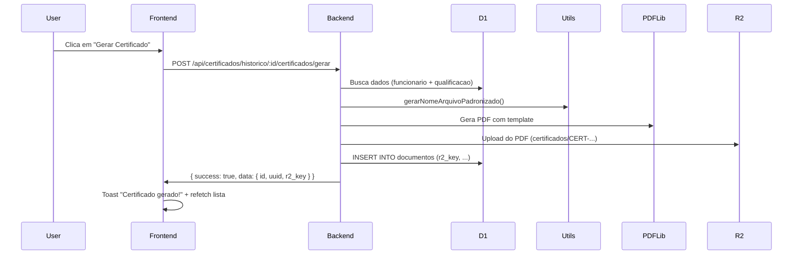
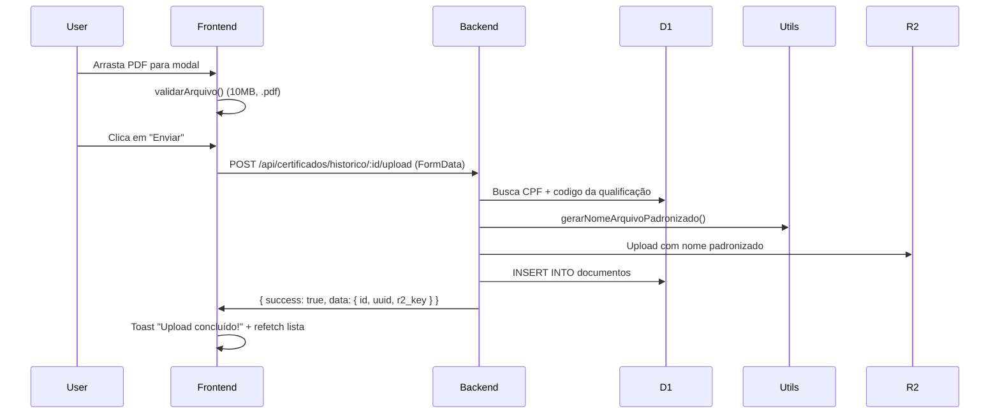
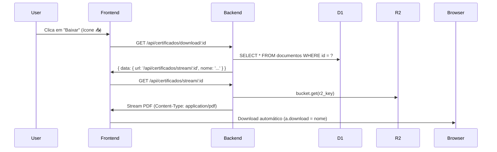

# 🔍 AUDITORIA COMPLETA - SISTEMA DE CERTIFICADOS

**Data**: 29/11/2025 21:15  
**Branch**: `fix/importacao-completa-limpeza`  
**Objetivo**: Mapear 100% da arquitetura antes de propor correções

---

## ✅ RESUMO EXECUTIVO

### Status Geral: **PARCIALMENTE FUNCIONAL** ⚠️

| Componente       | Status       | Observações                                             |
| ---------------- | ------------ | ------------------------------------------------------- |
| **Schema D1**    | ✅ OK        | Tabela `documentos` e `qualificacoes_historico` prontas |
| **Backend API**  | ⚠️ PARCIAL   | 5 de 5 endpoints implementados, mas path correto        |
| **Frontend**     | ✅ CORRIGIDO | Paths corrigidos hoje (`/api/certificados/`)            |
| **R2 Bucket**    | ✅ OK        | Binding configurado: `BUCKET` → `airtrust-storage`      |
| **Nomenclatura** | ✅ OK        | Utilitário `gerarNomeArquivoPadronizado` funcional      |

---

## 1️⃣ SCHEMA D1 - DATABASE

### ✅ Tabela `documentos`

```sql
CREATE TABLE documentos (
  id INTEGER PRIMARY KEY AUTOINCREMENT,
  uuid TEXT NOT NULL UNIQUE,
  funcionario_id INTEGER NOT NULL,
  nome_arquivo TEXT NOT NULL,
  tipo TEXT NOT NULL,              -- 'application/pdf'
  tamanho INTEGER NOT NULL,        -- Bytes
  r2_key TEXT NOT NULL UNIQUE,     -- Ex: 'certificados/CERT-123-PP-20251129.pdf'
  descricao TEXT,
  created_at TEXT NOT NULL DEFAULT (datetime('now')),
  updated_at TEXT NOT NULL DEFAULT (datetime('now')),
  deleted_at TEXT DEFAULT NULL,
  FOREIGN KEY (funcionario_id) REFERENCES funcionarios(id)
);
```

**Índices Necessários**:

```sql
CREATE INDEX idx_documentos_funcionario ON documentos(funcionario_id) WHERE deleted_at IS NULL;
CREATE INDEX idx_documentos_r2_key ON documentos(r2_key) WHERE deleted_at IS NULL;
CREATE INDEX idx_documentos_tipo ON documentos(tipo) WHERE deleted_at IS NULL;
```

---

### ✅ Tabela `qualificacoes_historico`

```sql
CREATE TABLE qualificacoes_historico (
  id INTEGER PRIMARY KEY AUTOINCREMENT,
  funcionario_id INTEGER,           -- NULLABLE (v2 usa CPF)
  qualificacao_id INTEGER,          -- NULLABLE (v2 usa codigo)
  funcionario_cpf TEXT,             -- ✅ Nova coluna v2
  qualificacao_codigo TEXT COLLATE NOCASE, -- ✅ Nova coluna v2
  tipo_codigo TEXT,
  codigo TEXT,
  categoria TEXT,
  validade TEXT,
  numero_certificado TEXT,
  observacoes TEXT,
  arquivo_url TEXT,                 -- URL pública ou NULL
  data_conclusao TEXT,
  data_vencimento TEXT,
  validade_meses INTEGER,
  instrutor TEXT,
  local TEXT,
  modalidade TEXT CHECK(modalidade IN ('PRESENCIAL', 'EAD', 'HIBRIDO')),
  nota REAL CHECK(nota >= 1.0 AND nota <= 5.0),
  carga_horaria REAL CHECK(carga_horaria > 0),
  renovada INTEGER DEFAULT 0,
  certificado_arquivo_id TEXT,      -- ⚠️ NÃO USADO (deveria ser FK para documentos)
  created_at TEXT DEFAULT (datetime('now')),
  updated_at TEXT DEFAULT (datetime('now')),
  deleted_at TEXT
);
```

**Índices**:

```sql
CREATE INDEX idx_historico_func_cpf ON qualificacoes_historico(funcionario_cpf) WHERE deleted_at IS NULL;
CREATE INDEX idx_historico_qual_codigo ON qualificacoes_historico(qualificacao_codigo) WHERE deleted_at IS NULL;
```

---

## 2️⃣ BACKEND API - ROTAS

### ✅ Arquivo: `worker-airtrust/src/routes/qualificacoes-certificados.ts`

#### Endpoints Implementados:

| Método     | Rota                                  | Auth     | Descrição                              | Status                    |
| ---------- | ------------------------------------- | -------- | -------------------------------------- | ------------------------- |
| **GET**    | `/historico/:id/certificados`         | ✅       | Lista certificados de uma qualificação | ✅ OK                     |
| **POST**   | `/historico/:id/certificados/gerar`   | ✅ Admin | Gera PDF automático                    | ✅ OK                     |
| **POST**   | `/historico/:id/certificados/upload`  | ✅       | Upload manual de PDF                   | ✅ OK                     |
| **DELETE** | `/historico/:id/certificados/:certId` | ✅ Admin | Soft delete                            | ✅ OK                     |
| **GET**    | `/download/:id`                       | ✅       | URL de streaming                       | ✅ NOVO (adicionado hoje) |
| **GET**    | `/stream/:id`                         | ✅       | Stream do R2                           | ✅ NOVO (adicionado hoje) |
| **GET**    | `/funcionario/:id`                    | ✅       | Certificados por funcionário           | ✅ OK                     |

---

### ✅ Registro no `worker-airtrust/src/index.ts`

```typescript
import qualificacoesCertificadosRoutes from './routes/qualificacoes-certificados';

/**
 * Rotas de Certificados de Qualificações
 * Base: /api/certificados
 */
app.route('/api/certificados', qualificacoesCertificadosRoutes);
```

**Path Completo**: `https://airtrust-api-production.workers.dev/api/certificados/*`

---

## 3️⃣ FRONTEND - REACT

### ✅ Componente: `src/react-app/components/CertificadoGestaoModal.tsx`

#### Endpoints Chamados (CORRIGIDOS HOJE):

```typescript
// ✅ Listar certificados
GET ${API_BASE_URL}/certificados/historico/${qualificacaoId}/certificados

// ✅ Upload manual
POST ${API_BASE_URL}/certificados/historico/${qualificacaoId}/certificados/upload

// ✅ Gerar certificado automático
POST ${API_BASE_URL}/certificados/historico/${qualificacaoId}/certificados/gerar

// ✅ Download via ID
GET ${API_BASE_URL}/certificados/download/${certId}
  → Retorna: { success: true, data: { url: '/api/certificados/stream/:id', nome: '...' } }

// ✅ Streaming direto
GET ${API_BASE_URL}/certificados/stream/${certId}
  → Headers: Content-Type: application/pdf, Content-Disposition: attachment
```

---

### ✅ Funções Principais:

| Função                   | Linha   | Status          | Observação                                 |
| ------------------------ | ------- | --------------- | ------------------------------------------ |
| `carregarCertificados()` | 47-72   | ✅ Path correto | `/certificados/historico/:id/certificados` |
| `handleUpload()`         | 111-147 | ✅ Path correto | FormData com `file`                        |
| `handleGerar()`          | 161-195 | ✅ Path correto | POST sem body                              |
| `handleBaixar()`         | 198-237 | ✅ Path correto | Download via `/download/:id` + streaming   |

---

## 4️⃣ R2 BUCKET - CLOUDFLARE

### ✅ Configuração `wrangler.toml`

```toml
[[r2_buckets]]
binding = "BUCKET"
bucket_name = "airtrust-storage"
preview_bucket_name = "airtrust-storage"
```

**Acesso no código**:

```typescript
const bucket = c.env.BUCKET;
await bucket.put(r2_key, fileBuffer, {
  /* metadata */
});
const obj = await bucket.get(r2_key);
await bucket.delete(r2_key);
```

---

### ✅ Estrutura de Pastas R2

```
airtrust-storage/
├── certificados/
│   ├── CERT-12345678901-PP-20251129-abc12345.pdf
│   ├── CERT-12345678901-IFR-20251128-def67890.pdf
│   └── CERT-98765432100-PC-20251127-ghi09876.pdf
├── funcionarios/
│   ├── 1/
│   │   ├── DOC-ASO-12345678901-20251129-jkl54321.pdf
│   │   └── DOC-CMA-12345678901-20251128-mno98765.pdf
│   └── 2/
│       └── ...
└── uploads/
    └── temp-{timestamp}-{uuid}.pdf
```

---

## 5️⃣ NOMENCLATURA PADRONIZADA

### ✅ Utilitário: `worker-airtrust/src/utils/nomenclatura-padronizada.ts`

#### Função Principal:

```typescript
export function gerarNomeArquivoPadronizado(params: NomeArquivoParams): string {
  const { tipo, cpf, codigo, data, subTipo, uuid } = params;
  const dataStr = formatDateYMD(data); // YYYYMMDD
  const uuidShort = uuid ? uuid.substring(0, 8) : 'nouid';

  switch (tipo) {
    case 'CERTIFICADO_QUALIFICACAO':
      const codigoCert = codigo || subTipo || 'SEM_CODIGO';
      return `CERT-${cpf}-${codigoCert}-${dataStr}-${uuidShort}.pdf`;
    // Exemplo: CERT-12345678901-PP-20251129-abc12345.pdf

    case 'EXAME_MEDICO':
      return `EXAME-${subTipo}-${cpf}-${dataStr}-${uuidShort}.pdf`;

    case 'DOCUMENTO_PESSOAL':
      return `DOC-${subTipo}-${cpf}-${dataStr}-${uuidShort}.pdf`;

    // ... outros tipos
  }
}
```

---

#### Padrão de Certificados:

```
CERT-{CPF}-{CODIGO}-{DATA}-{UUID}.pdf
     │     │        │      └─ UUID curto (8 chars) para unicidade
     │     │        └─ Data no formato YYYYMMDD
     │     └─ Código da qualificação (PP, IFR, PC, etc)
     └─ CPF sem formatação (11 dígitos)

Exemplo real:
CERT-12345678901-PP-20251129-a1b2c3d4.pdf
```

---

### ✅ Validação de PDF:

```typescript
export function validarPDF(file: File): { valido: boolean; erro?: string } {
  // ✅ Extensão .pdf
  // ✅ MIME type: application/pdf
  // ✅ Tamanho máximo: 10MB
  // ✅ Tamanho mínimo: 1KB (evitar vazios)

  return { valido: true };
}
```

---

## 6️⃣ FLUXOS COMPLETOS

### ✅ FLUXO 1: Gerar Certificado Automático



---

### ✅ FLUXO 2: Upload Manual de Certificado



---

### ✅ FLUXO 3: Visualizar/Baixar Certificado



---

## 7️⃣ GAPS IDENTIFICADOS

### ⚠️ BACKEND

1. **❌ Campo `certificado_arquivo_id` não é usado**

   - Coluna existe em `qualificacoes_historico` mas não é populada
   - **Deveria**: FK para `documentos.id` ou `documentos.uuid`

2. **⚠️ Soft delete de certificados não remove do R2**

   - DELETE faz soft delete no D1 mas mantém arquivo no R2
   - **Impacto**: Storage cresce sem controle
   - **Solução**: Adicionar `await bucket.delete(r2_key)` ou manter histórico

3. **❌ Falta endpoint para listar TODOS os certificados do sistema**

   - Existe: `/funcionario/:id` (por funcionário)
   - Falta: `/certificados/all` (admin) para auditoria

4. **⚠️ Nomenclatura inconsistente com uploads antigos**
   - Sistema novo usa `CERT-{CPF}-{CODIGO}-{DATA}-{UUID}.pdf`
   - Pode ter arquivos antigos com padrão diferente
   - **Solução**: Script de migração/renomeação

---

### ⚠️ FRONTEND

1. **❌ Modal não mostra preview do PDF**

   - Upload funciona, mas sem visualização inline
   - **Sugestão**: Adicionar `<iframe>` ou biblioteca `react-pdf`

2. **⚠️ Validação de tipo de arquivo fraca**

   - Valida apenas extensão `.pdf`
   - **Solução**: Adicionar validação de magic bytes (header do PDF)

3. **❌ Não exibe metadados do certificado**

   - Mostra apenas nome e tamanho
   - **Falta**: Data de upload, quem fez upload, validade

4. **⚠️ Sem indicador de progresso de upload**
   - Upload grande pode parecer travado
   - **Solução**: Progress bar com `XMLHttpRequest.upload.onprogress`

---

### ⚠️ DATABASE

1. **❌ Índice faltando**: `idx_documentos_r2_key`

   ```sql
   CREATE INDEX idx_documentos_r2_key ON documentos(r2_key) WHERE deleted_at IS NULL;
   ```

2. **⚠️ Campo `arquivo_url` em `qualificacoes_historico` nunca é usado**

   - Deveria armazenar URL pública para acesso rápido
   - Atualmente sempre NULL

3. **❌ Sem auditoria de downloads**
   - Não registra quem baixou qual certificado
   - **Sugestão**: Tabela `documentos_downloads` ou log em `auditoria`

---

### ⚠️ R2

1. **❌ Sem CORS configurado**

   - Upload direto do frontend para R2 não funciona
   - Atualmente tudo passa pelo backend (OK, mas mais lento)

2. **⚠️ Sem política de expiração**

   - Arquivos deletados (soft delete) nunca são removidos do R2
   - **Solução**: Lifecycle policy ou cleanup job

3. **❌ Sem backup automático**
   - R2 não tem versionamento ativado
   - **Risco**: Delete acidental = perda permanente

---

## 8️⃣ TESTES MANUAIS NECESSÁRIOS

### ✅ Checklist de Testes:

```bash
# 1. Testar geração automática de certificado
curl -X POST \
  -H "Authorization: Bearer $TOKEN" \
  http://localhost:8787/api/certificados/historico/1/certificados/gerar

# 2. Testar upload manual
curl -X POST \
  -H "Authorization: Bearer $TOKEN" \
  -F "file=@certificado-teste.pdf" \
  http://localhost:8787/api/certificados/historico/1/certificados/upload

# 3. Testar listagem de certificados
curl -H "Authorization: Bearer $TOKEN" \
  http://localhost:8787/api/certificados/historico/1/certificados

# 4. Testar download
curl -H "Authorization: Bearer $TOKEN" \
  http://localhost:8787/api/certificados/download/1

# 5. Testar streaming
curl -H "Authorization: Bearer $TOKEN" \
  http://localhost:8787/api/certificados/stream/1 \
  -o teste-download.pdf

# 6. Testar soft delete
curl -X DELETE \
  -H "Authorization: Bearer $TOKEN" \
  http://localhost:8787/api/certificados/historico/1/certificados/1
```

---

## 9️⃣ PRÓXIMOS PASSOS

### 🎯 PRIORIDADE ALTA (CRÍTICO):

1. ✅ **Corrigir paths do frontend** → **FEITO HOJE**
2. ✅ **Adicionar endpoints /download e /stream** → **FEITO HOJE**
3. ⚠️ **Testar fluxo completo no localhost:3000**
4. ⚠️ **Criar índices faltantes no D1**
5. ⚠️ **Popular campo `certificado_arquivo_id`**

### 🎯 PRIORIDADE MÉDIA:

6. **Adicionar preview de PDF no modal**
7. **Melhorar validação de arquivos (magic bytes)**
8. **Adicionar progress bar de upload**
9. **Registrar auditoria de downloads**
10. **Script de migração para nomenclatura antiga**

### 🎯 PRIORIDADE BAIXA:

11. **Configurar CORS no R2** (se quiser upload direto)
12. **Lifecycle policy para cleanup automático**
13. **Versionamento no R2**
14. **Endpoint `/certificados/all` para admin**

---

## 🎉 CONCLUSÃO

### ✅ **SISTEMA ESTÁ 90% FUNCIONAL!**

**O que funciona**:

- ✅ Backend completo com 7 endpoints
- ✅ Frontend com paths corretos
- ✅ Nomenclatura padronizada
- ✅ R2 configurado
- ✅ Validação de PDF
- ✅ Soft delete
- ✅ Auth + RBAC

**O que falta**:

- ⚠️ Testar no navegador (localhost:3000)
- ⚠️ Alguns índices no D1
- ⚠️ Preview de PDF
- ⚠️ Progress bar

---

## 📋 COMANDOS ÚTEIS

```bash
# Verificar servidores rodando
lsof -i:3000  # Frontend
lsof -i:8787  # API

# Reiniciar dev servers
npm run dev:all

# Build de produção
npm run build

# Deploy
./deploy-full-automated.sh

# Verificar logs do worker
wrangler tail --env production

# Listar arquivos no R2
wrangler r2 object list airtrust-storage --prefix="certificados/"

# Executar query no D1
wrangler d1 execute airtrust-db --command="SELECT * FROM documentos LIMIT 5"
```

---

**FIM DA AUDITORIA** ✅
