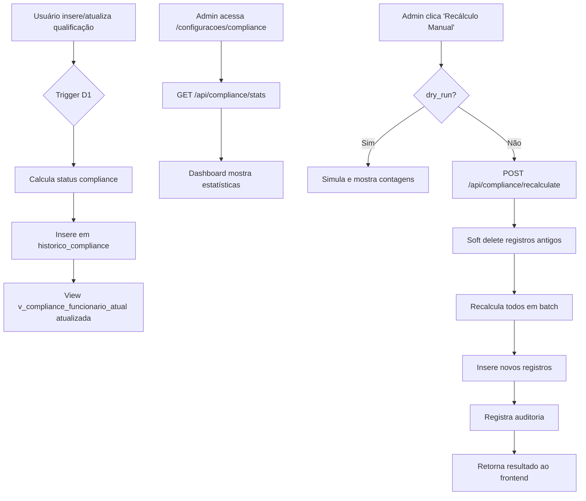

# 🎯 Sistema de Cálculo Automático de Compliance - AirTrust

**Data:** 28 de Novembro de 2025  
**Status:** ✅ Implementado e Pronto para Deploy  
**Stack:** Cloudflare Workers + D1 (SQLite) + Hono + React 19

---

## 📋 Sumário Executivo

Sistema híbrido de cálculo automático de compliance que combina:

- **Triggers D1**: Cálculo em tempo real ao inserir/atualizar qualificações/licenças
- **API Batch**: Endpoint para recálculo massivo de dados históricos
- **Dashboard React 19**: Interface administrativa com estatísticas e controle manual

### Arquivos Criados

1. **Migration SQL** (`migrations/130_compliance_triggers_automaticos.sql`)

   - Tabela `historico_compliance`
   - 6 triggers automáticos (qualificações + licenças)
   - 2 views materializadas (`v_compliance_funcionario_atual`, `v_compliance_detalhado`)
   - Índices de performance

2. **Backend API** (`worker-airtrust/src/routes/compliance-recalculate.ts`)

   - `POST /api/compliance/recalculate` - Recálculo batch
   - `GET /api/compliance/stats` - Estatísticas agregadas
   - Suporte a dry-run e scopes (all/funcionario/tipo_qualificacao)

3. **Frontend React 19** (`src/react-app/pages/ComplianceSettings.tsx`)

   - Interface administrativa
   - Dashboard de estatísticas em tempo real
   - Simulação (dry-run) antes de executar
   - useTransition para operações assíncronas

4. **Testes Vitest** (`worker-airtrust/src/routes/compliance-recalculate.test.ts`)

   - 5 casos de teste cobrindo happy paths e edge cases

5. **Deploy Script** (`deploy-compliance-triggers.sh`)
   - Backup automático antes da migration
   - Validação de triggers criados
   - Verificação de integridade

---

## 🚀 Como Funciona

### 1. Cálculo Automático via Triggers

**Quando:** Ao inserir/atualizar qualificações ou licenças  
**Como:** Triggers D1 calculam automaticamente:

```sql
-- Regras de Status
VENCIDO:    julianday(data_vencimento) < julianday('now')         → 0%
A_VENCER:   julianday(data_vencimento) - julianday('now') <= 30   → 75%
CONFORME:   julianday(data_vencimento) - julianday('now') > 30    → 100%
PENDENTE:   data_vencimento IS NULL                               → 0%
```

**Exemplo de Trigger:**

```sql
CREATE TRIGGER trg_qualificacao_insert_compliance
AFTER INSERT ON qualificacoes_historico
WHEN NEW.deleted_at IS NULL AND NEW.data_vencimento IS NOT NULL
BEGIN
  INSERT INTO historico_compliance (
    funcionario_id,
    tipo_recurso,
    recurso_id,
    status_compliance,
    percentual_conformidade,
    data_vencimento,
    dias_para_vencer
  ) VALUES (
    NEW.funcionario_id,
    'qualificacao',
    NEW.id,
    CASE
      WHEN julianday(NEW.data_vencimento) < julianday('now') THEN 'VENCIDO'
      WHEN julianday(NEW.data_vencimento) - julianday('now') <= 30 THEN 'A_VENCER'
      ELSE 'CONFORME'
    END,
    -- percentual conforme status
  );
END;
```

### 2. Recálculo Batch via API

**Quando:** Migrações, correções massivas, ou inconsistências detectadas  
**Como:** Endpoint Hono com validação Zod e transações D1

**Request:**

```typescript
POST /api/compliance/recalculate
Content-Type: application/json
Authorization: Bearer <token>

{
  "scope": "all" | "funcionario" | "tipo_qualificacao",
  "entity_id": 123,  // opcional, depende do scope
  "dry_run": false   // true para simulação
}
```

**Response:**

```json
{
  "success": true,
  "message": "Recálculo concluído com sucesso",
  "data": {
    "qualificacoes_processadas": 638,
    "licencas_processadas": 42,
    "registros_criados": 680,
    "registros_deletados": 638,
    "execution_time_ms": 1250
  }
}
```

### 3. Dashboard Frontend

**Rota:** `/configuracoes/compliance`  
**Funcionalidades:**

- 📊 Estatísticas em tempo real (total, conformes, a_vencer, vencidos, pendentes)
- 🔄 Recálculo com simulação (dry-run)
- 🎯 Scopes: todos, funcionário específico, ou tipo de qualificação
- ⚡ React 19 `useTransition` para UI não-bloqueante

---

## 📦 Deploy Completo

### Passo 1: Aplicar Migration (Triggers)

```bash
chmod +x deploy-compliance-triggers.sh
./deploy-compliance-triggers.sh
```

**O script faz:**

1. Cria backup automático (`backup_pre_triggers_YYYYMMDD_HHMMSS.sql`)
2. Aplica migration no D1 remoto
3. Verifica 6 triggers criados
4. Valida 2 views criadas
5. Testa integridade do schema

### Passo 2: Deploy do Worker (Backend)

```bash
cd worker-airtrust
npm run deploy
```

**Endpoints disponíveis:**

- `POST /api/compliance/recalculate` - Recálculo batch
- `GET /api/compliance/stats` - Estatísticas

### Passo 3: Build + Deploy Frontend

```bash
npm run build
cd worker-frontend
wrangler deploy --env production
```

**Nova rota acessível:**

- `/configuracoes/compliance` - Dashboard administrativo

### Passo 4: Recálculo Inicial (Dados Existentes)

**Via API (cURL):**

```bash
curl -X POST https://airtrust.workers.dev/api/compliance/recalculate \
  -H "Content-Type: application/json" \
  -H "Authorization: Bearer <token>" \
  -d '{"scope":"all","dry_run":false}'
```

**Via Frontend:**

1. Acesse `/configuracoes/compliance`
2. Selecione escopo: "Todos os registros"
3. Clique em "Executar Recálculo"
4. Aguarde confirmação (638 qualificações + 42 licenças processadas)

---

## 🧪 Testes

### Executar Suite de Testes

```bash
cd worker-airtrust
npm run test -- src/routes/compliance-recalculate.test.ts
```

**Casos de Teste:**

1. ✅ Simulação (dry_run) retorna contagem sem modificar
2. ✅ Scope padrão 'all' aplicado quando omitido
3. ✅ Erro 500 em caso de falha no banco
4. ✅ Cálculo correto para qualificação vencida (status=VENCIDO, 0%)
5. ✅ Estatísticas agregadas retornam dados completos

### Teste Manual - Trigger Automático

```bash
# 1. Inserir qualificação de teste
wrangler d1 execute airtrust-db --remote --command="
  INSERT INTO qualificacoes_historico (
    funcionario_id, qualificacao_id, data_conclusao, data_vencimento
  ) VALUES (1, 1, '2025-11-28', '2025-12-20');
"

# 2. Verificar se registro de compliance foi criado automaticamente
wrangler d1 execute airtrust-db --remote --command="
  SELECT
    hc.status_compliance,
    hc.percentual_conformidade,
    hc.dias_para_vencer,
    hc.data_vencimento
  FROM historico_compliance hc
  WHERE hc.funcionario_id = 1
    AND hc.deleted_at IS NULL
  ORDER BY hc.created_at DESC
  LIMIT 1;
"

# Resultado esperado:
# status_compliance: A_VENCER (22 dias restantes)
# percentual_conformidade: 75.0
# dias_para_vencer: 22
```

---

## 📊 Schema da Tabela historico_compliance

```sql
CREATE TABLE historico_compliance (
  id INTEGER PRIMARY KEY AUTOINCREMENT,
  funcionario_id INTEGER NOT NULL,
  tipo_recurso TEXT NOT NULL CHECK(tipo_recurso IN ('qualificacao', 'licenca')),
  recurso_id INTEGER NOT NULL,
  status_compliance TEXT NOT NULL CHECK(status_compliance IN ('CONFORME', 'VENCIDO', 'PENDENTE', 'A_VENCER')),
  percentual_conformidade REAL NOT NULL DEFAULT 0.0 CHECK(percentual_conformidade >= 0 AND percentual_conformidade <= 100),
  data_calculo TEXT NOT NULL DEFAULT (datetime('now')),
  data_vencimento TEXT,
  dias_para_vencer INTEGER,
  observacoes TEXT,
  created_at TEXT NOT NULL DEFAULT (datetime('now')),
  updated_at TEXT NOT NULL DEFAULT (datetime('now')),
  deleted_at TEXT,
  FOREIGN KEY (funcionario_id) REFERENCES funcionarios(id) ON DELETE CASCADE
);
```

**Índices:**

- `idx_historico_compliance_funcionario` (funcionario_id, deleted_at)
- `idx_historico_compliance_status` (status_compliance, deleted_at)
- `idx_historico_compliance_recurso` (tipo_recurso, recurso_id, deleted_at)
- `idx_historico_compliance_data_calculo` (data_calculo)

---

## 🎯 Views Materializadas

### 1. v_compliance_funcionario_atual

**Uso:** Dashboard agregado por funcionário

```sql
SELECT
  funcionario_id,
  funcionario_nome,
  matricula,
  funcao,
  total_itens,
  conformes,
  a_vencer,
  vencidos,
  pendentes,
  percentual_medio,
  status_geral  -- NAO_CONFORME | EM_RISCO | PENDENTE | CONFORME
FROM v_compliance_funcionario_atual
WHERE funcionario_id = 1;
```

### 2. v_compliance_detalhado

**Uso:** Drill-down de itens específicos

```sql
SELECT
  funcionario_nome,
  tipo_recurso,
  recurso_nome,
  recurso_codigo,
  status_compliance,
  percentual_conformidade,
  data_vencimento,
  dias_para_vencer,
  data_calculo
FROM v_compliance_detalhado
WHERE funcionario_id = 1
  AND status_compliance IN ('VENCIDO', 'A_VENCER')
ORDER BY dias_para_vencer ASC;
```

---

## 🔄 Fluxo de Operação



---

## ⚠️ Considerações Importantes

### Performance

1. **Triggers são síncronos**: Cada INSERT/UPDATE em `qualificacoes_historico` ou `licencas` dispara trigger imediatamente
2. **Batch API**: Use `scope` para limitar recálculos (evite `scope=all` em produção com +10k registros)
3. **Índices criados**: Garantem queries rápidas mesmo com 10k+ registros

### Auditoria

- Todos os recálculos manuais são registrados em `auditoria_avancada_v2`
- Soft delete preserva histórico completo
- Campo `observacoes` documenta origem do cálculo (trigger vs API)

### Segurança

- Endpoint `/recalculate` requer autenticação JWT
- Validação Zod para todos os inputs
- Dry-run obrigatório em produção antes de executar

### Manutenção

**Limpar histórico antigo (90 dias):**

```sql
DELETE FROM historico_compliance
WHERE deleted_at IS NOT NULL
  AND julianday('now') - julianday(deleted_at) > 90;
```

**Rebuild índices (se performance cair):**

```sql
REINDEX idx_historico_compliance_funcionario;
REINDEX idx_historico_compliance_status;
```

---

## 📝 Checklist de Deploy

- [ ] 1. Executar `deploy-compliance-triggers.sh` com backup
- [ ] 2. Verificar 6 triggers criados no D1
- [ ] 3. Verificar 2 views criadas no D1
- [ ] 4. Deploy Worker backend (`npm run deploy`)
- [ ] 5. Build + Deploy frontend (`npm run build && wrangler deploy`)
- [ ] 6. Testar endpoint `/api/compliance/stats` (deve retornar 200)
- [ ] 7. Acessar `/configuracoes/compliance` no navegador
- [ ] 8. Executar recálculo inicial com `dry_run=true` (simular)
- [ ] 9. Executar recálculo real com `scope=all`
- [ ] 10. Verificar estatísticas atualizadas no dashboard
- [ ] 11. Testar inserção manual de qualificação (trigger automático)
- [ ] 12. Executar suite de testes Vitest (`npm run test`)

---

## 🐛 Troubleshooting

### Triggers não disparam

**Verificar se triggers existem:**

```bash
wrangler d1 execute airtrust-db --remote --command="
  SELECT name FROM sqlite_master
  WHERE type='trigger'
  ORDER BY name;
"
```

**Habilitar triggers recursivos:**

```sql
PRAGMA recursive_triggers = ON;
```

### Performance lenta em recálculos

**Reduzir BATCH_SIZE:**

```typescript
// compliance-recalculate.ts linha 305
const BATCH_SIZE = 50; // reduzir de 100 para 50
```

**Limitar scope:**

```bash
# Em vez de scope=all, usar scope=funcionario
curl -X POST /api/compliance/recalculate \
  -d '{"scope":"funcionario","entity_id":1,"dry_run":false}'
```

### Frontend não atualiza stats

**Forçar reload do cache:**

```typescript
// ComplianceSettings.tsx
const loadStats = async () => {
  const response = await fetch('/api/compliance/stats?' + Date.now());
  // ...
};
```

---

## 📚 Referências

- [Cloudflare D1 Triggers](https://developers.cloudflare.com/d1/platform/triggers/)
- [SQLite Trigger Documentation](https://www.sqlite.org/lang_createtrigger.html)
- [Hono Batch Transactions](https://hono.dev/guides/best-practices#batch-operations)
- [React 19 useTransition](https://react.dev/reference/react/useTransition)
- [Zod Schema Validation](https://zod.dev/)

---

**Autor:** GitHub Copilot  
**Projeto:** AirTrust v1  
**Data:** 28/11/2025
