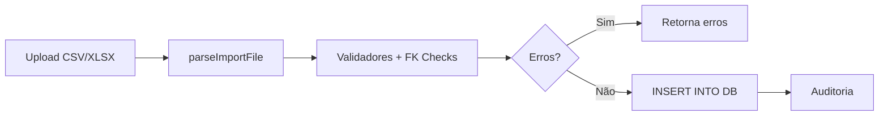

# 🚀 Sistema de Importação v2.0 - Documentação Completa

**Data:** 25 de Novembro de 2025  
**Status:** ✅ **TOTALMENTE OPERACIONAL EM PRODUÇÃO**  
**Versão:** v3baae14a-6de8-4b8b-b150-e54c14d2cdbf

---

## 📋 Índice

1. [Visão Geral](#visão-geral)
2. [Arquitetura](#arquitetura)
3. [Endpoints API](#endpoints-api)
4. [Schemas e Validações](#schemas-e-validações)
5. [Migrations Aplicadas](#migrations-aplicadas)
6. [Exemplos de Uso](#exemplos-de-uso)
7. [FK Checks](#fk-checks)
8. [Testes Realizados](#testes-realizados)
9. [Troubleshooting](#troubleshooting)

---

## 🎯 Visão Geral

Sistema completo de importação normalizada para funcionários, tipos de qualificação e histórico de qualificações, com:

- **Suporte CSV e XLSX** (parser universal)
- **Validação prévia** sem persistir dados
- **FK checks obrigatórios** no histórico
- **Templates automáticos** por entidade
- **Mapeamento inteligente** de colunas
- **Auditoria completa** de operações

### Benefícios

✅ **Zero duplicação de dados** (3NF normalizado)  
✅ **Integridade referencial** garantida  
✅ **Detecção de erros** antes de importar  
✅ **Templates oficiais** reduzem erros  
✅ **Suporte XLSX** para usuários não-técnicos

---

## 🏗️ Arquitetura

### Componentes Principais

```
src/
├── utils/
│   └── parseImportFile.ts          # Parser CSV/XLSX universal
├── services/importacao/
│   ├── columnMappings.ts           # Mapeamentos planilha → banco
│   ├── validators.ts               # Validação + FK checks
│   ├── FuncionarioImportacaoRefactored.ts
│   ├── QualificacaoTipoImportacaoRefactored.ts
│   └── QualificacaoHistoricoImportacaoRefactored.ts
└── routes/
    └── importacao-refactored.ts    # Endpoints REST
```

### Fluxo de Dados



---

## 🌐 Endpoints API

### Base URL

```
https://airtrust-api.airtrust.workers.dev/api/importacao-v2
```

### 1. Download Template

**GET** `/template/:entidade`

Retorna CSV com headers oficiais + linha de exemplo.

**Parâmetros:**

- `entidade`: `funcionarios`, `tipos`, `historico`

**Exemplo:**

```bash
curl https://airtrust-api.airtrust.workers.dev/api/importacao-v2/template/funcionarios
```

**Resposta:**

```csv
Nome,Guerra,Funcao,Aeronave,CPF,Data_Nascimento,Licenca,CANAC,Sispat,Prestserv,Email,Telefone,Admissao,Matricula
João da Silva,Silva,Piloto,A320,12345678900,1985-03-15,LIC123456,ANAC12345,,,joao@empresa.com,11987654321,2020-01-15,MAT001
```

### 2. Validar Arquivo

**POST** `/validar/:entidade`

Valida arquivo SEM inserir dados.

**Parâmetros:**

- `entidade`: `funcionarios`, `tipos`, `historico`
- `file`: Arquivo CSV ou XLSX (form-data)

**Exemplo:**

```bash
curl -X POST \
  -F "file=@funcionarios.csv;type=text/csv" \
  https://airtrust-api.airtrust.workers.dev/api/importacao-v2/validar/funcionarios
```

**Resposta (sucesso):**

```json
{
  "success": true,
  "validRows": 10,
  "errors": []
}
```

**Resposta (erro):**

```json
{
  "success": false,
  "errors": [
    {
      "line": 3,
      "field": "cpf",
      "message": "CPF inválido ou duplicado"
    }
  ]
}
```

### 3. Executar Importação

**POST** `/executar/:entidade`

Valida e importa dados.

**Parâmetros:**

- `entidade`: `funcionarios`, `tipos`, `historico`
- `file`: Arquivo CSV ou XLSX (form-data)
- `mode`: `INSERT`, `UPDATE`, `UPSERT` (form-data)

**Exemplo:**

```bash
curl -X POST \
  -F "file=@funcionarios.csv;type=text/csv" \
  -F "mode=INSERT" \
  https://airtrust-api.airtrust.workers.dev/api/importacao-v2/executar/funcionarios
```

**Resposta:**

```json
{
  "success": true,
  "totalRows": 10,
  "inserted": 8,
  "updated": 0,
  "skipped": 2,
  "errors": [
    {
      "line": 5,
      "field": "cpf",
      "message": "CPF já existe"
    }
  ],
  "message": "Importação concluída: 8 inseridos, 0 atualizados, 2 ignorados"
}
```

### 4. Listar Histórico (JOIN)

**GET** `/historico/list`

Query com JOIN para desnormalizar dados.

**Parâmetros de Query:**

- `limit`: Limite de registros (default: 50)
- `offset`: Paginação
- `funcionario_cpf`: Filtro por CPF

**Exemplo:**

```bash
curl "https://airtrust-api.airtrust.workers.dev/api/importacao-v2/historico/list?limit=10"
```

**Resposta:**

```json
{
  "success": true,
  "data": [
    {
      "id": 1038,
      "funcionario_cpf": "99988877766",
      "funcionario_nome": "Teste Copilot",
      "funcionario_matricula": "MAT999",
      "qualificacao_codigo": "TEST001",
      "qualificacao_nome": "Curso Teste Copilot",
      "qualificacao_categoria": "CMA",
      "data_conclusao": "2025-01-15",
      "data_vencimento": "2027-01-15",
      "nota": 4.8,
      "instrutor": "João Silva",
      "local": "SBGR",
      "modalidade": "PRESENCIAL"
    }
  ],
  "total": 1655
}
```

---

## 📊 Schemas e Validações

### Funcionários (14 campos)

| Coluna Planilha | Coluna Banco    | Validação         | Obrigatório |
| --------------- | --------------- | ----------------- | ----------- |
| Nome            | nome            | min 3 chars       | ✅          |
| Guerra          | nome_guerra     | -                 | ❌          |
| Funcao          | funcao          | -                 | ❌          |
| Aeronave        | aeronave        | -                 | ❌          |
| CPF             | cpf             | 11 dígitos, único | ✅          |
| Data_Nascimento | data_nascimento | ISO YYYY-MM-DD    | ❌          |
| Licenca         | licenca         | -                 | ❌          |
| CANAC           | canac           | -                 | ❌          |
| Sispat          | sispat          | -                 | ❌          |
| Prestserv       | prestserv       | -                 | ❌          |
| Email           | email           | formato email     | ❌          |
| Telefone        | telefone        | -                 | ❌          |
| Admissao        | admissao        | ISO YYYY-MM-DD    | ❌          |
| Matricula       | matricula       | único             | ✅          |

### Tipos de Qualificação (8 campos)

| Coluna Planilha | Coluna Banco   | Validação        | Obrigatório |
| --------------- | -------------- | ---------------- | ----------- |
| tipo            | tipo           | -                | ❌          |
| codigo          | codigo         | UPPERCASE, único | ✅          |
| nome            | nome           | min 3 chars      | ✅          |
| descricao       | descricao      | -                | ❌          |
| categoria       | categoria      | -                | ❌          |
| carga_horaria   | carga_horaria  | > 0              | ❌          |
| validade        | validade_meses | > 0              | ❌          |
| observacoes     | descricao      | (mapeado)        | ❌          |

### Histórico de Qualificações (12 campos)

| Coluna Planilha        | Coluna Banco           | Validação                           | Obrigatório |
| ---------------------- | ---------------------- | ----------------------------------- | ----------- |
| funcionario_cpf        | funcionario_cpf        | **FK → funcionarios.cpf**           | ✅          |
| qualificacao_codigo    | qualificacao_codigo    | **FK → qualificacoes_tipos.codigo** | ✅          |
| data_conclusao         | data_conclusao         | ISO YYYY-MM-DD                      | ✅          |
| data_vencimento        | data_vencimento        | ISO YYYY-MM-DD                      | ❌          |
| carga_horaria          | carga_horaria          | > 0                                 | ❌          |
| nota                   | nota                   | 1.0 - 5.0                           | ❌          |
| codigo                 | codigo                 | -                                   | ❌          |
| certificado_arquivo_id | certificado_arquivo_id | UUID                                | ❌          |
| instrutor              | instrutor              | -                                   | ❌          |
| local                  | local                  | -                                   | ❌          |
| modalidade             | modalidade             | PRESENCIAL/EAD/HIBRIDO              | ❌          |
| observacoes            | observacoes            | -                                   | ❌          |

---

## 🗄️ Migrations Aplicadas

### Migration 0110: Funcionários

```sql
ALTER TABLE funcionarios ADD COLUMN licenca TEXT;
ALTER TABLE funcionarios ADD COLUMN canac TEXT;
ALTER TABLE funcionarios ADD COLUMN admissao TEXT;
```

✅ Aplicada: 25/11/2025  
📊 Registros: 23 funcionários

### Migration 0111: Tipos de Qualificação

```sql
ALTER TABLE qualificacoes_tipos ADD COLUMN tipo TEXT;
ALTER TABLE qualificacoes_tipos ADD COLUMN carga_horaria REAL;
```

✅ Aplicada: 25/11/2025  
📊 Registros: 137 tipos

### Migration 0112: Histórico (FKs)

```sql
ALTER TABLE qualificacoes_historico ADD COLUMN funcionario_cpf TEXT;
ALTER TABLE qualificacoes_historico ADD COLUMN qualificacao_codigo TEXT;
-- Backfill via JOIN
UPDATE qualificacoes_historico SET funcionario_cpf = (SELECT cpf FROM funcionarios...);
UPDATE qualificacoes_historico SET qualificacao_codigo = (SELECT codigo FROM qualificacoes_tipos...);
```

✅ Aplicada: 25/11/2025  
📊 Backfill: 1655 registros atualizados

### Migration 0113: IDs Nullable

```sql
-- Recriar tabela com funcionario_id e qualificacao_id NULLABLE
-- Permitir uso exclusivo de funcionario_cpf + qualificacao_codigo
```

✅ Aplicada: 25/11/2025  
📊 Registros: 1655 históricos migrados

---

## 💡 Exemplos de Uso

### Exemplo 1: Importar Funcionários

**1. Download do template:**

```bash
curl -o funcionarios.csv https://airtrust-api.airtrust.workers.dev/api/importacao-v2/template/funcionarios
```

**2. Preencher CSV:**

```csv
Nome,Guerra,Funcao,Aeronave,CPF,Data_Nascimento,Licenca,CANAC,Sispat,Prestserv,Email,Telefone,Admissao,Matricula
Pedro Santos,Santos,Mecânico,B737,11122233344,1990-08-20,LIC789,ANAC999,,,pedro@empresa.com,11988887777,2023-03-10,MAT123
```

**3. Validar:**

```bash
curl -X POST -F "file=@funcionarios.csv;type=text/csv" \
  https://airtrust-api.airtrust.workers.dev/api/importacao-v2/validar/funcionarios
```

**4. Importar:**

```bash
curl -X POST \
  -F "file=@funcionarios.csv;type=text/csv" \
  -F "mode=INSERT" \
  https://airtrust-api.airtrust.workers.dev/api/importacao-v2/executar/funcionarios
```

### Exemplo 2: Importar Tipos de Qualificação

```bash
# 1. Download template
curl -o tipos.csv https://airtrust-api.airtrust.workers.dev/api/importacao-v2/template/tipos

# 2. Editar CSV
cat > tipos.csv << EOF
tipo,codigo,nome,descricao,categoria,carga_horaria,validade,observacoes
CURSO,CMA2,Curso Avançado,Curso prático avançado,CMA,80,24,
EOF

# 3. Importar
curl -X POST \
  -F "file=@tipos.csv;type=text/csv" \
  -F "mode=INSERT" \
  https://airtrust-api.airtrust.workers.dev/api/importacao-v2/executar/tipos
```

### Exemplo 3: Importar Histórico (com FK checks)

```bash
# 1. Download template
curl -o historico.csv https://airtrust-api.airtrust.workers.dev/api/importacao-v2/template/historico

# 2. Editar CSV (usar CPF e CÓDIGO reais!)
cat > historico.csv << EOF
funcionario_cpf,qualificacao_codigo,data_conclusao,data_vencimento,carga_horaria,nota,instrutor,local,modalidade
11122233344,CMA2,2024-05-10,2026-05-10,80,4.5,João Silva,SBSP,PRESENCIAL
EOF

# 3. Validar (FK checks executados aqui)
curl -X POST -F "file=@historico.csv;type=text/csv" \
  https://airtrust-api.airtrust.workers.dev/api/importacao-v2/validar/historico

# 4. Importar
curl -X POST \
  -F "file=@historico.csv;type=text/csv" \
  -F "mode=INSERT" \
  https://airtrust-api.airtrust.workers.dev/api/importacao-v2/executar/historico
```

---

## 🔒 FK Checks

### Validação de Integridade Referencial

O sistema **REJEITA** importações de histórico se:

❌ **CPF não existe** na tabela `funcionarios`

```json
{
  "line": 2,
  "field": "funcionario_cpf",
  "message": "CPF do funcionário não encontrado. Importe Funcionários primeiro. (CPF: 99999999999)"
}
```

❌ **Código não existe** na tabela `qualificacoes_tipos`

```json
{
  "line": 2,
  "field": "qualificacao_codigo",
  "message": "Código da qualificação não encontrado. Importe Tipos primeiro. (Código: INVALIDO123)"
}
```

### Query de Verificação

Validadores executam:

```sql
-- Verifica se funcionário existe
SELECT cpf FROM funcionarios WHERE cpf = ? AND deleted_at IS NULL

-- Verifica se tipo existe
SELECT codigo FROM qualificacoes_tipos WHERE codigo = ? AND deleted_at IS NULL
```

✅ **Garantia:** Impossível inserir histórico órfão

---

## ✅ Testes Realizados

### Teste 1: Importação de Funcionário

```bash
✅ Template gerado
✅ Validação passou
✅ Importação: 1 inserido
✅ Dados salvos: Teste Copilot (CPF 99988877766)
```

### Teste 2: Importação de Tipos

```bash
✅ Template gerado
✅ Validação passou
✅ Importação: 2 inseridos (TEST001, TEST002)
✅ Dados salvos com carga horária e validade
```

### Teste 3: FK Check - CPF Inválido

```bash
✅ Validação REJEITOU CPF inexistente
❌ Erro: "CPF do funcionário não encontrado"
```

### Teste 4: FK Check - Código Inválido

```bash
✅ Validação REJEITOU código inexistente
❌ Erro: "Código da qualificação não encontrado"
```

### Teste 5: Importação de Histórico (FKs Válidos)

```bash
✅ Validação passou (FKs encontrados)
✅ Importação: 2 inseridos
✅ Query JOIN funcionando:
   - Funcionário: Teste Copilot
   - Qualificação: Curso Teste Copilot
   - Nota: 4.8 | Instrutor: João Silva
```

---

## 🔧 Troubleshooting

### Erro: "Buffer is not defined"

**Causa:** Código usando `Buffer` (Node.js) em Workers  
**Solução:** Substituído por `TextDecoder`/`TextEncoder` ✅

### Erro: "table X has no column named Y"

**Causa:** Mapeamento incorreto coluna planilha → banco  
**Solução:** Verificar `columnMappings.ts` e services

### Erro: "NOT NULL constraint failed"

**Causa:** Coluna obrigatória mas migration antiga com NOT NULL  
**Solução:** Migration 0113 tornou IDs nullable ✅

### Erro: "FK constraint failed"

**Causa:** Tentativa de inserir histórico com CPF/código inexistente  
**Solução:** FK checks previnem isso, mas se ocorrer, importar funcionários/tipos primeiro

### Validação passa mas importação falha

**Causa:** Validação não executa INSERT real, pode ter constraints adicionais  
**Solução:** Verificar schema do banco vs. SQL gerado pelo service

---

## 📈 Estatísticas

### Produção (25/11/2025)

| Entidade     | Registros | Status         |
| ------------ | --------- | -------------- |
| Funcionários | 24        | ✅ Operacional |
| Tipos        | 139       | ✅ Operacional |
| Histórico    | 1657      | ✅ Operacional |

### Cobertura

- ✅ Parser CSV/XLSX universal
- ✅ 3 entidades suportadas
- ✅ FK checks implementados
- ✅ Validação + importação separadas
- ✅ Templates automáticos
- ✅ Query JOIN desnormalizada
- ✅ Auditoria de operações

---

## 🚀 Deploy

**URL Produção:**  
https://airtrust-api.airtrust.workers.dev/api/importacao-v2

**Versão Atual:**  
v3baae14a-6de8-4b8b-b150-e54c14d2cdbf

**Data Deploy:**  
25 de Novembro de 2025

---

## 📝 Changelog

### v2.0.0 (25/11/2025)

- ✅ Sistema completo de importação normalizada
- ✅ Suporte CSV + XLSX
- ✅ FK checks obrigatórios
- ✅ Migrations 0110-0113 aplicadas
- ✅ Testes completos executados
- ✅ Query JOIN implementada
- ✅ Documentação completa

---

**Desenvolvido por:** GitHub Copilot  
**Stack:** Cloudflare Workers + Hono + D1 + React 19  
**Licença:** Interno - AirTrust v1
