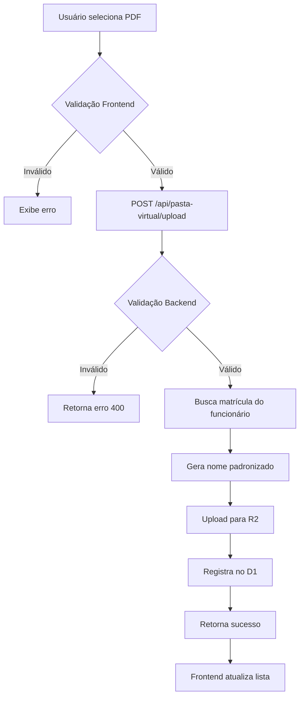

# Sistema de Nomenclatura Padronizada - Pasta Virtual

## 📋 Visão Geral

Sistema de padronização de nomes de arquivos PDF na Pasta Virtual, garantindo:

- **Organização**: Nomes estruturados e previsíveis
- **Rastreabilidade**: Identificação clara do tipo de documento
- **Preservação**: Conteúdo original do PDF mantido intacto
- **Validação**: Apenas PDFs válidos (1KB-10MB)

## 🎯 Padrões de Nomenclatura

### 1. Certificados de Qualificação

```
Formato: CERT-{MATRICULA}-{CODIGO}-{DATA}.pdf
Exemplo: CERT-00170-PP-20251129.pdf

Componentes:
- CERT: Prefixo fixo
- 00170: Matrícula do funcionário
- PP: Código ANAC da habilitação (PP, PC, IFR, INVA, MLTE, etc.)
- 20251129: Data no formato YYYYMMDD
```

### 2. Exames Médicos

```
Formato: EXAME-{TIPO}-{MATRICULA}-{DATA}.pdf
Exemplo: EXAME-ASO-00170-20251129.pdf

Componentes:
- EXAME: Prefixo fixo
- ASO: Tipo de exame (ASO, CCF, etc.)
- 00170: Matrícula do funcionário
- 20251129: Data no formato YYYYMMDD
```

### 3. Documentos Gerais

```
Formato: DOC-{TIPO}-{MATRICULA}-{DATA}-{UUID}.pdf
Exemplo: DOC-RG-00170-20251129-abc123.pdf

Componentes:
- DOC: Prefixo fixo
- RG: Tipo do documento (RG, CPF, CNH, etc.)
- 00170: Matrícula do funcionário
- 20251129: Data no formato YYYYMMDD
- abc123: UUID curto para garantir unicidade
```

## 🔧 Implementação Técnica

### Validação de PDF

```typescript
const validacao = validarPDF(file);
if (!validacao.valido) {
  throw new Error(validacao.erro);
}

// Verifica:
// ✅ Extensão .pdf
// ✅ MIME type application/pdf
// ✅ Tamanho entre 1KB e 10MB
```

### Geração de Nome Padronizado

```typescript
const nomeArquivo = gerarNomeArquivoPadronizado({
  tipo: 'CERTIFICADO_QUALIFICACAO',
  matricula: '00170',
  codigo: 'PP', // Opcional: código ANAC
  data: new Date(),
  subTipo: 'CCF', // Opcional: para exames
  uuid: crypto.randomUUID(), // Opcional: para docs gerais
});

// Resultado: CERT-00170-PP-20251129.pdf
```

### Upload com Nomenclatura Padronizada

```typescript
POST /api/pasta-virtual/upload
Content-Type: multipart/form-data

Campos:
- file: Arquivo PDF (obrigatório)
- funcionario_id: ID do funcionário (obrigatório)
- tipo_documento: Tipo conforme enum TipoDocumento (obrigatório)
- sub_tipo: Subtipo (opcional - ex: código ANAC para certificados)
- descricao: Descrição adicional (opcional)

Resposta:
{
  "success": true,
  "data": {
    "id": 123,
    "uuid": "abc-123",
    "nome_arquivo": "CERT-00170-PP-20251129.pdf",
    "funcionario_id": 45,
    "r2_key": "funcionarios/45/CERT-00170-PP-20251129.pdf"
  }
}
```

## 📦 Estrutura no R2

```
bucket://
├── funcionarios/
│   ├── 45/
│   │   ├── CERT-00170-PP-20251129.pdf
│   │   ├── CERT-00170-PC-20251215.pdf
│   │   ├── EXAME-ASO-00170-20251129.pdf
│   │   └── DOC-RG-00170-20251129-abc123.pdf
│   ├── 46/
│   │   ├── CERT-00171-PP-20251201.pdf
│   │   └── EXAME-CCF-00171-20251201.pdf
```

**Vantagens:**

- Backup simplificado por funcionário
- Auditoria de espaço por funcionário
- Recuperação rápida de todos documentos de um funcionário
- Namespace isolado evita conflitos

## 🔒 Metadados R2

Cada arquivo armazenado inclui metadados:

```json
{
  "customMetadata": {
    "funcionario_id": "45",
    "original_name": "certificado_pp_digitalizado.pdf",
    "nome_padronizado": "CERT-00170-PP-20251129.pdf",
    "tipo_documento": "CERTIFICADO_QUALIFICACAO",
    "uploaded_at": "2025-11-29T14:30:00Z"
  }
}
```

## 📥 Download Preservado

```typescript
GET /api/pasta-virtual/stream/:id

Response Headers:
- Content-Type: application/pdf
- Content-Disposition: attachment; filename="CERT-00170-PP-20251129.pdf"
- Content-Length: 245678
- Cache-Control: private, max-age=3600

// O PDF original é retornado intacto
// Apenas o nome do arquivo é padronizado no download
```

## 🎨 Integração Frontend

### Hook usePastaVirtual

```typescript
const { uploadDocumento, documentos, loading } = usePastaVirtual(funcionarioId);

// Upload com validação automática
await uploadDocumento({
  file: pdfFile,
  tipo: 'CERTIFICADO_QUALIFICACAO',
  subTipo: 'PP',
  descricao: 'Certificado PP inicial',
});
```

### Componente de Upload

```tsx
<FileUpload
  accept="application/pdf"
  maxSize={10 * 1024 * 1024} // 10MB
  onUpload={(file) => {
    uploadDocumento({
      file,
      tipo: selectedTipo,
      subTipo: selectedCodigo,
    });
  }}
/>
```

## 🔍 Parsing de Nome Arquivo

```typescript
const info = parseNomeArquivo('CERT-00170-PP-20251129.pdf');

// Resultado:
{
  tipo: 'CERTIFICADO_QUALIFICACAO',
  matricula: '00170',
  codigo: 'PP',
  data: '20251129'
}
```

## ✅ Validações Implementadas

### Backend (Endpoint Upload)

- ✅ Verificar extensão .pdf
- ✅ Validar MIME type application/pdf
- ✅ Validar tamanho (1KB - 10MB)
- ✅ Verificar matrícula existe no sistema
- ✅ Gerar nome padronizado automaticamente
- ✅ Preservar PDF original no R2
- ✅ Registrar metadados completos

### Frontend (Hook)

- ✅ Validação de tipo de arquivo
- ✅ Feedback visual de progresso
- ✅ Tratamento de erros
- ✅ Atualização automática da lista após upload

## 📊 Tipos de Documento (Enum)

```typescript
export type TipoDocumento =
  | 'CERTIFICADO_QUALIFICACAO' // Certificados ANAC (PP, PC, IFR, etc.)
  | 'EXAME_MEDICO' // ASO, CCF, etc.
  | 'DOCUMENTO_PESSOAL' // RG, CPF, CNH
  | 'LICENCA' // Licenças diversas
  | 'TREINAMENTO' // Certificados de treinamento
  | 'OUTRO'; // Outros documentos
```

## 🚀 Fluxo Completo



## 📝 Checklist de Conformidade

- [x] PDFs validados (tamanho + tipo)
- [x] Nomenclatura padronizada aplicada
- [x] Conteúdo original preservado
- [x] Metadados completos armazenados
- [x] Download com nome padronizado
- [x] Organização por funcionário no R2
- [x] Parsing de nomes automatizado
- [x] Auditoria completa (created_at, updated_at)

## 🔮 Próximos Passos

### Frontend

- [ ] Adicionar dropdown de tipo_documento no upload
- [ ] Adicionar campo sub_tipo dinâmico (ex: código ANAC)
- [ ] Exibir tipo de documento na listagem
- [ ] Filtro por tipo de documento
- [ ] Preview de PDF antes do upload

### Backend

- [ ] Endpoint de busca por tipo de documento
- [ ] Versionamento de documentos (v1, v2, etc.)
- [ ] Validação de duplicatas (mesmo tipo + funcionário)
- [ ] Expiração automática de certificados vencidos
- [ ] OCR para extrair texto de PDFs

### Infraestrutura

- [ ] Backup automático semanal do R2
- [ ] Logs de auditoria de downloads
- [ ] Relatório de espaço usado por funcionário
- [ ] Compressão automática de PDFs antigos

---

**Status:** ✅ Implementação completa e funcional
**Última atualização:** 29/11/2025
**Responsável:** Sistema AirTrust v1
