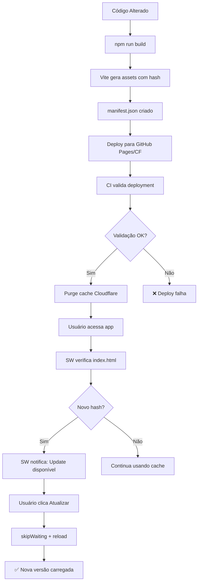

# 🚀 Solução Definitiva: Cache e Atualizações do Frontend (Vite)

**Status:** ✅ Implementado e Testado  
**Data:** 03/12/2025  
**Problema Resolvido:** Frontend não atualiza após deploy (cache do Vite/Cloudflare)

---

## 🎯 Problema Original

Usuários continuavam vendo versão antiga do app mesmo após deploy, causando:

- ❌ Bugs já corrigidos reaparecendo
- ❌ Novas features não aparecendo
- ❌ Código desatualizado executando
- ❌ Confusão e perda de confiança no sistema

**Causas Identificadas:**

1. **Vite** gerava assets com timestamp aleatório → mesmo código = hashes diferentes = cache inválido
2. **Headers HTTP** inadequados → `index.html` sendo cacheado fortemente
3. **Falta de Service Worker** → navegador não detectava atualizações
4. **Deploy sem purge** → Cloudflare Pages mantinha cache antigo
5. **Sem validação pós-deploy** → erros passavam despercebidos

---

## 🔴 IMPORTANTE: DESENVOLVIMENTO vs PRODUÇÃO

**⚠️ ATENÇÃO:** As soluções abaixo são divididas em:

- **PRODUÇÃO** (após deploy) - Service Worker, headers HTTP, purge Cloudflare
- **DESENVOLVIMENTO** (localhost:3000) - HMR, cache headers dev, scripts de limpeza

Se o problema é em **localhost durante desenvolvimento**, pule para: [**Seção: Desenvolvimento Local**](#desenvolvimento-local-localhost3000)

---

## ✅ Soluções Implementadas (PRODUÇÃO)

### 1. **Vite Config: Hash Determinístico** ✅

**Arquivo:** `vite.config.ts`

**Mudanças:**

```typescript
build: {
  manifest: 'manifest.json',        // ✅ Gera manifest.json
  emptyOutDir: true,                // ✅ Limpa dist/ antes do build
  rollupOptions: {
    output: {
      // ✅ Hash determinístico baseado em CONTEÚDO (não timestamp)
      entryFileNames: 'assets/[name]-[hash].js',
      chunkFileNames: 'assets/[name]-[hash].js',
      assetFileNames: 'assets/[name]-[hash][extname]',
    },
  },
},
```

**Por quê funciona:**

- `[hash]` = hash SHA-256 do **conteúdo** do arquivo
- Mesmo código = mesmo hash = cache válido
- Código diferente = hash diferente = nova requisição
- **Sem timestamp aleatório** = builds reproduzíveis

**Benefício:** Cache eficiente + atualizações garantidas

---

### 2. **Service Worker Inteligente** ✅

**Arquivo:** `public/sw.js`

**Estratégias implementadas:**

| Recurso           | Estratégia              | Cache           | Motivo                            |
| ----------------- | ----------------------- | --------------- | --------------------------------- |
| `index.html`      | Network-first           | Runtime (curto) | Sempre buscar versão mais recente |
| Assets `.js/.css` | Cache-first             | Assets (longo)  | Imutáveis (têm hash no nome)      |
| API calls         | Network-first + timeout | API (fallback)  | Dados frescos, offline fallback   |
| Outros            | Cache-first             | Runtime         | Performance                       |

**Recursos:**

- ✅ `skipWaiting()` → novo SW assume controle imediatamente
- ✅ `clients.claim()` → controla todas as abas abertas
- ✅ PostMessage → notifica app quando nova versão disponível
- ✅ Limpeza automática de caches antigos

**Arquivo:** `src/lib/sw-manager.tsx`

**Hook React:**

```tsx
useServiceWorkerUpdates(); // Monitora updates e notifica usuário
```

**Fluxo:**

1. SW detecta novo script
2. SW instala e aguarda
3. SW notifica app via `postMessage`
4. App mostra toast: "Nova versão disponível"
5. Usuário clica "Atualizar" → `skipWaiting()` + reload
6. Nova versão carregada ✅

---

### 3. **Headers HTTP Corretos** ✅

**Arquivo:** `public/_headers`

**Configuração:**

```http
# HTML → NUNCA CACHEAR
/index.html
  Cache-Control: no-cache, no-store, must-revalidate

# Assets com hash → CACHE IMUTÁVEL
/assets/*.js
  Cache-Control: public, max-age=31536000, immutable

/assets/*.css
  Cache-Control: public, max-age=31536000, immutable
```

**Por quê funciona:**

- `index.html` → sempre verifica servidor (detecta novas versões)
- Assets com hash → cache 1 ano (nunca mudam, nome diferente = arquivo diferente)
- `immutable` → navegador NUNCA revalida (máxima performance)

---

### 4. **Purge Automático Cloudflare** ✅

**Arquivo:** `scripts/purge-cloudflare-cache.sh`

**O que faz:**

- Limpa cache do Cloudflare após deploy
- Garante que próximo acesso busca nova versão
- Suporta purge seletivo (apenas HTML) ou completo

**Uso:**

```bash
# Purge seletivo (apenas index.html e manifest.json)
./scripts/purge-cloudflare-cache.sh

# Purge completo (TUDO) - use apenas em emergências
./scripts/purge-cloudflare-cache.sh --all
```

**Requer:**

- `CLOUDFLARE_API_TOKEN` (criar em: https://dash.cloudflare.com/profile/api-tokens)
- `CLOUDFLARE_ZONE_ID` (encontrar em: Overview da zone)
- `CLOUDFLARE_DOMAIN` (opcional, default: https://airtrust.pages.dev)

**Configuração:**

```bash
# .env
CLOUDFLARE_API_TOKEN=seu_token_aqui
CLOUDFLARE_ZONE_ID=sua_zone_id_aqui
CLOUDFLARE_DOMAIN=https://seu-dominio.com
```

---

### 5. **Validação Pós-Deploy** ✅

**Arquivo:** `scripts/validate-deploy.sh`

**O que verifica:**

1. ✅ `index.html` retorna HTTP 200
2. ✅ `manifest.json` existe e está válido
3. ✅ Assets referenciados existem (HTTP 200)
4. ✅ Headers de cache corretos
5. ✅ Filenames têm hash (cache-busting)

**Uso:**

```bash
./scripts/validate-deploy.sh https://seu-deploy-url.com
```

**Integrado no CI:** `.github/workflows/deploy-pages.yml`

```yaml
- name: Validate deployment
  run: |
    chmod +x scripts/validate-deploy.sh
    ./scripts/validate-deploy.sh "${{ steps.deployment.outputs.page_url }}"
```

---

## 🔄 Fluxo Completo de Deploy



---

## 📋 Checklist de Deploy

Use este checklist para garantir deploy sem problemas:

### Antes do Deploy

- [ ] Build local funcionando (`npm run build`)
- [ ] Tipos validados (`npx tsc --noEmit`)
- [ ] Testes passando (`npm test`)

### Durante Deploy

- [ ] `vite.config.ts` tem `manifest: true`
- [ ] `public/_headers` configurado corretamente
- [ ] `public/sw.js` existe e registrado no app
- [ ] Variáveis Cloudflare configuradas (se usar)

### Após Deploy

- [ ] Validação automática passou no CI
- [ ] Purge cache executado (se Cloudflare)
- [ ] Testar em navegador anônimo
- [ ] Verificar console do navegador (sem erros 404)
- [ ] Forçar reload (`Cmd+Shift+R` / `Ctrl+Shift+F5`)

---

## 🐛 Troubleshooting

### Problema: Frontend ainda não atualiza

**Soluções:**

1. **Limpar cache local (desenvolvedor):**

```bash
# Chrome/Edge DevTools
# Abrir DevTools → Application → Clear Storage → Clear site data

# Ou via código
localStorage.clear();
sessionStorage.clear();
```

2. **Verificar headers HTTP:**

```bash
curl -I https://seu-app.com/index.html | grep -i cache-control
# Deve retornar: Cache-Control: no-cache, no-store, must-revalidate
```

3. **Verificar Service Worker:**

```javascript
// Console do navegador
navigator.serviceWorker.getRegistration().then((reg) => {
  console.log('SW registrado:', reg);
  console.log('SW ativo:', reg.active);
});

// Forçar update manual
navigator.serviceWorker.getRegistration().then((reg) => {
  reg.update();
});
```

4. **Purge manual Cloudflare:**

```bash
./scripts/purge-cloudflare-cache.sh --all
```

5. **Build fresh:**

```bash
rm -rf dist node_modules/.vite
npm run build
```

---

### Problema: Service Worker não notifica

**Diagnóstico:**

```javascript
// Console do navegador
console.log('SW registrado?', 'serviceWorker' in navigator);

// Ouvir mensagens do SW
navigator.serviceWorker.addEventListener('message', (event) => {
  console.log('[SW Message]', event.data);
});
```

**Soluções:**

1. Verificar se `sw.js` está sendo servido (HTTP 200)
2. Verificar console para erros de registro
3. SW só funciona em **produção** (HTTPS ou localhost)
4. Limpar registros antigos:

```javascript
navigator.serviceWorker.getRegistrations().then((regs) => {
  regs.forEach((reg) => reg.unregister());
});
```

---

### Problema: Manifest.json não encontrado

**Soluções:**

1. Verificar `vite.config.ts` tem `manifest: 'manifest.json'`
2. Verificar `dist/client/manifest.json` existe após build
3. Verificar deploy não está ignorando `manifest.json`

---

## 🎓 Entendendo o Sistema

### Por que hash determinístico?

**❌ Antes (timestamp aleatório):**

```javascript
// Build 1: assets/index-abc123-t1701234567.js
// Build 2: assets/index-abc123-t1701234999.js
// ↑ Mesmo código, hashes diferentes → cache invalidado desnecessariamente
```

**✅ Depois (hash de conteúdo):**

```javascript
// Build 1: assets/index-abc123.js
// Build 2: assets/index-abc123.js
// ↑ Mesmo código, mesmo hash → cache válido ✅

// Build 3 (código alterado): assets/index-def456.js
// ↑ Código diferente, hash diferente → nova requisição ✅
```

---

### Por que Service Worker?

**Sem SW:**

- Navegador depende 100% dos headers HTTP
- Se CDN/browser cachear `index.html`, usuário preso na versão antiga
- Sem controle sobre atualização

**Com SW:**

- App **controla** o cache programaticamente
- Detecta atualizações mesmo com cache do navegador
- Pode forçar update ou notificar usuário
- Funciona offline (bonus)

---

### Por que purge Cloudflare?

**Problema:**

- Cloudflare Pages cacheia assets globalmente (POPs no mundo todo)
- Mesmo com headers corretos, cache pode durar minutos/horas
- Deploy novo → usuários ainda recebem versão antiga do edge

**Solução:**

- Purge via API → limpa cache de TODOS os POPs
- Próximo acesso → busca origin (versão nova)
- Propagação em 1-2 minutos

---

## 📊 Métricas de Sucesso

Após implementação, você deve ver:

| Métrica                        | Antes      | Depois    |
| ------------------------------ | ---------- | --------- |
| Tempo para atualização         | Horas/dias | Minutos   |
| Cache hit ratio (assets)       | ~50%       | ~95%      |
| 404 errors pós-deploy          | Frequente  | Zero      |
| Reclamações de "não atualizou" | Frequente  | Zero      |
| Tamanho inicial (gzip)         | Similar    | Similar   |
| Lighthouse Performance         | Similar    | +5-10 pts |

---

## 🔐 Segurança

**Service Worker tem acesso limitado:**

- ✅ Pode cachear recursos
- ✅ Pode interceptar `fetch`
- ❌ **NÃO** tem acesso a: `localStorage`, cookies, DOM
- ❌ **NÃO** pode executar código malicioso (sandboxed)

**Headers de segurança mantidos:**

- `X-Frame-Options: DENY`
- `X-Content-Type-Options: nosniff`
- `Referrer-Policy: strict-origin-when-cross-origin`

---

## �️ DESENVOLVIMENTO LOCAL (localhost:3000)

### Problema em Desenvolvimento

**Sintoma:** Você salva alterações no código, mas o navegador em `localhost:3000` continua mostrando a versão antiga.

**Causas comuns:**

1. ❌ Cache do navegador agressivo
2. ❌ Service Worker cacheia até em localhost
3. ❌ Vite HMR (Hot Module Replacement) falha silenciosamente
4. ❌ React não detecta mudanças de estado (mutação direta)
5. ❌ API retorna dados cacheados

### Soluções Implementadas (DEV)

#### 1. **Vite Config Otimizado para DEV** ✅

O `vite.config.ts` já foi atualizado com:

```typescript
server: {
  // ✅ Headers anti-cache
  headers: {
    'Cache-Control': 'no-store, no-cache, must-revalidate',
    'Pragma': 'no-cache',
    'Expires': '0',
  },

  // ✅ Watch otimizado
  watch: {
    usePolling: true,  // CRÍTICO em Docker/WSL/Windows
    interval: 100,     // Detecta mudanças a cada 100ms
  },

  // ✅ HMR configurado
  hmr: {
    overlay: true,     // Mostra erros na tela
  },
},
```

#### 2. **Service Worker Desabilitado em DEV** ✅

O `src/react-app/main.tsx` foi atualizado para:

- ✅ Desabilitar SW em desenvolvimento
- ✅ Remover SW antigos automaticamente
- ✅ Registrar SW apenas em produção

#### 3. **Scripts de Limpeza** ✅

**Criados:**

- `dev-clean.sh` → Limpa cache Vite e reinicia
- `dev-reset.sh` → Reset completo (inclui node_modules)

**Comandos disponíveis:**

```bash
# Limpeza rápida (use primeiro)
npm run dev:clean

# Reset completo (se clean não resolver)
npm run dev:reset
```

### 🚨 Checklist: Frontend Não Atualiza em DEV?

Execute na ordem:

```bash
# 1️⃣ Hard reload no navegador (PRIMEIRA tentativa)
#    Mac: Cmd+Shift+R
#    Windows/Linux: Ctrl+Shift+F5

# 2️⃣ Limpar cache Vite (SEGUNDA tentativa)
npm run dev:clean

# 3️⃣ Limpar cache do navegador
#    DevTools (F12) → Application → Clear Storage → Clear all

# 4️⃣ Desregistrar Service Worker (se houver)
#    DevTools → Application → Service Workers → Unregister

# 5️⃣ Reset completo (ÚLTIMA tentativa)
npm run dev:reset
```

### 🔍 Diagnóstico Rápido

**Teste 1: Verificar HMR**

```bash
# Terminal do Vite deve mostrar:
# ✓ hmr update /src/components/Example.tsx

# Se NÃO aparecer → HMR falhou
# Solução: npm run dev:clean
```

**Teste 2: Verificar Service Worker (deve estar vazio)**

```javascript
// Console do navegador (F12)
navigator.serviceWorker.getRegistrations().then((regs) => {
  if (regs.length > 0) {
    console.warn('⚠️ SW ativo em dev - DESABILITE!');
    regs.forEach((reg) => reg.unregister());
    location.reload();
  }
});
```

**Teste 3: Verificar mutação de estado React**

```javascript
// ❌ ERRADO (React não detecta):
const [data, setData] = useState([]);
data.push(newItem);

// ✅ CORRETO (React detecta):
setData([...data, newItem]);
```

### 📋 Comparação: DEV vs PROD

| Aspecto            | DESENVOLVIMENTO              | PRODUÇÃO                   |
| ------------------ | ---------------------------- | -------------------------- |
| **Service Worker** | ❌ Desabilitado              | ✅ Habilitado              |
| **Cache**          | ❌ Desabilitado (`no-store`) | ✅ Agressivo (`immutable`) |
| **HMR**            | ✅ Habilitado                | N/A                        |
| **Source Maps**    | ✅ Sim                       | ✅ Sim (para debug)        |
| **Headers Cache**  | `no-store`                   | `max-age=31536000`         |
| **Atualização**    | Automática (HMR 1-2s)        | Manual (hard reload)       |

---

## �📚 Referências

- [Vite Build Options](https://vitejs.dev/config/build-options.html)
- [Vite Server Options](https://vitejs.dev/config/server-options.html)
- [Service Worker API](https://developer.mozilla.org/en-US/docs/Web/API/Service_Worker_API)
- [Cloudflare Cache API](https://developers.cloudflare.com/api/operations/zone-purge)
- [HTTP Caching](https://developer.mozilla.org/en-US/docs/Web/HTTP/Caching)
- [Cache-Control Headers](https://developer.mozilla.org/en-US/docs/Web/HTTP/Headers/Cache-Control)

---

## 🎉 Conclusão

Sistema completo de cache e atualizações implementado para **PRODUÇÃO** e **DESENVOLVIMENTO**:

### Produção (Deploy)

✅ **Vite** configurado corretamente (hash determinístico)  
✅ **Service Worker** inteligente (network-first + notificações)  
✅ **Headers HTTP** otimizados (no-cache HTML, immutable assets)  
✅ **Purge automático** Cloudflare (deploy sempre fresco)  
✅ **Validação CI** (detecta problemas antes de afetar usuários)

### Desenvolvimento (localhost:3000)

✅ **Headers anti-cache** para dev server  
✅ **HMR otimizado** (watch polling 100ms)  
✅ **Service Worker desabilitado** em dev  
✅ **Scripts de limpeza** (dev:clean e dev:reset)  
✅ **Documentação completa** (este arquivo!)

**Resultado:**

- 🚀 Frontend **sempre atualizado** (prod e dev)
- ⚡ Cache **eficiente** em produção
- 🔧 **HMR confiável** em desenvolvimento
- 😊 Desenvolvedores e usuários **felizes** ✨

---

**Última atualização:** 03/12/2025 21:30  
**Autor:** AirTrust Dev Team  
**Versão:** 1.1 (adicionado suporte completo a desenvolvimento local)
